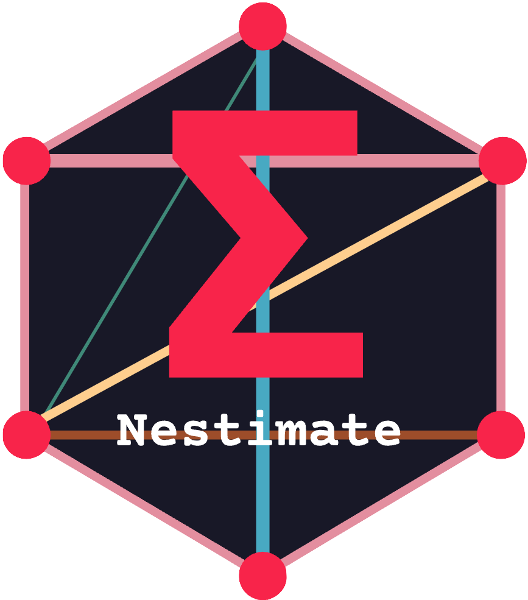

# Nestimate 

> A computational R package for network estimation, validation, and comparison.

<!-- badges: start -->
[](https://github.com/mohsaqr/Nestimate)
[](https://CRAN.R-project.org/package=Nestimate)
[](https://opensource.org/licenses/MIT)
<!-- badges: end -->

Nestimate is a computational package for building, validating, and comparing networks. It provides a unified `build_network()` interface across five areas:

- **Dynamic networks** — transition, frequency, attention-weighted, co-occurrence, windowed transition, and mixed (directed + undirected) networks from sequential and binary event data
- **Psychological networks** — correlation, partial correlation, graphical lasso (EBICglasso), and Ising models from cross-sectional or panel data
- **Multi-cluster networks** — MCML decomposition of networks into macro (between-cluster) and micro (within-cluster) layers, plus sequence clustering and mixed Markov models
- **Higher-order networks** — HON, HONEM, HyPa, and Multi-Order Generative models that capture dependencies beyond first-order transitions
- **Statistical validation** — bootstrap, permutation testing, split-half reliability, centrality stability, and difference tests across all network types

### What Sets Nestimate Apart

Nestimate implements four families of transition network estimation: standard TNA (transition probabilities), frequency TNA (raw counts), attention TNA (temporal decay weighting that emphasizes recent transitions), and co-occurrence networks from binary data. On top of these, windowed TNA (`wtna()`) builds networks from binary indicator matrices using temporal windows — producing directed transitions between windows, undirected co-occurrence within windows, or mixed networks that combine both in a single model.

For psychological networks, Nestimate implements EBICglasso, partial correlations, and Ising estimation from scratch using coordinate descent regularization, precision matrix inversion, and EBIC model selection. These require no external network packages — the entire package has only 4 imports (ggplot2, glasso, data.table, cluster) — yet produce numerically equivalent results. Transition networks and bootstrap are byte-identical to the `tna` package; permutation tests match to Monte Carlo precision; EBICglasso produces numerically equivalent results to established implementations. All equivalence tests compare outputs value by value on identical synthetic datasets.

Every network type — dynamic, psychological, higher-order — shares the same validation pipeline: bootstrap confidence intervals, permutation testing, split-half reliability, and centrality stability analysis. These are not separate packages bolted on; they are part of the same interface.

## Installation

```r
# From GitHub
devtools::install_github("mohsaqr/Nestimate")
```

## Quick Start

```r
library(Nestimate)

# Transition network from event-log data
data(human_cat)
net <- build_network(human_cat, method = "tna",
                     action = "category", actor = "session_id",
                     time = "timestamp")

# Psychological network from cross-sectional data
data(srl_strategies)
net_pna <- build_network(srl_strategies, method = "glasso",
                         params = list(gamma = 0.5))

# Validate with bootstrap
boot <- bootstrap_network(net, iter = 1000)
```

## Dynamic Networks

All dynamic network methods are accessed through `build_network()` with a `method` argument. The function accepts long-format event logs directly — specifying `action` (what happened), `actor` (who), and `time` (when) — and handles format conversion internally.

### Estimation Methods

| Method | Aliases | Description |
|--------|---------|-------------|
| `"relative"` | `"tna"`, `"transition"` | Transition probabilities (directed) |
| `"frequency"` | `"ftna"`, `"counts"` | Raw transition counts (directed) |
| `"attention"` | `"atna"` | Decay-weighted transitions emphasizing recent events (directed) |
| `"co_occurrence"` | `"cna"` | Co-occurrence counts from binary data (undirected) |

No data preparation is required. `build_network()` accepts raw event logs directly — pass the column names for `action`, `actor`, and `time`, and the function handles format conversion, session detection, ordering, and metadata preservation internally. A `group` argument builds separate per-group networks in a single call with no extra steps.

```r
net_tna  <- build_network(human_cat, method = "tna",
                          action = "category", actor = "session_id",
                          time = "timestamp")
net_ftna <- build_network(human_cat, method = "ftna",
                          action = "category", actor = "session_id",
                          time = "timestamp")
net_atna <- build_network(human_cat, method = "atna",
                          action = "category", actor = "session_id",
                          time = "timestamp")

# Per-group networks — one network per superclass, no extra steps
group_nets <- build_network(human_cat, method = "tna",
                            action = "category", actor = "session_id",
                            time = "timestamp", group = "superclass")
```

### Window-Based TNA

`wtna()` builds networks from binary (one-hot) data using temporal windowing. Many datasets are binary: at each time point, multiple states are either active (1) or inactive (0). WTNA supports three modes:

- **`"transition"`**: directed transitions between consecutive windows
- **`"cooccurrence"`**: undirected co-occurrence within windows
- **`"both"`**: a mixed network combining directed and undirected edges

The mixed mode captures both the temporal sequencing (which states follow each other across windows) and the contemporaneous structure (which states co-occur within the same window) in a single model.

```r
data(learning_activities)

# Co-occurrence network
net_co <- build_network(learning_activities, method = "cna", actor = "student")

# Windowed transition network
net_wtna <- wtna(learning_activities, actor = "student",
                 method = "transition", type = "relative")

# Mixed network: transitions + co-occurrence
net_mixed <- wtna(learning_activities, actor = "student",
                  method = "both", type = "relative")
```

## Psychological Networks

| Method | Aliases | Description |
|--------|---------|-------------|
| `"cor"` | `"corr"`, `"correlation"` | Pearson correlations (undirected) |
| `"pcor"` | `"partial"` | Partial correlations controlling for all other variables (undirected) |
| `"glasso"` | `"ebicglasso"`, `"regularized"` | L1-regularized precision matrix with EBIC selection (undirected, sparse) |
| `"ising"` | — | L1-regularized logistic regression for binary variables (undirected, sparse) |

All estimators are implemented from scratch — EBICglasso with coordinate descent, partial correlations via precision matrix inversion, EBIC model selection — with no dependency on igraph, bootnet, or qgraph.

```r
data(srl_strategies)
net_cor    <- build_network(srl_strategies, method = "cor")
net_pcor   <- build_network(srl_strategies, method = "pcor")
net_glasso <- build_network(srl_strategies, method = "glasso",
                            params = list(gamma = 0.5))

# Node predictability (R-squared from network structure)
predictability(net_glasso)
```

Custom estimators can be added via `register_estimator()`.

## Multi-Cluster Networks

### MCML

MCML decomposes a network whose nodes belong to known groups (communities, categories, topics) into two layers. The **macro** layer aggregates node-to-node edges into a cluster-to-cluster network. The **micro** layer extracts the internal transition structure inside each group.

`cluster_summary()` computes MCML from a pre-existing weight matrix; `build_mcml()` works from raw transition data by recoding node labels to cluster labels and counting actual transitions.

```r
clusters <- list(
  Metacognitive = c("Planning", "Monitoring", "Evaluating"),
  Cognitive = c("Elaboration", "Organization", "Rehearsal"),
  Resource = c("Help_Seeking", "Time_Mgmt", "Effort_Reg")
)

mcml <- cluster_summary(net, clusters, type = "tna")
mcml$macro$weights                   # Cluster-to-cluster transition matrix
mcml$clusters$Metacognitive$weights  # Within-cluster transitions

# Or from raw sequence/edge data
mcml2 <- build_mcml(sequences, clusters)
```

### Sequence Clustering

`cluster_data()` computes pairwise sequence distances and partitions into `k` groups. Supports 9 distance metrics (Hamming, Levenshtein, LCS, cosine, Jaccard, and more), 8 clustering methods (PAM, Ward, complete/average/single linkage), and optional temporal weighting.

Both `cluster_data()` and `build_mmm()` results can be passed directly to `build_network()`, which builds a separate network per cluster and returns a `netobject_group` — a named list of networks ready for comparison, permutation testing, or visualization.

```r
clust <- cluster_data(net, k = 3, dissimilarity = "hamming", method = "ward.D2")
plot(clust, type = "silhouette")
plot(clust, type = "mds")

# Convert to per-cluster networks
cluster_nets <- build_network(clust, method = "tna")

# Compare clusters with permutation test
permutation_test(cluster_nets$`Cluster 1`, cluster_nets$`Cluster 2`)
```

### Mixed Markov Models

`build_mmm()` fits a mixture of Markov chains via EM, clustering sequences by their transition dynamics rather than sequence similarity. Supports soft assignments, BIC/AIC/ICL model selection, and covariate regression:

```r
mmm <- build_mmm(net, k = 3, covariates = c("project"))
compare_mmm(net, k = 2:6)

# Convert to per-cluster networks
mmm_nets <- build_network(mmm)
```

### Covariates

Both clustering methods support covariate analysis, but with different roles. In `cluster_data()`, covariates are **post-hoc**: they do not influence the clustering itself but characterize who ends up in which cluster via multinomial logistic regression after the fact. In `build_mmm()`, covariates are **integrated into the EM algorithm**: they model covariate-dependent mixing proportions, so the covariate structure directly influences cluster membership during estimation.

```r
# Post-hoc: clustering is purely behavioral, covariates analyzed afterward
clust <- cluster_data(net, k = 2, covariates = c("Achiever"))
summary(clust)  # Includes covariate profiles and odds ratios

# Integrated: covariates influence cluster assignments during EM
mmm <- build_mmm(net, k = 2, covariates = c("Group"))
summary(mmm)
```

## Higher-Order Networks

Methods that capture dependencies beyond first-order transitions:

| Function | Method |
|----------|--------|
| `build_hon()` | Higher-Order Network — variable-length memory dependencies |
| `build_honem()` | Higher-Order Network Embedding |
| `build_hypa()` | Hyper-Path Anomaly detection |
| `build_mogen()` | Multi-Order Generative model — optimal Markov order per node |

```r
hon <- build_hon(sequences, k = 2)
pathways(hon)
```

## Simplicial Complex Analysis

Topological analysis of network structure:

```r
sc <- build_simplicial(net, method = "clique")
betti_numbers(sc)
euler_characteristic(sc)

ph <- persistent_homology(net)
qa <- q_analysis(net)
```

## Statistical Validation

```r
# Split-half reliability
reliability(net)

# Bootstrap confidence intervals and significance
boot <- bootstrap_network(net, iter = 1000)

# Centrality stability (CS-coefficient)
centrality_stability(net)

# Permutation-based group comparison
perm <- permutation_test(net_group1, net_group2)

# Specialized glasso bootstrap (edge CIs, centrality stability, difference tests)
boot_gl <- boot_glasso(net_pna, iter = 1000,
                       centrality = c("strength", "expected_influence"))
```

| Function | Purpose |
|----------|---------|
| `reliability()` | Split-half reliability of edge weights |
| `bootstrap_network()` | Bootstrap CIs, p-values, and significance for each edge |
| `centrality_stability()` | CS-coefficient via case-dropping subsets |
| `permutation_test()` | Edge-level comparison between two networks (paired/unpaired) |
| `boot_glasso()` | Edge inclusion, centrality stability, and difference tests for glasso networks |

### Centrality

```r
centrality(net)
```

Computes InStrength, OutStrength, and Betweenness for directed networks; Strength for undirected.

## Data Preparation

Data preparation is not necessary — `build_network()` accepts long format, wide format, and one-hot binary matrices directly and handles conversion internally. The following utilities are provided for convenience when working outside `build_network()`:

```r
prepare_data(event_log, action = "code", actor = "student", time = "timestamp")
wide_to_long(wide_data)
long_to_wide(long_data, action = "action", actor = "id", time = "time")
action_to_onehot(long_data, action = "action", actor = "id", time = "time")
```

## Bundled Datasets

| Dataset | Description | N |
|---------|-------------|---|
| `human_cat` | Human interactions in AI pair programming (9 categories) | 10,796 events, 429 sessions |
| `human_detailed` | Same interactions at fine-grained code level | 10,796 events |
| `learning_activities` | Binary learning activity indicators | 6,000 obs (200 students x 30 timepoints) |
| `srl_strategies` | Self-regulated learning strategy frequencies | 250 students, 9 strategies |
| `group_regulation_long` | Group regulation sequences with covariates | Long format with Actor, Action, Time |
| `human_ai_edges` | Pre-computed edge list | — |

See `?vibcoding-data` for the full family of human-AI coding datasets at three granularity levels.

## Documentation

- [Transition Networks](https://mohsaqr.github.io/Nestimate/articles/transition-networks.html) — TNA, FTNA, ATNA, co-occurrence, WTNA, validation, clustering, MMM
- [Co-occurrence & Ising Networks](https://mohsaqr.github.io/Nestimate/articles/co-occurrence-networks.html) — binary data analysis
- [Psychological Networks](https://mohsaqr.github.io/Nestimate/articles/psychological-networks.html) — correlation, partial correlation, glasso, bootstrap
- [Clustering](https://mohsaqr.github.io/Nestimate/articles/clustering.html) — dissimilarity-based clustering, MMM, per-cluster networks
- [Full Reference](https://mohsaqr.github.io/Nestimate/reference/)

## Citation

If you use Nestimate in your research, please cite:

> Saqr, M., Lopez-Pernas, S., Tormanen, T., Kaliisa, R., Misiejuk, K., & Tikka, S. (2025). Transition Network Analysis: A Novel Framework for Modeling, Visualizing, and Identifying the Temporal Patterns of Learners and Learning. *Proceedings of the 15th Learning Analytics and Knowledge Conference*. doi: [10.1145/3706468.3706513](https://doi.org/10.1145/3706468.3706513)

> Saqr, M., Beck, E., & Lopez-Pernas, S. (2024). Psychological Networks. In M. Saqr & S. Lopez-Pernas (Eds.), *Learning Analytics Methods and Tutorials* (pp. 513-546). Springer. doi: [10.1007/978-3-031-54464-4_19](https://doi.org/10.1007/978-3-031-54464-4_19)

## License

MIT
