# Network Estimation and Visualization with Nestimate + cograph

## 1 Introduction

**Nestimate** is a unified network estimation package for R. It provides
a single entry point —
[`build_network()`](https://pak.dynasite.org/Nestimate/reference/build_network.md)
— that accepts sequence data, wide-format behavioral data, or numeric
matrices and estimates networks using any of 10 built-in methods. The
result is a `netobject` that inherits `cograph_network`, so every object
produced by Nestimate can be plotted with
[`splot()`](https://sonsoles.me/cograph/reference/splot.html) directly.

The core design principle is that **estimation and visualization are
separate concerns**: Nestimate handles all computation (network
construction, bootstrapping, permutation testing, clustering,
multi-cluster analysis), while cograph handles all rendering. This
separation means the analyst writes estimation code once and gets
publication-ready figures without adapter code or manual class
conversion.

Beyond single-network estimation, Nestimate provides a complete
statistical toolkit:

- **Bootstrap stability analysis** (`bootstrap_network`) — identifies
  which edges survive resampling and which are sampling artifacts.
- **Permutation-based group comparison** (`permutation`) — tests whether
  edges differ significantly between conditions.
- **Multi-cluster multi-level analysis** (`csum`, `summarize_clusters`)
  — aggregates node-level networks into cluster-level summaries for
  hierarchical visualization.
- **Centrality stability** (`centrality_stability`) — assesses whether
  centrality rankings are robust to case dropping.
- **Group-level operations** — bootstrapping, permutation testing, and
  plotting work on grouped networks with no additional code.

This tutorial walks through the full pipeline with the
`group_regulation_long` dataset shipped with Nestimate.

------------------------------------------------------------------------

## 2 Data

`group_regulation_long` is a long-format dataset of collaborative
regulation behaviors coded across student groups. Each row is one coded
action in a session, with columns identifying the actor, the group,
achievement level, course, timestamp, and the regulation behavior.

``` r

data("group_regulation_long", package = "Nestimate")
head(group_regulation_long)
```

      Actor Achiever Group Course                Time    Action
    1     1     High     1      A 2025-01-01 08:27:07  cohesion
    2     1     High     1      A 2025-01-01 08:35:20 consensus
    3     1     High     1      A 2025-01-01 08:42:18   discuss
    4     1     High     1      A 2025-01-01 08:50:00 synthesis
    5     1     High     1      A 2025-01-01 08:52:25     adapt
    6     1     High     1      A 2025-01-01 08:57:31 consensus

The nine regulation behaviors are: `adapt`, `cohesion`, `consensus`,
`coregulate`, `discuss`, `emotion`, `monitor`, `plan`, and `synthesis`.
These form the nodes of the networks we estimate below.

------------------------------------------------------------------------

## 3 Estimating Networks

### 3.1 A single network

[`build_network()`](https://pak.dynasite.org/Nestimate/reference/build_network.md)
estimates a network from raw data. The `method` argument selects the
estimation algorithm. Here we use `"relative"`, which computes
row-normalized transition probabilities — the standard approach in
transition network analysis (TNA). Unlike constructing a TNA model
manually (preparing wide-format data, computing the transition matrix,
normalizing),
[`build_network()`](https://pak.dynasite.org/Nestimate/reference/build_network.md)
handles all data preparation internally.

``` r

net <- build_network(
  group_regulation_long,
  action = "Action", actor = "Actor",
  method = "relative"
)
net
```

    Transition Network (relative probabilities) [directed]
      Weights: [0.001, 0.498]  |  mean: 0.115

      Weight matrix:
                 adapt cohesion consensus coregulate discuss emotion monitor  plan
      adapt      0.000    0.273     0.477      0.022   0.059   0.120   0.033 0.016
      cohesion   0.003    0.027     0.498      0.119   0.060   0.116   0.033 0.141
      consensus  0.005    0.015     0.082      0.188   0.188   0.073   0.047 0.396
      coregulate 0.016    0.036     0.135      0.023   0.274   0.172   0.086 0.239
      discuss    0.071    0.048     0.321      0.084   0.195   0.106   0.022 0.012
      emotion    0.002    0.325     0.320      0.034   0.102   0.077   0.036 0.100
      monitor    0.011    0.056     0.159      0.058   0.375   0.091   0.018 0.216
      plan       0.001    0.025     0.290      0.017   0.068   0.147   0.076 0.374
      synthesis  0.235    0.034     0.466      0.044   0.063   0.071   0.012 0.075
                 synthesis
      adapt          0.000
      cohesion       0.004
      consensus      0.008
      coregulate     0.019
      discuss        0.141
      emotion        0.003
      monitor        0.016
      plan           0.002
      synthesis      0.000

      Initial probabilities:
      consensus     0.214  ████████████████████████████████████████
      plan          0.204  ██████████████████████████████████████
      discuss       0.175  █████████████████████████████████
      emotion       0.151  ████████████████████████████
      monitor       0.144  ███████████████████████████
      cohesion      0.060  ███████████
      synthesis     0.019  ████
      coregulate    0.019  ████
      adapt         0.011  ██

The returned `net` is a `netobject` (which inherits `cograph_network`),
so [`splot()`](https://sonsoles.me/cograph/reference/splot.html) renders
it directly:

``` r

splot(net)
```

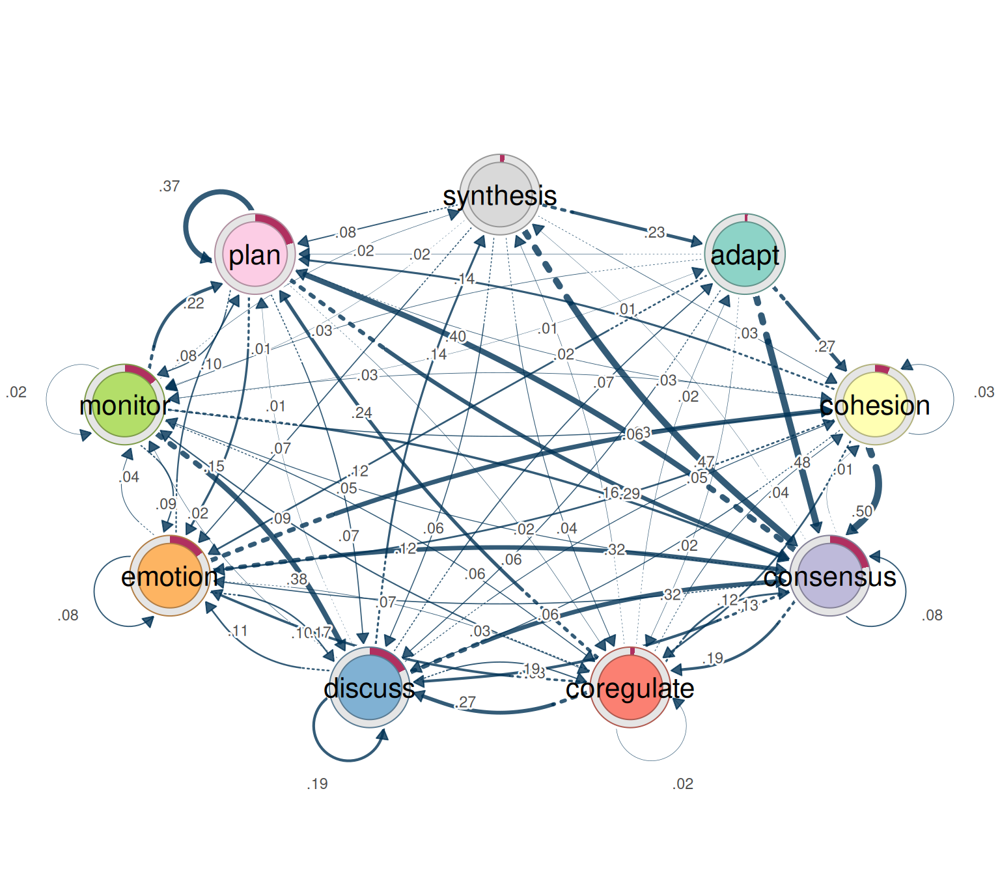

Figure 1: Collaborative regulation network — row-normalized transitions
(relative method)

### 3.2 Available estimators

Nestimate ships with 10 built-in estimators. Each is selected via the
`method` argument to
[`build_network()`](https://pak.dynasite.org/Nestimate/reference/build_network.md):

``` r

list_estimators()
```

                    name                                                description
    1          attention                       Decay-weighted attention transitions
    2      co_occurrence                             Co-occurrence within sequences
    3                cor                               Pairwise correlation network
    4          frequency                            Raw transition frequency counts
    5                gap             Gap-allowed transitions weighted by 1/distance
    6             glasso                EBICglasso regularized partial correlations
    7              ising             Ising model (L1-penalized logistic regression)
    8                mgm Mixed Graphical Model (nodewise lasso, EBIC, LW threshold)
    9              ngram      n-gram transitions (adjacent pairs per n-gram window)
    10              pcor                         Unregularized partial correlations
    11          relative                    Row-normalized transition probabilities
    12           reverse        Reverse (reply) transitions: transpose of frequency
    13              wtna                     Window-based TNA transitions (one-hot)
    14 wtna_cooccurrence                   Window-based TNA co-occurrence (one-hot)
       directed
    1      TRUE
    2     FALSE
    3     FALSE
    4      TRUE
    5      TRUE
    6     FALSE
    7     FALSE
    8     FALSE
    9      TRUE
    10    FALSE
    11     TRUE
    12     TRUE
    13     TRUE
    14    FALSE

Different estimators answer different research questions. Directed
methods (relative, frequency, attention) model sequential transitions —
which behavior follows which. Undirected methods (glasso, pcor, cor,
co_occurrence, ising) model co-occurrence or partial correlation
structures — which behaviors tend to appear together. The choice of
method should be driven by the theoretical question, not by convenience.

``` r

frequency_net    <- build_network(group_regulation_long, action = "Action",
                                  actor = "Actor", method = "frequency")
attention_net    <- build_network(group_regulation_long, action = "Action",
                                  actor = "Actor", method = "attention")
co_occurrence_net <- build_network(group_regulation_long, action = "Action",
                                   actor = "Actor", method = "co_occurrence")
```

Each of these is a `netobject` that works with
[`splot()`](https://sonsoles.me/cograph/reference/splot.html):

``` r

splot(frequency_net)
```

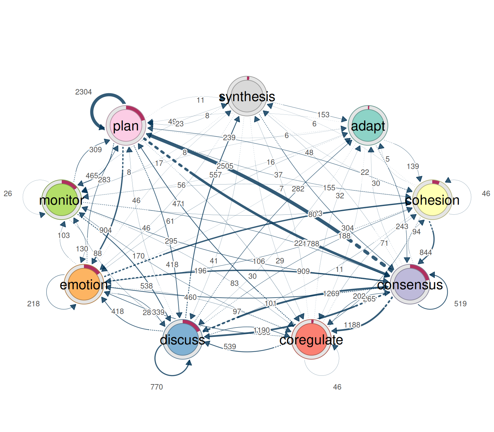

Figure 2: Frequency-based transition network (raw counts)

``` r

splot(co_occurrence_net, layout = "spring")
```

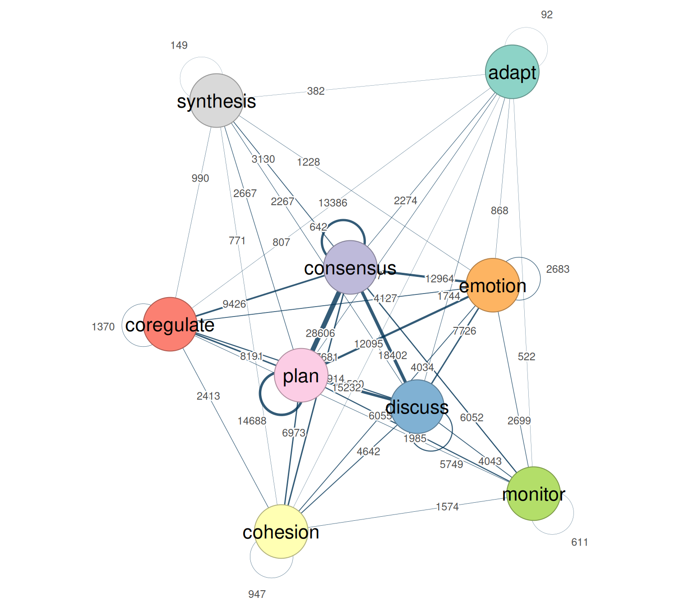

Figure 3: Co-occurrence network (undirected)

------------------------------------------------------------------------

## 4 Bootstrap Stability

To ensure that the patterns we observe reflect genuine structure rather
than sampling noise, we need bootstrap resampling.
[`bootstrap_network()`](https://pak.dynasite.org/Nestimate/reference/bootstrap_network.md)
resamples the data, refits the model at each iteration, and identifies
which edges are stable. The result is a `net_bootstrap` object.

``` r

set.seed(265)
boot <- bootstrap_network(net, iter = 1000)
boot
```

      Edge                   Mean     95% CI          p
      -----------------------------------------------
      cohesion → consensus   0.498  [0.474, 0.521]  ***
      adapt → consensus    0.478  [0.430, 0.523]  ***
      synthesis → consensus   0.466  [0.427, 0.507]  ***
      consensus → plan     0.396  [0.383, 0.407]  ***
      monitor → discuss    0.375  [0.351, 0.401]  ***
      ... and 46 more significant edges

    Bootstrap Network  [Transition Network (relative) | directed]
      Iterations : 1000  |  Nodes : 9
      Edges      : 51 significant / 78 total
      CI         : 95%  |  Inference: stability  |  CR [0.75, 1.25]

### 4.1 Styled mode (default)

Significant edges (p \< 0.05) appear **solid dark blue**;
non-significant edges appear **dashed grey**. This immediately separates
the stable network structure from noise.

``` r

splot(boot)
```


Figure 4: Bootstrapped network — solid = stable edges, dashed = sampling
artifacts

### 4.2 Significant edges only

``` r

splot(boot, display = "significant")
```

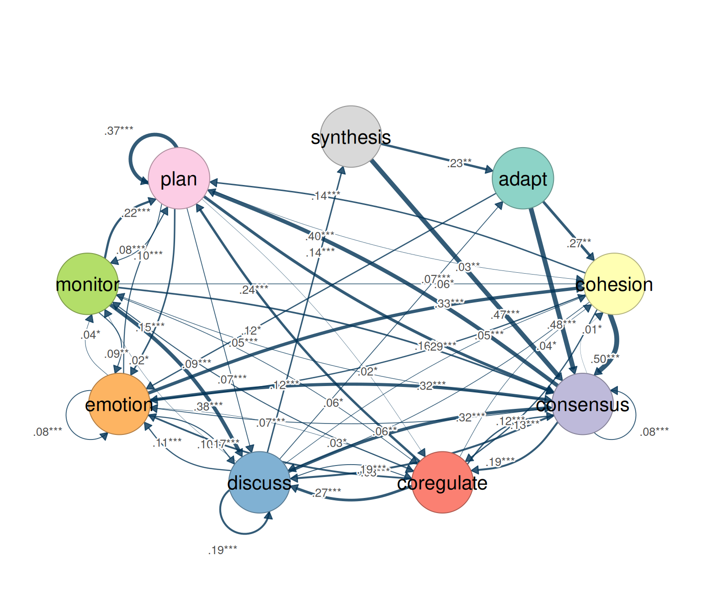

Figure 5: Only statistically stable edges retained

### 4.3 Full network (no styling)

``` r

splot(boot, display = "full")
```

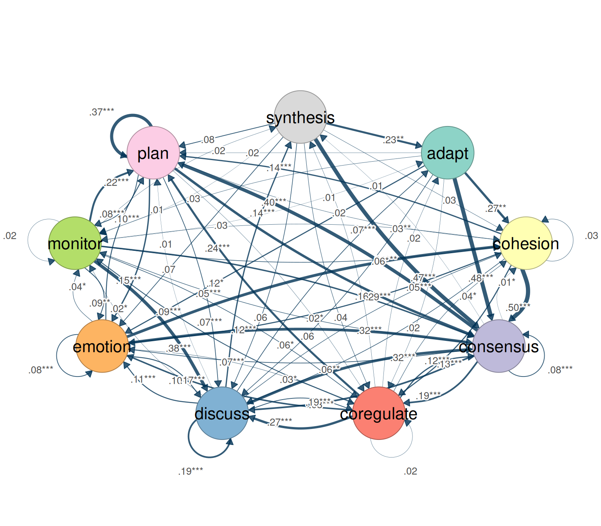

Figure 6: All edges shown with uniform styling (bootstrap weights)

### 4.4 Significance stars on edge labels

``` r

splot(boot, show_stars = TRUE)
```

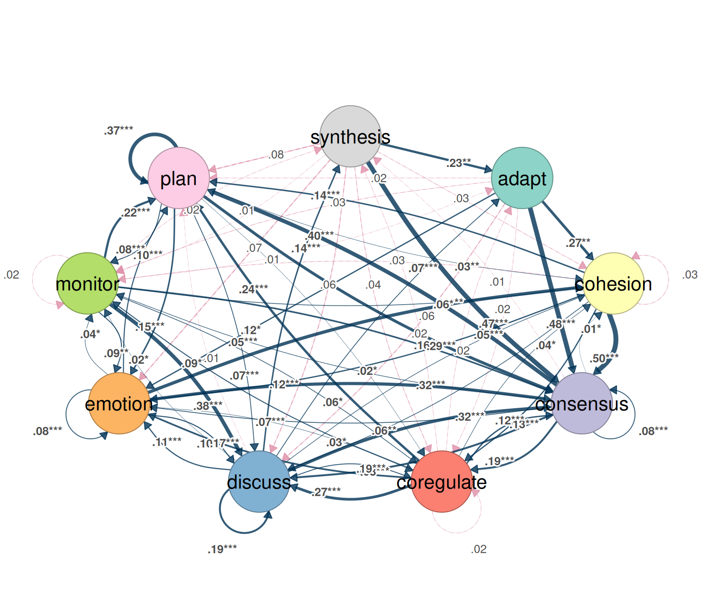

Figure 7: Bootstrap network with significance stars (\*, \*\*, \*\*\*)

### 4.5 Confidence interval labels

``` r

splot(boot, show_ci = TRUE)
```

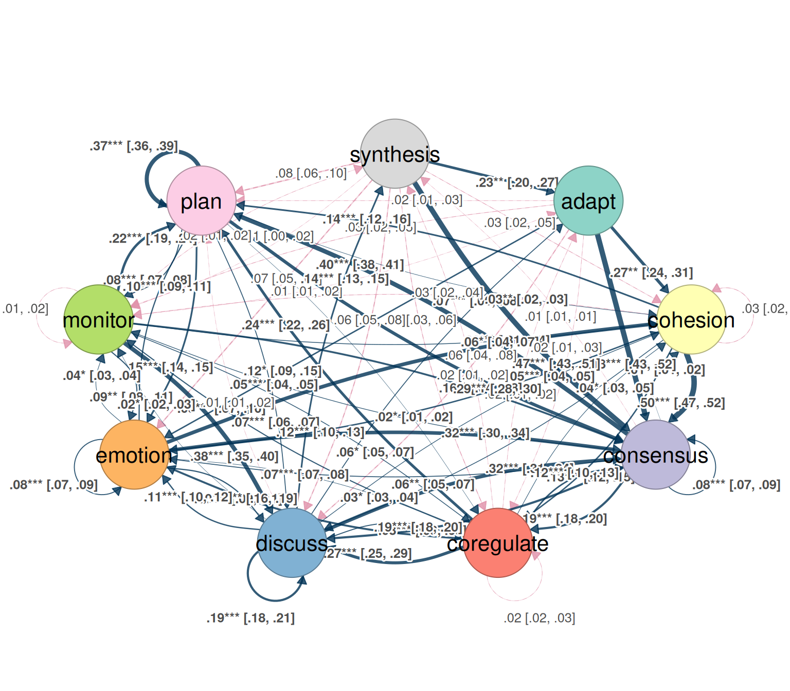

Figure 8: Bootstrap weights with 95% CI bounds on each edge label

> **[`splot()`](https://sonsoles.me/cograph/reference/splot.html)
> display modes for `net_bootstrap`**
>
> | `display` | Description |
> |----|----|
> | `"styled"` (default) | Significant = solid blue, non-significant = dashed grey |
> | `"significant"` | Only significant edges |
> | `"full"` | All edges, uniform styling |
>
> Additional parameters: `show_stars`, `show_ci`, `inherit_style`.

### 4.6 Forest plots

Forest plots provide a complementary view of bootstrap results, showing
the point estimate and confidence interval for every edge. Three layouts
are available:

``` r

plot_bootstrap_forest(boot, show_ci = TRUE)
```

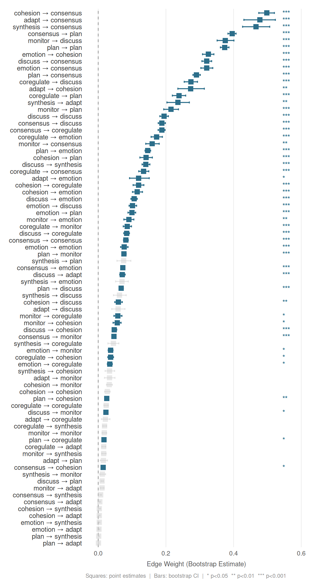

Figure 9: Bootstrap forest plot — default linear layout

``` r

plot_bootstrap_forest(boot, show_ci = TRUE, layout = "circular")
```

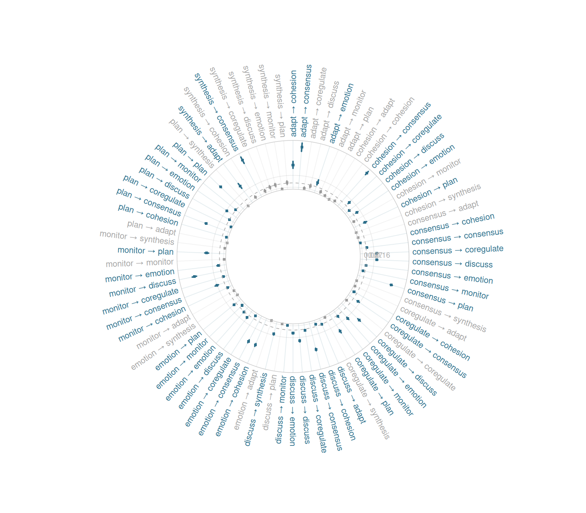

Figure 10: Bootstrap forest plot — circular layout

``` r

plot_bootstrap_forest(boot, show_ci = TRUE, layout = "grouped", scale = 0.55)
```

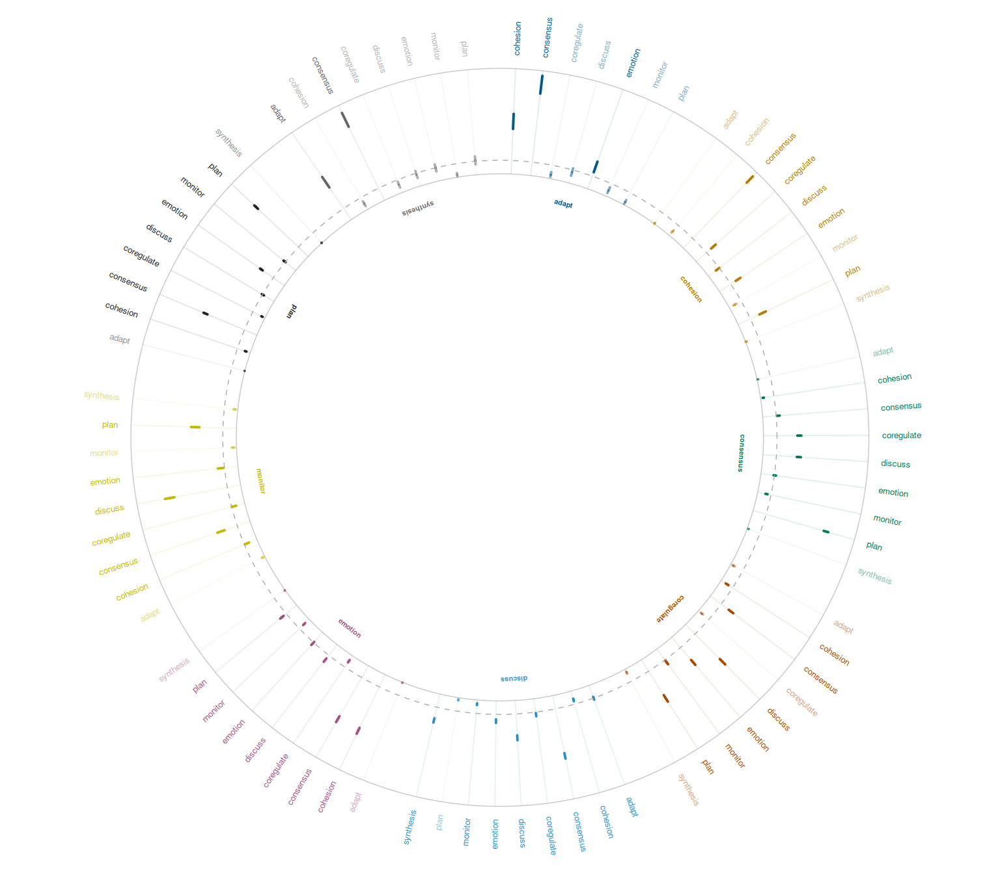

Figure 11: Bootstrap forest plot — grouped by source node

------------------------------------------------------------------------

## 5 Centrality Stability

Bootstrap alone tells us which edges are stable. To assess whether
centrality rankings are robust, we need the case-dropping procedure from
Epskamp et al. (2018): progressively remove increasing fractions of
cases, recompute centrality, and correlate with the original ranking.
The CS-coefficient is the maximum proportion of cases that can be
dropped while maintaining a correlation above 0.7 in at least 95% of
bootstrap samples.

``` r

set.seed(265)
cs <- centrality_stability(net, iter = 500)
cs
```

    Centrality Stability (500 iterations, threshold = 0.7)
      Drop proportions: 0.1, 0.2, 0.3, 0.4, 0.5, 0.6, 0.7, 0.8, 0.9

      CS-coefficients:
        InStrength       0.90
        OutStrength      0.90
        Betweenness      0.90

``` r

splot(cs)
```

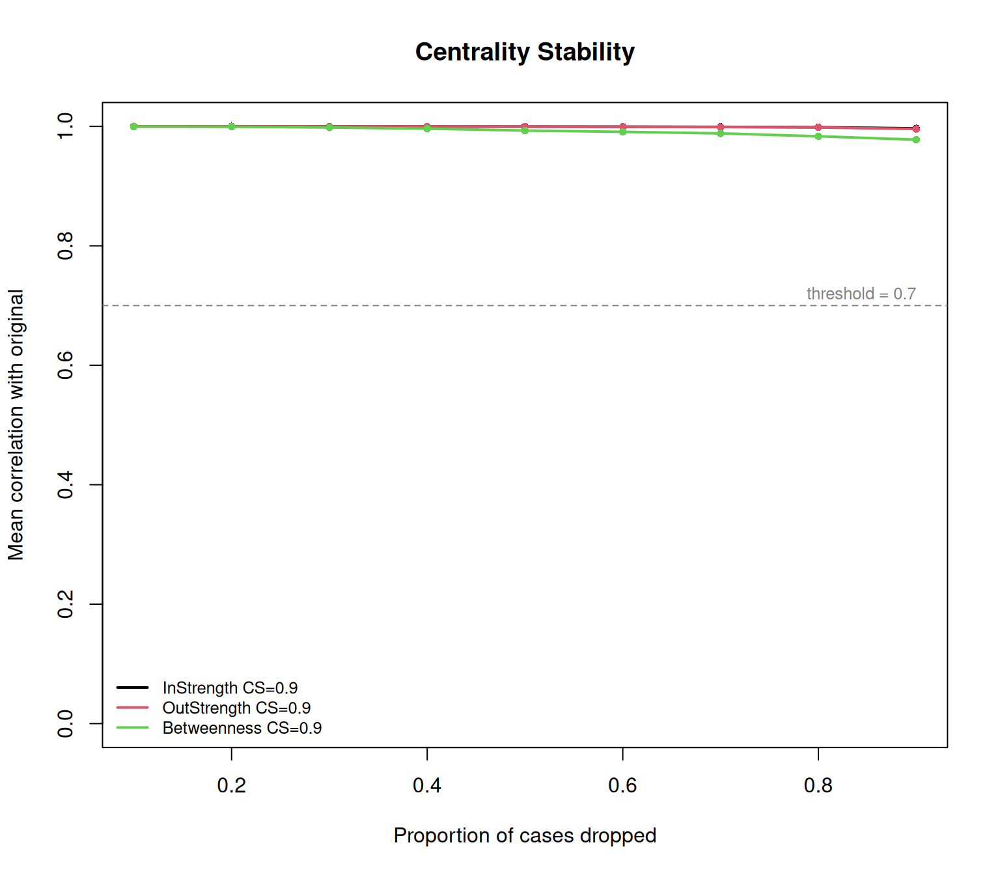

Figure 12: Centrality stability — correlation with original ranking as
cases are dropped

A CS-coefficient above 0.5 is generally considered acceptable; above 0.7
is good (Epskamp et al., 2018). The horizontal dashed line marks the 0.7
threshold.

------------------------------------------------------------------------

## 6 Group Networks

### 6.1 Building group networks

Pass `group =` to
[`build_network()`](https://pak.dynasite.org/Nestimate/reference/build_network.md)
and it estimates a separate network per group level, returning a
`netobject_group`.
[`splot()`](https://sonsoles.me/cograph/reference/splot.html) dispatches
to
[`plot_netobject_group()`](https://sonsoles.me/cograph/reference/plot_netobject_group.html)
and renders all groups in an automatic grid.

``` r

grp_net <- build_network(
  group_regulation_long, method = "relative",
  action = "Action", actor = "Actor", time = "Time",
  group = "Achiever"
)
names(grp_net)
```

    [1] "High" "Low" 

``` r

splot(grp_net)
```

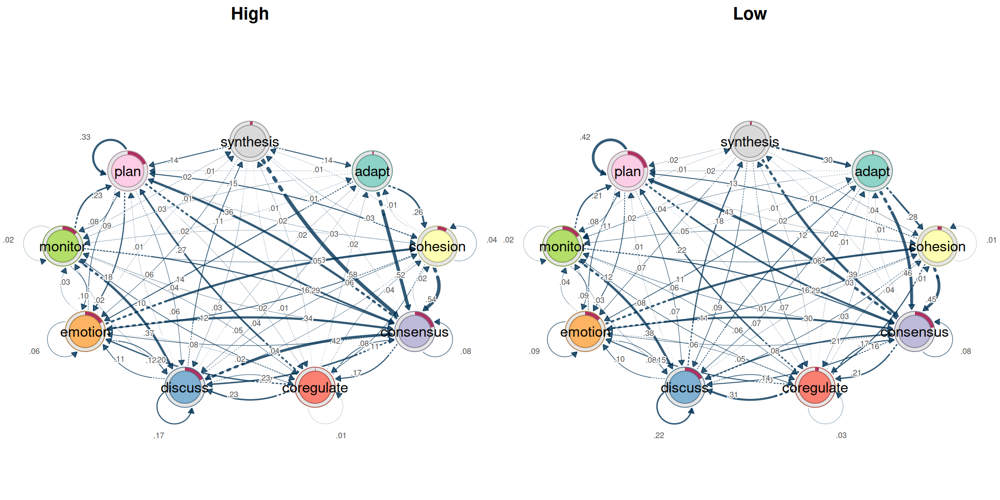

Figure 13: High vs. Low achievers — side-by-side on a common weight
scale

`common_scale = TRUE` (default) ensures both panels use the same maximum
weight, so edge widths are directly comparable. Turn it off when you
want each panel to use its own scale:

``` r

splot(grp_net, common_scale = FALSE, title_prefix = "Achievers: ")
```

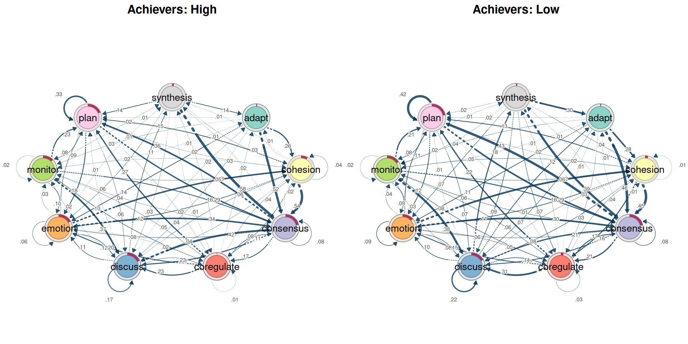

Figure 14: Each group on its own weight scale — emphasises internal
structure

### 6.2 Group bootstrap

Bootstrapping works on grouped networks.
[`bootstrap_network()`](https://pak.dynasite.org/Nestimate/reference/bootstrap_network.md)
applied to a `netobject_group` returns a `net_bootstrap_group` — one
bootstrap result per group, rendered in a multi-panel grid.

``` r

set.seed(265)
gboot <- bootstrap_network(grp_net, iter = 500)
```

``` r

splot(gboot)
```

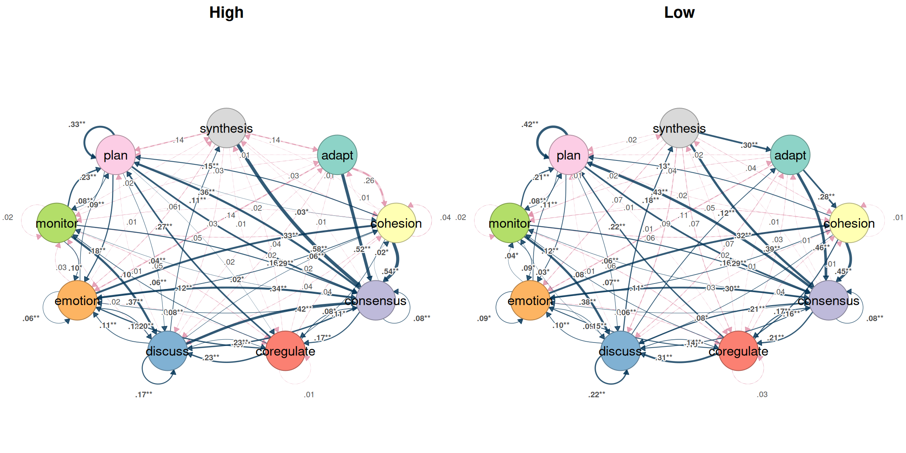

Figure 15: Group-level bootstrap — original networks per cluster

------------------------------------------------------------------------

## 7 Permutation Testing

### 7.1 Pairwise comparison

[`permutation()`](https://pak.dynasite.org/Nestimate/reference/permutation.md)
tests whether each edge differs significantly between two networks by
comparing the observed difference to a permutation null distribution.
Green edges indicate the first group is stronger; red edges indicate the
second group is stronger.

``` r

set.seed(265)
perm <- permutation(grp_net$High, grp_net$Low, iter = 1000)
perm
```

    Permutation Test: Transition Network (relative probabilities) [directed]
      Iterations: 1000  |  Alpha: 0.05
      Nodes: 9  |  Edges tested: 78  |  Significant: 42
      Global test (networks differ overall?): M = 2.612 (p = 0.000999)  |  S = 0.210 (p = 0.000999)

``` r

splot(perm)
```

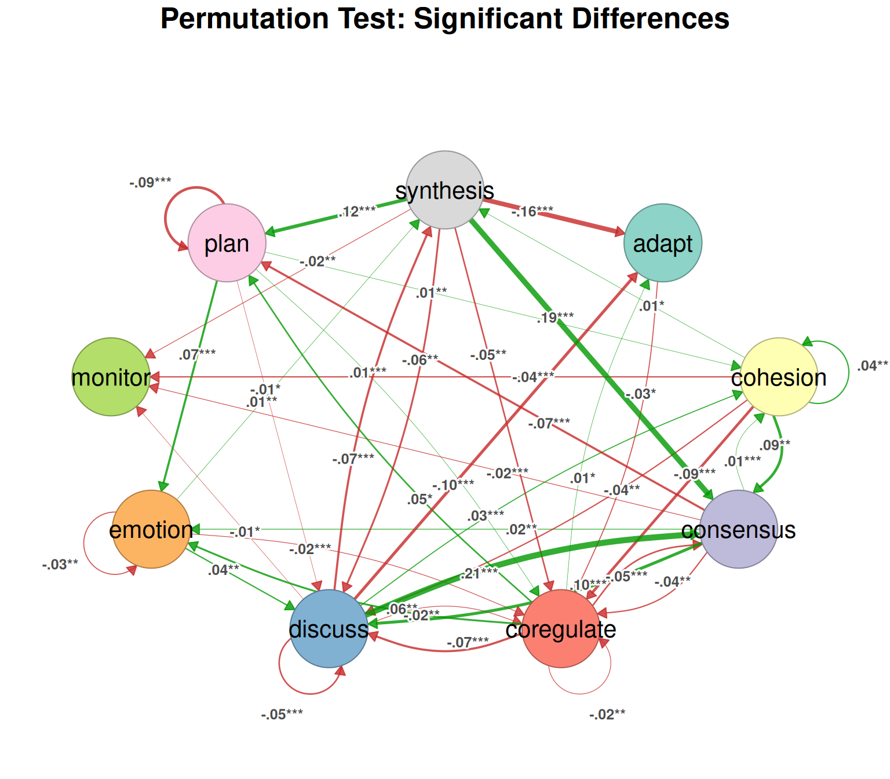

Figure 16: Permutation test — green = High \> Low, red = Low \> High (p
\< 0.05)

### 7.2 Show non-significant edges

``` r

splot(perm, show_nonsig = TRUE)
```

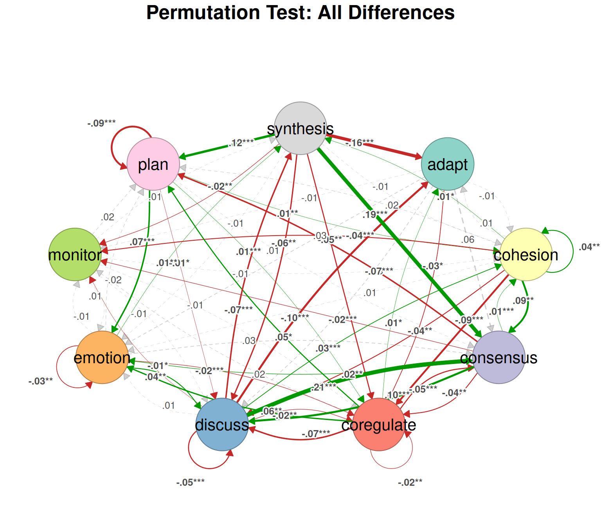

Figure 17: All edges — coloured solid = significant, dashed grey =
non-significant

### 7.3 With significance stars and effect sizes

``` r

splot(perm, show_stars = TRUE, show_effect = TRUE)
```

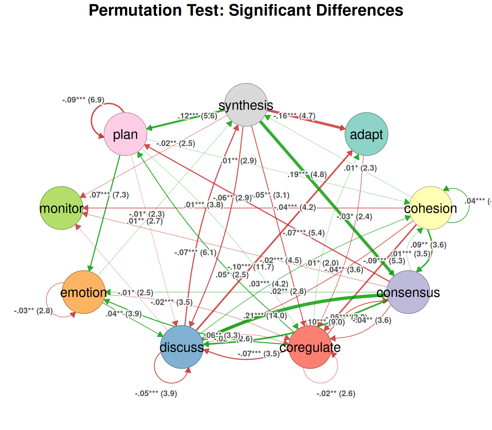

Figure 18: Permutation test with stars and effect sizes (Cohen’s d in
parentheses)

> **[`splot()`](https://sonsoles.me/cograph/reference/splot.html)
> parameters for `net_permutation`**
>
> | Parameter             | Default     | Description                           |
> |-----------------------|-------------|---------------------------------------|
> | `show_nonsig`         | `FALSE`     | Show non-significant edges            |
> | `edge_positive_color` | `"#009900"` | Color when group 1 \> group 2         |
> | `edge_negative_color` | `"#C62828"` | Color when group 2 \> group 1         |
> | `show_stars`          | `TRUE`      | Significance stars (\*, \*\*, \*\*\*) |
> | `show_effect`         | `FALSE`     | Effect size in parentheses            |

### 7.4 Group-level permutation

When applied to a `netobject_group`,
[`permutation()`](https://pak.dynasite.org/Nestimate/reference/permutation.md)
runs all pairwise comparisons and returns a `net_permutation_group`.
[`splot()`](https://sonsoles.me/cograph/reference/splot.html) renders
each comparison in a grid.

``` r

set.seed(265)
gperm <- permutation(grp_net, iter = 1000)
```

``` r

splot(gperm)
```

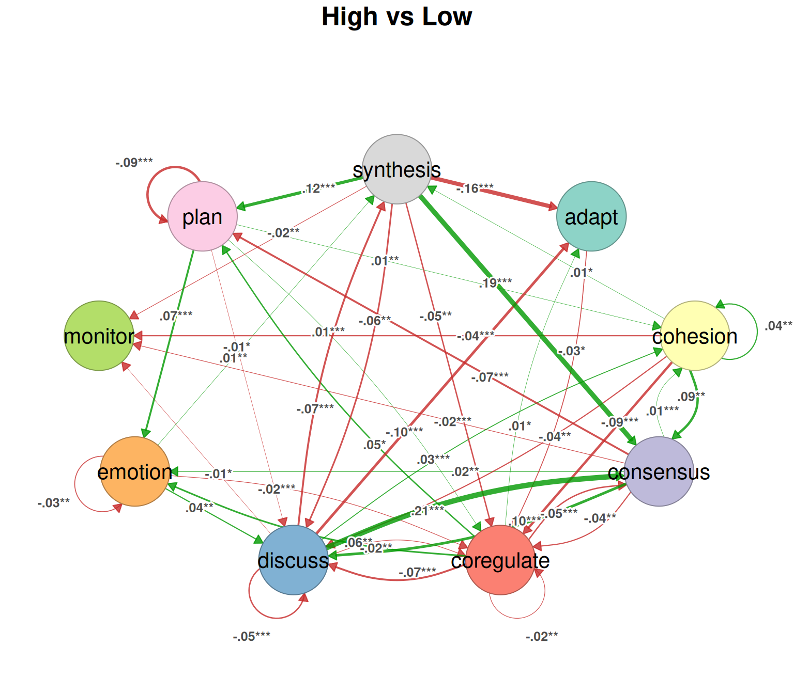

Figure 19: Group-level permutation test — all pairwise comparisons

------------------------------------------------------------------------

## 8 Multi-Cluster Multi-Level Analysis (MCML)

A common analytical question is: given a network of individual states
(nodes), can we group them into meaningful clusters and study how these
clusters interact? The MCML (Multi-Cluster Multi-Level) pipeline does
exactly this. It aggregates a node-level network into a cluster-level
summary, producing both a macro-level view (cluster-to-cluster
transitions) and per-cluster detail networks (within-cluster structure).

There are several ways to build an MCML analysis, depending on whether
you start from a pre-built network or from raw data, and whether you
define clusters manually or discover them algorithmically.

### 8.1 Approach 1: Theory-driven clusters from a network

When domain knowledge dictates the grouping, define clusters as a named
list of node labels and pass them to
[`csum()`](https://sonsoles.me/cograph/reference/csum.html). For
collaborative regulation, we can distinguish regulatory behaviors
(monitoring, planning, coregulating, adapting) from social-communicative
behaviors (cohesion, consensus, discussion, emotion, synthesis):

``` r

clusters <- list(
  Regulatory = c("monitor", "plan", "coregulate", "adapt"),
  Social     = c("cohesion", "consensus", "discuss", "emotion", "synthesis")
)

mcml_theory <- csum(net, clusters, type = "tna")
mcml_theory
```

    Cluster Summary
    ---------------
    Type: tna
    Method: sum
    Clusters: 2
    Nodes: 9
    Cluster sizes: 4, 5

    Macro (cluster-level) weights (2x2):
      Inits: 0.318, 0.682
               Regulatory Social
    Regulatory      0.302  0.698
    Social          0.332  0.668

    Per-cluster weights:
      Regulatory (4 nodes)
      Social (5 nodes)

[`splot()`](https://sonsoles.me/cograph/reference/splot.html) dispatches
the `mcml` object to
[`plot_mcml()`](https://sonsoles.me/cograph/reference/plot_mcml.html),
rendering a two-layer visualization: the bottom layer shows
within-cluster detail networks, the top layer shows the macro
(cluster-to-cluster) summary.

``` r

splot(mcml_theory)
```

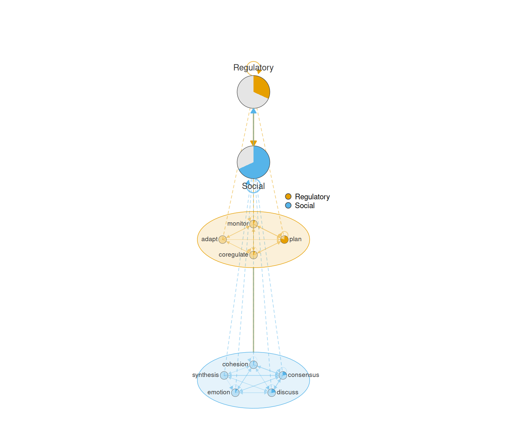

Figure 20: MCML — theory-driven two-cluster partition (Regulatory
vs. Social)

### 8.2 Approach 2: Theory-driven clusters from a network object

[`summarize_clusters()`](https://sonsoles.me/cograph/reference/summarize_clusters.html)
provides the same result through a slightly different interface. When
given a `netobject`, it uses the pre-computed weight matrix:

``` r

mcml_built <- summarize_clusters(net, clusters, type = "tna")
splot(mcml_built)
```

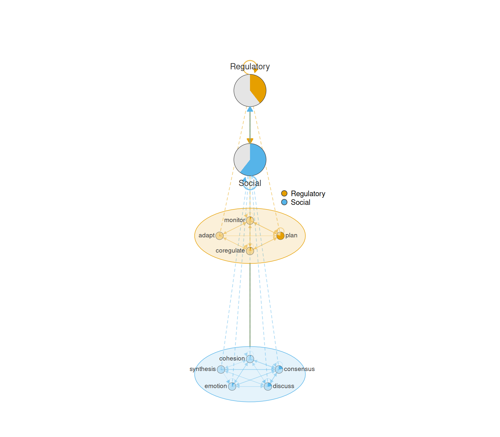

### 8.3 Converting MCML to individual network objects

[`as_tna()`](https://pak.dynasite.org/Nestimate/reference/as_tna.md)
converts an MCML result into a `netobject_group` — a named list
containing the macro network and each per-cluster network as individual
`netobject` objects. This is useful when you want to analyze each
cluster’s network independently (e.g., compute centrality, run
bootstrap) or pass them to other functions.

``` r

tna_models <- as_tna(mcml_theory)
names(tna_models)
```

    [1] "macro"      "Regulatory" "Social"    

``` r

splot(tna_models)
```

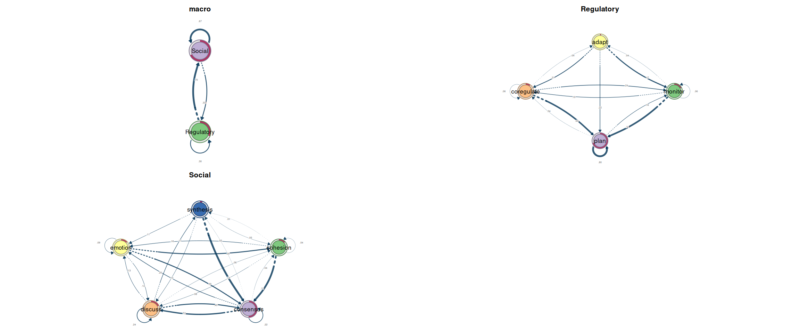

Figure 21: MCML converted to individual networks — macro + per-cluster
panels

### 8.4 Summarize to a cluster-level network

[`summarize_network()`](https://sonsoles.me/cograph/reference/summarize_network.html)
from cograph takes a different approach: instead of a two-layer MCML
visualization, it collapses the node-level network into a single
cluster-level `cograph_network` where each cluster becomes one node.
This is useful when you only need the macro view.

``` r

summary_net <- summarize_network(net, clusters)
summary_net
```

    Cograph network: 2 nodes, 4 edges ( directed )
    Source: matrix
      Nodes (2): Regulatory, Social
      Edges: 2 / 2 (density: 100.0%)
      Weights: [1.660, 2.794]  |  mean: 2.227
      Strongest edges:
        Regulatory -> Social  2.794
        Social -> Regulatory  1.660
      Self-loops: 2  |  range: [1.206, 3.340]
    Layout: none
      Use as.data.frame() for the edge table, as.data.frame(what = "nodes") for the nodes.

``` r

splot(summary_net, node_size = 15, edge_labels = TRUE)
```

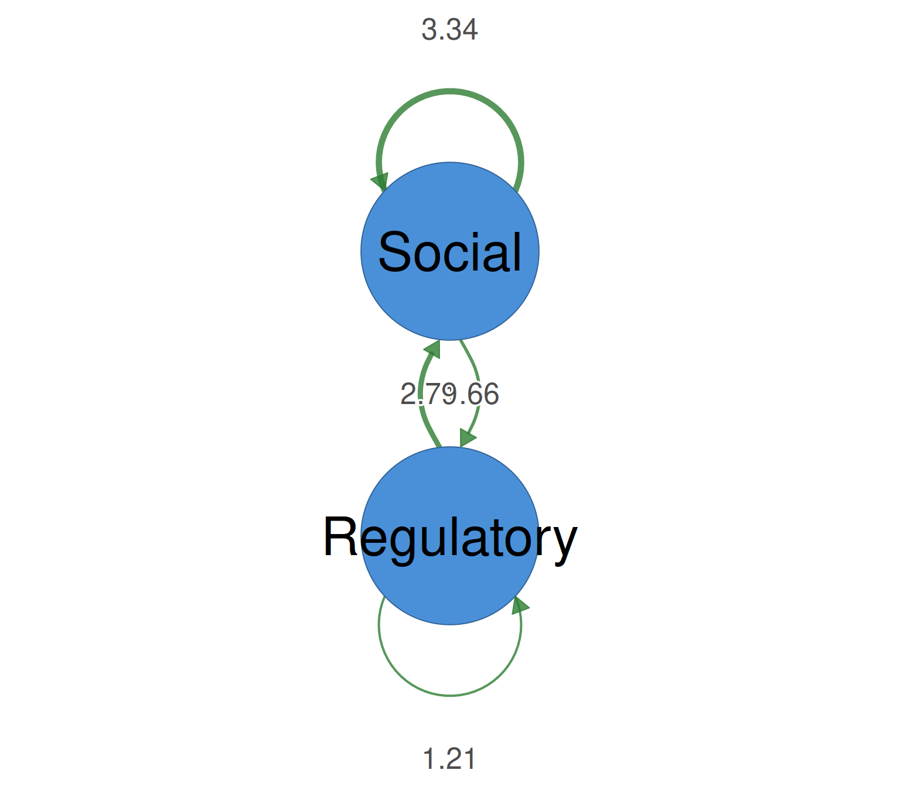

Figure 22: Cluster-level summary network — one node per cluster,
aggregated edge weights

> **MCML approaches summary**
>
> | Approach | Function | Input | Output | Use when |
> |----|----|----|----|----|
> | Theory-driven | `csum(net, clusters)` | netobject + named list | `mcml` | You know the grouping |
> | Theory-driven | `summarize_clusters(net, clusters)` | netobject + named list | `mcml` | Same, alternative API |
> | Data-driven | `cluster_network(data, k)` | raw data + k | `netobject_group` | Exploratory clustering |
> | Convert | `as_tna(mcml)` | mcml object | `netobject_group` | Per-cluster analysis |
> | Collapse | `summarize_network(net, clusters)` | netobject + clusters | `cograph_network` | Macro-only view |

------------------------------------------------------------------------

## 9 The Complete Dispatch Chain

Every Nestimate object routes through
[`splot()`](https://sonsoles.me/cograph/reference/splot.html)
automatically. The following table summarizes all supported object
classes:

| Nestimate class | Producer | [`splot()`](https://sonsoles.me/cograph/reference/splot.html) renders |
|----|----|----|
| `netobject` | [`build_network()`](https://pak.dynasite.org/Nestimate/reference/build_network.md) | Standard network plot |
| `net_bootstrap` | [`bootstrap_network()`](https://pak.dynasite.org/Nestimate/reference/bootstrap_network.md) | Stability-styled network |
| `net_permutation` | `permutation(x, y)` | Coloured difference network |
| `boot_glasso` | [`boot_glasso()`](https://pak.dynasite.org/Nestimate/reference/boot_glasso.md) | Regularized network with stability |
| `netobject_group` | `build_network(group=)` | Multi-panel grid |
| `net_bootstrap_group` | `bootstrap_network(group)` | Multi-panel bootstrap |
| `net_permutation_group` | `permutation(group)` | Multi-panel comparisons |
| `mcml` | [`csum()`](https://sonsoles.me/cograph/reference/csum.html) / [`summarize_clusters()`](https://sonsoles.me/cograph/reference/summarize_clusters.html) | Two-layer MCML plot |
| `net_stability` | [`centrality_stability()`](https://pak.dynasite.org/Nestimate/reference/centrality_stability.md) | Stability drop-off curve |

Each dispatcher respects all standard
[`splot()`](https://sonsoles.me/cograph/reference/splot.html) arguments
(`layout`, `node_fill`, `edge_color`, `title`, `minimum`, `threshold`,
etc.), so the same customization API works everywhere.

------------------------------------------------------------------------

## 10 References

Epskamp, S., Borsboom, D., & Fried, E. I. (2018). Estimating
psychological networks and their accuracy: A tutorial paper. *Behavior
Research Methods*, 50(1), 195–212.

------------------------------------------------------------------------

``` r

sessionInfo()
```

    R version 4.6.1 (2026-06-24)
    Platform: x86_64-pc-linux-gnu
    Running under: Ubuntu 24.04.5 LTS

    Matrix products: default
    BLAS:   /usr/lib/x86_64-linux-gnu/openblas-pthread/libblas.so.3
    LAPACK: /usr/lib/x86_64-linux-gnu/openblas-pthread/libopenblasp-r0.3.26.so;  LAPACK version 3.12.0

    locale:
     [1] LC_CTYPE=C.UTF-8       LC_NUMERIC=C           LC_TIME=C.UTF-8
     [4] LC_COLLATE=C.UTF-8     LC_MONETARY=C.UTF-8    LC_MESSAGES=C.UTF-8
     [7] LC_PAPER=C.UTF-8       LC_NAME=C              LC_ADDRESS=C
    [10] LC_TELEPHONE=C         LC_MEASUREMENT=C.UTF-8 LC_IDENTIFICATION=C

    time zone: UTC
    tzcode source: system (glibc)

    attached base packages:
    [1] stats     graphics  grDevices utils     datasets  methods   base

    other attached packages:
    [1] cograph_2.7.3    Nestimate_0.9.24

    loaded via a namespace (and not attached):
     [1] vctrs_0.7.3         cli_3.6.6           knitr_1.52
     [4] rlang_1.3.0         xfun_0.61           otel_0.2.0
     [7] generics_0.1.4      S7_0.2.2            data.table_1.18.6.1
    [10] jsonlite_2.0.0      labeling_0.4.3      glue_1.8.1
    [13] htmltools_0.5.9     scales_1.4.0        rmarkdown_2.32
    [16] grid_4.6.1          tibble_3.3.1        evaluate_1.0.5
    [19] fastmap_1.2.0       yaml_2.3.12         lifecycle_1.0.5
    [22] compiler_4.6.1      igraph_2.3.4        dplyr_1.2.1
    [25] RColorBrewer_1.1-3  pkgconfig_2.0.3     farver_2.1.2
    [28] digest_0.6.39       R6_2.6.1            tna_1.3.1
    [31] tidyselect_1.2.1    parallel_4.6.1      pillar_1.11.1
    [34] magrittr_2.0.5      withr_3.0.3         tools_4.6.1
    [37] gtable_0.3.6        ggplot2_4.0.3      
