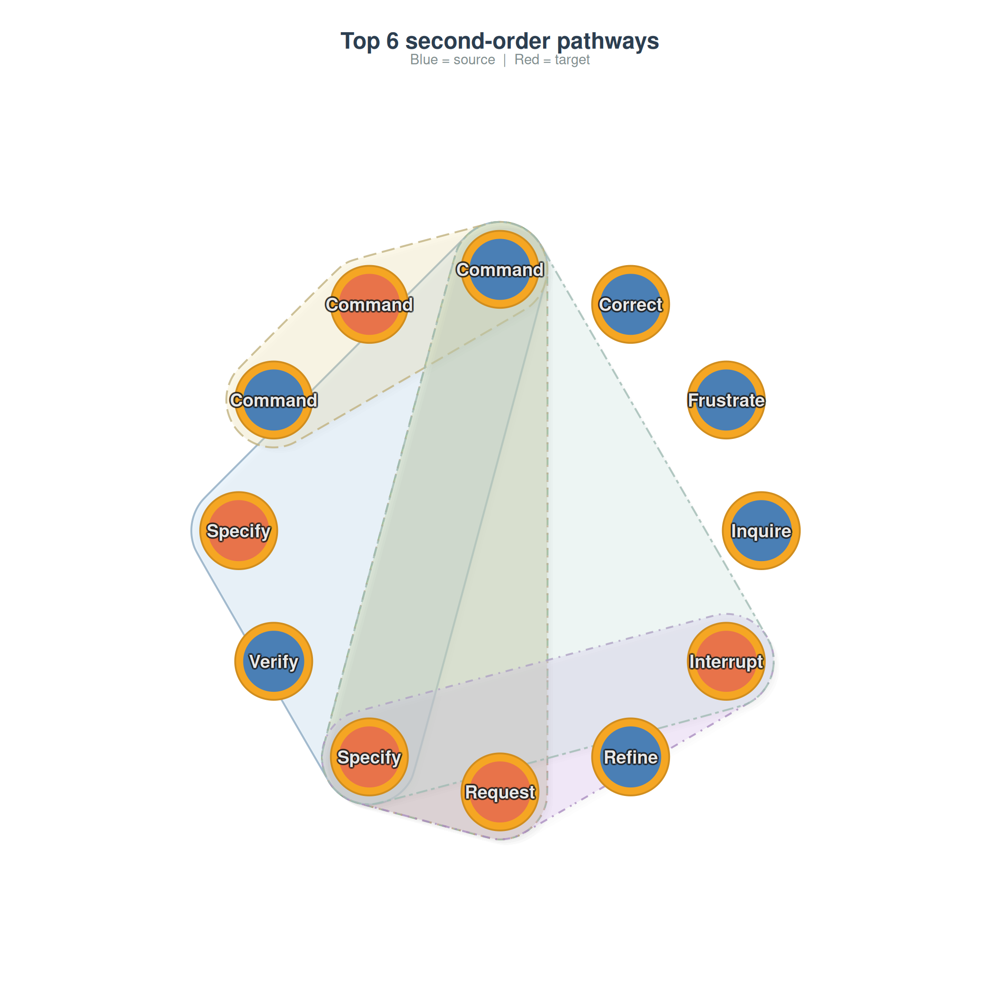
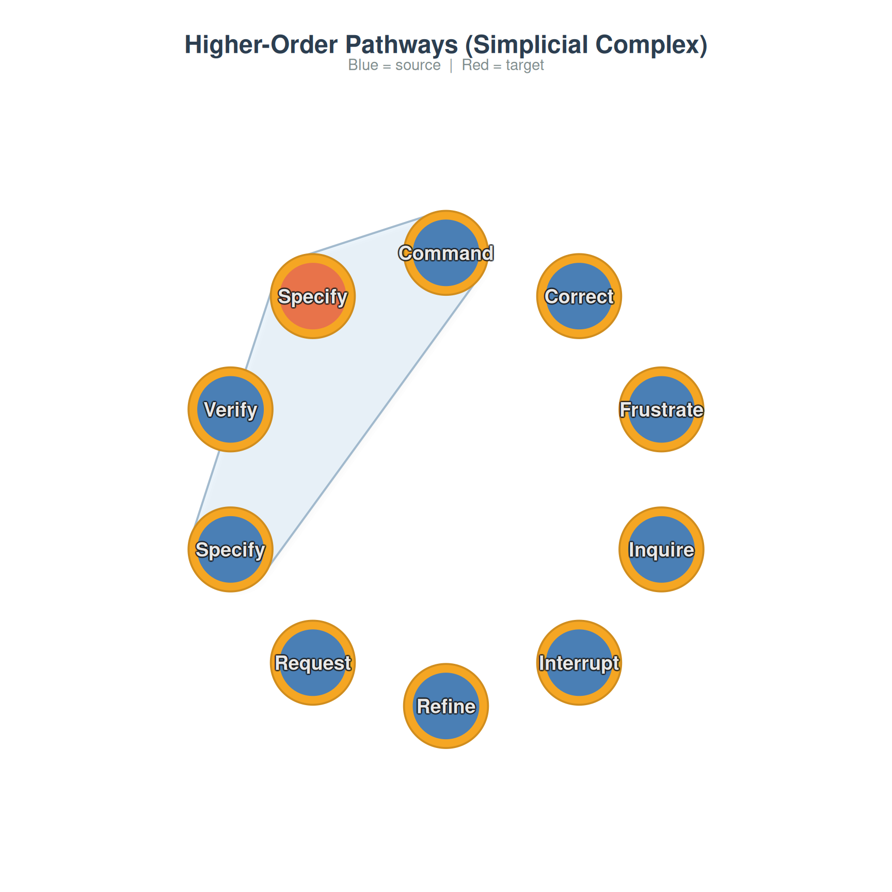
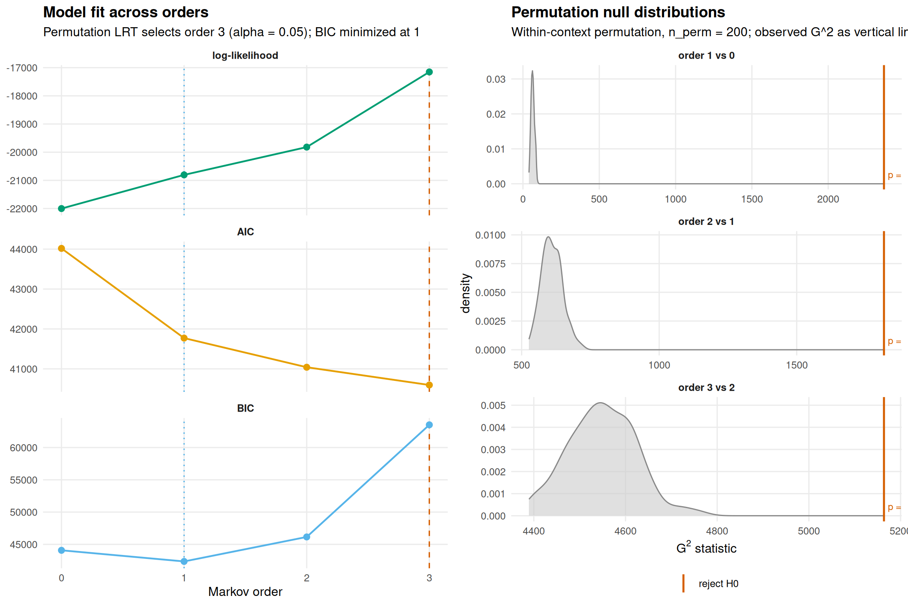
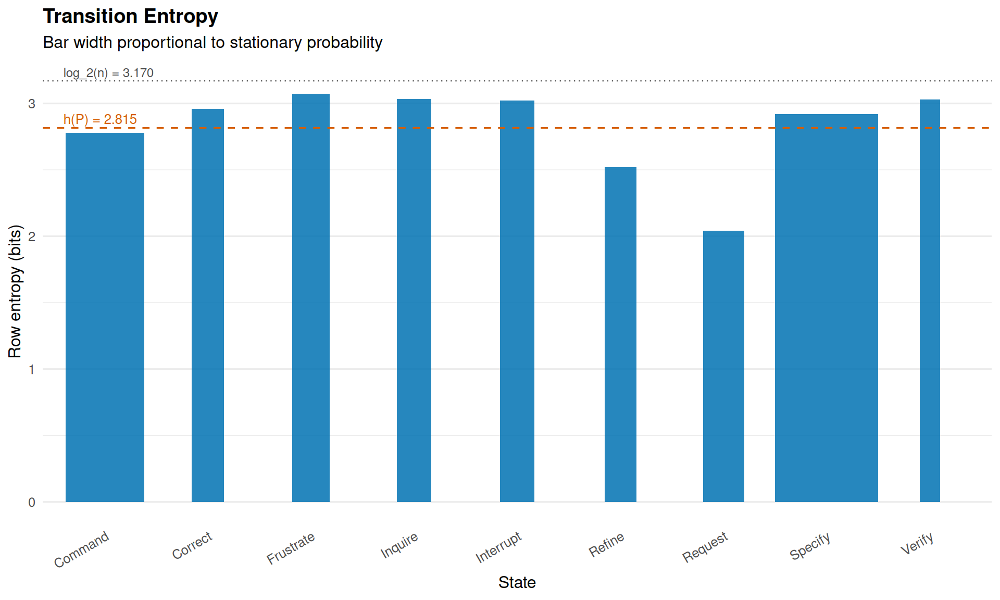

# Higher-Order Network Analysis with Simplicial Complexes

## Introduction

When we analyze sequential data as a network — who follows whom, which
state leads to which — we typically build a **first-order Markov
model**: the probability of the next state depends only on the current
state. This is the foundation of Transition Network Analysis (TNA).

But human behavior is not always memoryless. Consider two programmers
working with an AI coding assistant:

- Programmer A: *Specify → Request → Specify → Request* (a steady
  back-and-forth)
- Programmer B: *Frustrate → Specify → Request → Command* (escalating
  from frustration to direct commands)

In a first-order model, both sequences contribute equally to the
*Specify → Request* transition. But the **context** — what came before —
matters. The sequence *Frustrate → Specify* may lead to very different
next actions than *Request → Specify*. These are **higher-order
dependencies**: cases where the past two (or more) states jointly
predict the future better than the current state alone.

This tutorial introduces a complete pipeline for detecting, quantifying,
and visualizing higher-order structure in sequential data. We progress
from standard transition networks through statistical order detection,
pathway analysis, and into the topology of higher-order interactions
using simplicial complexes.

### What you will learn

1.  Test whether your data has higher-order dependencies (and at what
    order)
2.  Identify which specific pathways deviate from first-order
    expectations
3.  Detect anomalously frequent or rare behavioral sequences
4.  Compute topological invariants (Betti numbers, Euler characteristic)
5.  Track how network topology changes across thresholds (persistent
    homology)
6.  Visualize higher-order pathways as simplicial blob diagrams
7.  Compare higher-order structure across groups

### Packages

``` r

library(Nestimate)
library(cograph)

# Guard cograph::plot_simplicial() against grDevices::chull() failing on
# degenerate pathway clouds (collinear / single-point), which the CRAN
# cograph (2.1.1) hits but the dev build (>= 2.3.5) fixes in .smooth_blob().
# Shadow the function in the knit env so all call sites fall back to
# splot() with a warning rather than aborting the render. Package code is
# unaffected (scope is this vignette's knit environment only).
plot_simplicial <- function(...) {
  args <- list(...)
  tryCatch(do.call(cograph::plot_simplicial, args),
           error = function(e) {
             warning("plot_simplicial fell back to splot(): ",
                     conditionMessage(e), call. = FALSE)
             splot(args[[1]])
           })
}
```

**cograph** provides the simplicial visualization
([`plot_simplicial()`](https://sonsoles.me/cograph/reference/plot_simplicial.html)).
**Nestimate** provides the higher-order network construction
(`build_hon`, `build_hypa`, `build_mogen`) and simplicial complex
analysis (`build_simplicial`, `betti_numbers`, `persistent_homology`,
`q_analysis`).

## Building the Network

We use a dataset of human–AI pair programming sessions where a
researcher coded each human action into 9 behavioral categories:
Request, Specify, Command, Correct, Refine, Verify, Inquire, Interrupt,
and Frustrate.

``` r

data("human_long", package = "Nestimate")

net <- build_network(human_long, method = "relative",
                     action = "code", actor = "session_id",
                     time = "timestamp")
net
```

    Transition Network (relative probabilities) [directed]
      Weights: [0.018, 0.620]  |  mean: 0.111

      Weight matrix:
                Command Correct Frustrate Inquire Interrupt Refine Request Specify
      Command     0.235   0.088     0.055   0.066     0.035  0.038   0.155   0.280
      Correct     0.093   0.091     0.138   0.057     0.054  0.112   0.120   0.278
      Frustrate   0.103   0.115     0.176   0.075     0.047  0.171   0.111   0.125
      Inquire     0.196   0.126     0.098   0.188     0.094  0.062   0.084   0.106
      Interrupt   0.259   0.081     0.094   0.123     0.102  0.080   0.069   0.122
      Refine      0.058   0.075     0.072   0.047     0.042  0.086   0.146   0.457
      Request     0.096   0.019     0.044   0.067     0.051  0.033   0.039   0.620
      Specify     0.263   0.058     0.081   0.072     0.167  0.074   0.070   0.172
      Verify      0.224   0.079     0.164   0.118     0.043  0.097   0.116   0.083
                Verify
      Command    0.048
      Correct    0.056
      Frustrate  0.077
      Inquire    0.044
      Interrupt  0.069
      Refine     0.018
      Request    0.032
      Specify    0.043
      Verify     0.077

      Initial probabilities:
      Specify       0.679  ████████████████████████████████████████
      Command       0.175  ██████████
      Request       0.055  ███
      Interrupt     0.030  ██
      Correct       0.019  █
      Refine        0.019  █
      Frustrate     0.013  █
      Inquire       0.008
      Verify        0.002  

``` r

splot(net, minimum = 0.05, title = "Human Actions in AI-Assisted Coding")
```


Several patterns stand out: **Specify** is the hub — most actions lead
to and from it. Self-loops on Specify and Command indicate persistence.
The **Request → Specify → Command** backbone reflects the natural
workflow. But this first-order view might be hiding important patterns.
Does it matter *how* someone arrived at Specify?

## Is First-Order Enough? Multi-Order Model Selection

Before investing in higher-order analysis, we should answer: **does
sequential memory actually matter?** The Multi-Order Generative Model
(MOGen; Scholtes 2017) fits Markov models at increasing orders and
compares them using information criteria. Higher-order models fit better
but have exponentially more parameters — AIC and BIC find the best
tradeoff.

``` r

mg <- build_mogen(net, max_order = 4)
summary(mg)
```

    Multi-Order Generative Model (MOGen) Summary

      States: Command, Correct, Frustrate, Inquire, Interrupt, Refine, Request, Specify, Verify
      Paths: 508 | Observations: 10778
      Best by AIC: order 4  |  Best by BIC: order 1
      Selected:    order 4 (by aic)

            order layer_dof cum_dof    loglik      aic      bic best selected
    order_0     0         8       8 -22001.20 44018.40 44076.68
    order_1     1        72      80 -20805.61 41771.23 42354.05  BIC
    order_2     2       621     701 -19819.55 41041.10 46148.07
    order_3     3      2445    3146 -17152.10 40596.20 63515.63
    order_4     4      2990    6136 -11469.73 35211.46 79913.83  AIC      <--

``` r

plot(mg)
```


The plot traces AIC and BIC as functions of the Markov order. Because
higher-order models always fit better in terms of raw log-likelihood
(their parameter space contains the lower-order one), the meaningful
comparison is between fit and complexity. AIC penalises each parameter
by 2; BIC penalises by `log(n)`, which for this dataset is much larger
than 2 — so BIC favors small orders much more aggressively than AIC.

### Interpreting the results

- **Order 0**: Actions are independent — no sequential structure.
- **Order 1**: The standard Markov model is sufficient.
- **Order 2+**: Higher-order dependencies exist. A first-order TNA would
  miss them.

Even when order 1 is globally optimal (by BIC), *specific pathways* may
still exhibit higher-order behavior — the global model averages over all
states. The HON analysis below detects these local patterns. The next
section adds a complementary, principled hypothesis test that often
reveals signal BIC is too parsimonious to flag.

### Second-order transition matrix

[`mogen_transitions()`](https://saqr.me/Nestimate/reference/mogen_transitions.md)
extracts the transitions at a given order, showing which two-step
contexts lead to different outcomes:

``` r

mt <- mogen_transitions(mg, order = 2)
mt[1:8, ]
```

                                 path count probability               from
    1   Specify -> Command -> Specify   281      0.3914 Specify -> Command
    2   Command -> Request -> Specify   228      0.7782 Command -> Request
    3   Specify -> Command -> Request   198      0.2758 Specify -> Command
    4 Request -> Specify -> Interrupt   187      0.3264 Request -> Specify
    5   Command -> Command -> Command   163      0.3800 Command -> Command
    6 Command -> Specify -> Interrupt   148      0.2792 Command -> Specify
    7   Specify -> Request -> Specify   124      0.6526 Specify -> Request
    8    Specify -> Refine -> Specify   122      0.6010  Specify -> Refine
             to
    1   Specify
    2   Specify
    3   Request
    4 Interrupt
    5   Command
    6 Interrupt
    7   Specify
    8   Specify

Each row is a second-order pathway. The `from` column is the two-state
context, `to` is the predicted next state, `count` is the empirical
frequency, and `probability` is the conditional `P(to | from)`. A high
count combined with a high probability is a *predictive* context:
knowing the previous two states pins down the next one. A high count
with low probability is a *common but ambiguous* context — frequent in
the data, but its successor distribution is spread out.

[`plot_simplicial()`](https://sonsoles.me/cograph/reference/plot_simplicial.html)
accepts the
[`mogen_transitions()`](https://saqr.me/Nestimate/reference/mogen_transitions.md)
data.frame directly. It takes the top pathways by count and renders each
as a smooth blob over a shared circular layout, with the path’s
intermediate states in blue and the target state in red. Repeated states
(like `Specify -> Command -> Specify`) get distinct positions so the
blob covers three visually distinct nodes rather than collapsing to a
line.

``` r

plot_simplicial(net, pathways = mt, max_pathways = 6,
                title = "Top 6 second-order pathways")
```



To zoom in on the single most frequent pathway, set `max_pathways = 1`
and let the data.frame drive the selection. Because
[`mogen_transitions()`](https://saqr.me/Nestimate/reference/mogen_transitions.md)
returns rows already sorted by count, `max_pathways = N` always picks
the top `N`:

``` r

plot_simplicial(net, pathways = mt, max_pathways = 1)
```



### Permutation-exact Markov order test

MOGen uses information criteria. A complementary, principled approach is
the **permutation-exact LRT** in
[`markov_order_test()`](https://saqr.me/Nestimate/reference/markov_order_test.md):
at each order $`k`$, it tests $`H_0`$: “process is order $`(k-1)`$”
against $`H_1`$: “process is order $`k`$” by reframing as a
conditional-independence test on $`(k+1)`$-grams. The null distribution
is built by **shuffling successor labels within each context** — so the
test is exact under $`H_0`$, with no plug-in MLE bias from sparse
$`(k+1)`$-gram tables.

``` r

mot <- markov_order_test(net, max_order = 3, n_perm = 200, seed = 1)
mot
```

    Markov Order Test  [within-w permutation, n_perm = 200, alpha = 0.050]
      508 sequences / 10778 observations / 9 states

      Selected order  BIC: 1   AIC: 3   permutation-LRT: 3

     order    loglik      AIC      BIC   df      g2 p_permutation  p_asymptotic
         0 -22001.20 44018.40 44076.68   NA      NA            NA            NA
         1 -20805.61 41771.23 42354.05   64 2365.38   0.004975124  0.000000e+00
         2 -19819.55 41041.10 46148.07  576 1817.12   0.004975124 1.702866e-128
         3 -17152.10 40596.20 63515.63 4706 5163.79   0.004975124  2.317583e-06
     significant
              NA
            TRUE
            TRUE
            TRUE

``` r

plot(mot)
```



The output reveals a tension that is hidden by any single criterion.
**BIC** selects the smallest order (heavy parsimony penalty). **AIC**
and the **permutation LRT** both flag higher orders as significantly
better — every increase in order yields a $`G^2`$ statistic far in the
tail of the within-context permutation null. The right panel makes this
concrete: the grey density is the null $`G^2`$ distribution per order,
and the colored vertical line is the observed value. When the line sits
in the right tail, $`H_0`$ is rejected and the higher order carries
genuine information beyond the previous one.

The takeaway: sequential memory exists in this dataset. BIC penalises it
because the parameter space at order 3 is enormous (4,706 degrees of
freedom for the order-3 test alone), but the data does pay the cost.

### Per-state predictability: transition entropy

Order-selection answers a global question. **Transition entropy**
answers a per-state question: how predictable is each state’s next move?
[`transition_entropy()`](https://saqr.me/Nestimate/reference/transition_entropy.md)
computes the Shannon row-entropy `H(P[i, ]) = -sum_j P[i,j] log P[i,j]`
for every state, the chain-level entropy rate
`h(P) = sum_i pi_i H(P[i, ])` (the Shannon-McMillan-Breiman per-step
uncertainty under the stationary distribution `pi`), and the redundancy
`H(pi) - h(P)` (how much the previous state reduces uncertainty about
the next).

``` r

te <- transition_entropy(net)
te
```

    Transition Entropy (9 states, bits; ceiling = 3.170)

                              raw            normalised
      Entropy rate    h(P)  = 2.815 bits    0.888
      Stationary    H(pi)  = 2.983 bits    0.941
      Redundancy   H(pi)-h = 0.167 bits    0.056

    Normalised: h(P) and H(pi) are raw / log_2(n_states) (0 = deterministic, 1 = uniform);
      redundancy is the relative redundancy (H(pi) - h(P)) / H(pi), not raw / log_2(n_states).

``` r

plot(te)
```



Each bar is a state’s outgoing-distribution entropy in bits; the bar’s
**width is proportional to the stationary probability**, so the visual
area sums to the entropy rate `h(P)`. The dashed red line marks `h(P)`;
the dotted line marks the ceiling `log_2(n)` where every state has a
uniform outgoing distribution. States whose bar pokes near the ceiling
are unpredictable hubs (their next state is essentially random); short
bars are deterministic — once you arrive there, the next step is largely
fixed.

## Higher-Order Networks (HON)

While MOGen tells us *whether* higher-order dependencies exist on
average, the **Higher-Order Network** (HON; Xu et al. 2016) tells us
*where*. HON tests, for each state, whether adding context significantly
changes the outgoing transition distribution using KL-divergence. If the
distribution after *Request → Specify* differs from *Frustrate →
Specify*, HON creates separate nodes for these contexts.

``` r

hon <- build_hon(net)
hon
```

    Higher-Order Network (HON)
      Nodes:        977 (9 first-order states)
      Edges:        3733
      Max order:    5 (requested 5)
      Min freq:     1
      Trajectories: 508

``` r

pathways(hon, top = 10)
```

     [1] "Specify Command -> Specify"
     [2] "Command Request -> Specify"
     [3] "Specify Command -> Request"
     [4] "Request Specify -> Interrupt"
     [5] "Specify Command Request -> Specify"
     [6] "Command Command -> Command"
     [7] "Command Specify -> Interrupt"
     [8] "Command Request Specify -> Interrupt"
     [9] "Specify Command Specify -> Interrupt"
    [10] "Specify Request -> Specify"          

Out of 3733 total edges, **3652** (98%) are higher-order — transitions
where the preceding context changes the outcome. Look for pathways where
the higher-order probability differs substantially from the first-order
probability — these represent genuine contextual effects.

### Raw path frequencies

The most common 3-step sequences regardless of statistical significance:

``` r

path_counts(net, k = 3, top = 15)
```

                                  path count proportion
    1    Specify -> Command -> Specify   281     0.0288
    2    Command -> Request -> Specify   228     0.0234
    3    Specify -> Command -> Request   198     0.0203
    4  Request -> Specify -> Interrupt   187     0.0192
    5    Command -> Command -> Command   163     0.0167
    6  Command -> Specify -> Interrupt   148     0.0152
    7    Specify -> Request -> Specify   124     0.0127
    8     Specify -> Refine -> Specify   122     0.0125
    9    Specify -> Specify -> Specify   121     0.0124
    10 Specify -> Interrupt -> Command   109     0.0112
    11   Command -> Specify -> Command   106     0.0109
    12   Request -> Specify -> Specify    94     0.0096
    13   Specify -> Command -> Command    93     0.0095
    14   Command -> Specify -> Specify    76     0.0078
    15   Specify -> Specify -> Command    76     0.0078

## Path Anomaly Detection (HYPA)

HON detects *where* higher-order structure exists. **HYPA** (LaRock et
al. 2020) takes a complementary approach: it detects which specific
paths occur *significantly more or less often than expected* under a
null model.

HYPA constructs a De Bruijn graph and computes expected path frequencies
using a **multi-hypergeometric null model**: given the in- and
out-degrees of every node in the De Bruijn graph, what is the chance
distribution over path frequencies if the edges were assigned uniformly
at random subject to those degree constraints? Paths whose observed
frequency falls in the upper or lower tail of this null are flagged:

- **Over-represented** paths occur far more often than the
  degree-preserving null predicts. They represent **learned behavioural
  routines** — sequences the actors return to more reliably than their
  constituent transitions alone would suggest.
- **Under-represented** paths are *systematically avoided* — observed
  far less than chance. They reveal sequences that are pragmatically
  discouraged: cognitively redundant, socially inappropriate, or
  practically ineffective for the task at hand.

``` r

hypa <- build_hypa(net)
hypa
```

    HYPA: Path Anomaly Detection
      Order(s):     2
      Edges:        702
      Anomalous:    177 (alpha=0.05, p_adjust=BH)
        Over-repr:  133
        Under-repr: 44

``` r

plot_simplicial(hypa, dismantled = TRUE)
```


### Over-represented pathways

Top over-represented paths sorted by ratio (observed / expected):

``` r

summary(hypa, type = "over", order_by = "ratio", n = 8)
```

    HYPA Summary

      Order(s): 2 | Edges: 702
      Alpha: 0.05 | p_adjust: BH
      Anomalous: 177 (over: 133, under: 44) | order_by: ratio

      Over-represented (top 8 ):
                                    path observed  expected     ratio       p_tail
     Interrupt -> Interrupt -> Interrupt       29 2.7844871 10.414844 5.398941e-20
          Verify -> Interrupt -> Request        5 0.6879572  7.267894 7.213367e-04
        Frustrate -> Verify -> Frustrate       27 3.8139380  7.079297 1.082539e-14
          Refine -> Interrupt -> Correct        6 0.8519593  7.042590 2.547426e-04
             Verify -> Verify -> Inquire       10 1.4568505  6.864122 3.120114e-06
             Refine -> Inquire -> Refine        8 1.2069424  6.628320 3.795876e-05
     Interrupt -> Frustrate -> Interrupt       12 2.0454124  5.866788 1.679456e-06
           Verify -> Frustrate -> Verify       22 3.9821999  5.524584 3.057447e-10

      order                                path observed  expected     ratio
    1     2 Interrupt -> Interrupt -> Interrupt       29 2.7844871 10.414844
    2     2      Verify -> Interrupt -> Request        5 0.6879572  7.267894
    3     2    Frustrate -> Verify -> Frustrate       27 3.8139380  7.079297
    4     2      Refine -> Interrupt -> Correct        6 0.8519593  7.042590
    5     2         Verify -> Verify -> Inquire       10 1.4568505  6.864122
    6     2         Refine -> Inquire -> Refine        8 1.2069424  6.628320
    7     2 Interrupt -> Frustrate -> Interrupt       12 2.0454124  5.866788
    8     2       Verify -> Frustrate -> Verify       22 3.9821999  5.524584
            p_tail direction
    1 5.398941e-20      over
    2 7.213367e-04      over
    3 1.082539e-14      over
    4 2.547426e-04      over
    5 3.120114e-06      over
    6 3.795876e-05      over
    7 1.679456e-06      over
    8 3.057447e-10      over

In this dataset the top-ratio over-represented paths are typically
frustration cascades and inquiry-correction loops — composite routines
built from transitions that are individually unremarkable but, when
chained, occur many times more often than their degrees alone would
suggest.

`plot_simplicial(hypa, anomaly = "over", dismantled = TRUE)` renders one
panel per anomalous path so each routine is visible without overlap.
Pathways are ranked by ratio, so the most extreme over-representations
appear first:

``` r

plot_simplicial(hypa, anomaly = "over", max_pathways = 9,
                dismantled = TRUE, ncol = 3)
```


### Under-represented pathways

Paths the data actively avoids. The ratios here are typically far from
1.0 in the *other* direction: observed counts are a fraction of
expected, often with very small p-values:

``` r

summary(hypa, type = "under", order_by = "ratio", n = 8)
```

    HYPA Summary

      Order(s): 2 | Edges: 702
      Alpha: 0.05 | p_adjust: BH
      Anomalous: 177 (over: 133, under: 44) | order_by: ratio

      Under-represented (top 8 ):
                                  path observed  expected     ratio       p_tail
       Inquire -> Specify -> Interrupt        5  27.55236 0.1814726 1.677120e-07
       Frustrate -> Specify -> Command        6  30.26160 0.1982711 9.146340e-08
       Specify -> Specify -> Interrupt       34 148.58597 0.2288238 4.453897e-30
     Frustrate -> Specify -> Interrupt        9  36.40848 0.2471951 5.990496e-08
       Specify -> Command -> Interrupt        8  31.60485 0.2531257 5.922403e-07
       Frustrate -> Command -> Request        5  19.18825 0.2605761 1.313412e-04
        Refine -> Specify -> Interrupt       31 112.17749 0.2763478 7.847657e-20
           Refine -> Specify -> Verify        8  28.65139 0.2792185 5.388930e-06

      order                              path observed  expected     ratio
    1     2   Inquire -> Specify -> Interrupt        5  27.55236 0.1814726
    2     2   Frustrate -> Specify -> Command        6  30.26160 0.1982711
    3     2   Specify -> Specify -> Interrupt       34 148.58597 0.2288238
    4     2 Frustrate -> Specify -> Interrupt        9  36.40848 0.2471951
    5     2   Specify -> Command -> Interrupt        8  31.60485 0.2531257
    6     2   Frustrate -> Command -> Request        5  19.18825 0.2605761
    7     2    Refine -> Specify -> Interrupt       31 112.17749 0.2763478
    8     2       Refine -> Specify -> Verify        8  28.65139 0.2792185
            p_tail direction
    1 1.677120e-07     under
    2 9.146340e-08     under
    3 4.453897e-30     under
    4 5.990496e-08     under
    5 5.922403e-07     under
    6 1.313412e-04     under
    7 7.847657e-20     under
    8 5.388930e-06     under

Notice paths like `Specify -> Specify -> Specify -> Specify` — a
four-step run of pure specification — appear at a small fraction of
expected frequency. The transition `Specify -> Specify` exists in the
data, but stacking it four deep is something programmers actively don’t
do. The under-represented set captures these *negative* sequential
constraints.

``` r

plot_simplicial(hypa, anomaly = "under", max_pathways = 6,
                dismantled = TRUE, ncol = 3)
```


### Combined overlay

Multiple pathways on a single plot — overlapping regions indicate states
that participate in many higher-order patterns:

``` r

plot_simplicial(net, max_pathways = 6,
                title = "Top 6 Higher-Order Pathways")
```


## Higher-Order Analysis Across Groups

A powerful application is comparing higher-order structure across
conditions. We build grouped networks by cluster (Directive, Evaluative,
Metacognitive) and run HYPA on each:

``` r

grp_net <- build_network(human_long, method = "relative",
                         action = "code", actor = "session_id",
                         time = "timestamp", group = "cluster")

hypa_results <- lapply(names(grp_net), function(nm) {
  h <- build_hypa(grp_net[[nm]])
  data.frame(
    group = nm,
    total_edges = h$n_edges,
    anomalous = h$n_anomalous,
    over = h$n_over,
    under = h$n_under,
    pct_anomalous = round(100 * h$n_anomalous / h$n_edges, 1)
  )
})
do.call(rbind, hypa_results)
```

              group total_edges anomalous over under pct_anomalous
    1     Directive          27        22   11    11          81.5
    2 Metacognitive           8         7    4     3          87.5
    3    Evaluative          64        13    9     4          20.3

Groups with a higher percentage of anomalous pathways have more
higher-order structure — their sequential dynamics are less predictable
from first-order transitions alone.

``` r

par(mfrow = c(1, 2))
plot_simplicial(grp_net$Directive, max_pathways = 4,
                title = "Directive: Higher-Order Pathways")
```


``` r

plot_simplicial(grp_net$Evaluative, max_pathways = 4,
                title = "Evaluative: Higher-Order Pathways")
```


## Comparing Datasets

Higher-order analysis is particularly informative when applied to
different datasets. Here we compare the human-AI coding data with a
collaborative regulation dataset:

``` r

data("group_regulation_long", package = "Nestimate")
net_reg <- build_network(group_regulation_long, method = "relative",
                         action = "Action", actor = "Actor")

hypa_coding <- build_hypa(net)
hypa_reg <- build_hypa(net_reg)

comparison <- data.frame(
  dataset = c("Human-AI Coding", "Collaborative Regulation"),
  nodes = c(net$n_nodes, net_reg$n_nodes),
  total_paths = c(hypa_coding$n_edges, hypa_reg$n_edges),
  anomalous = c(hypa_coding$n_anomalous, hypa_reg$n_anomalous),
  over = c(hypa_coding$n_over, hypa_reg$n_over),
  under = c(hypa_coding$n_under, hypa_reg$n_under)
)
comparison
```

                       dataset nodes total_paths anomalous over under
    1          Human-AI Coding     9         702       177  133    44
    2 Collaborative Regulation     9         574       229  174    55

``` r

par(mfrow = c(1, 2))
plot_simplicial(net, max_pathways = 4,
                title = "Human-AI Coding")
```


``` r

plot_simplicial(net_reg, max_pathways = 4,
                title = "Collaborative Regulation")
```


Different domains produce different higher-order signatures. Comparing
these reveals whether sequential memory is a universal property of the
behavioral system or specific to particular tasks.

## Simplicial Complex Analysis

All the methods above analyze sequential pathways. **Simplicial complex
analysis** takes a different perspective: it examines the **topological
structure** of the network itself.

### What is a simplicial complex?

A standard network captures pairwise relationships: node A connects to
node B. But many interactions involve **groups**: states A, B, and C may
all be densely interconnected, forming a triangle. A simplicial complex
formalizes this:

- A **0-simplex** is a single node
- A **1-simplex** is an edge (two connected nodes)
- A **2-simplex** is a filled triangle (three mutually connected nodes)
- A **$`k`$-simplex** is a group of $`k+1`$ mutually connected nodes

The **clique complex** turns every clique into a simplex, lifting a flat
graph into a multi-dimensional topological object.

### Building the complex

``` r

sc <- build_simplicial(net, threshold = 0.05)
sc
```

    Clique Complex
      9 nodes, 511 simplices, dimension 8
      Density: 100.0%  |  Mean dim: 3.51  |  Euler: 1
      f-vector: (f0=9 f1=36 f2=84 f3=126 f4=126 f5=84 f6=36 f7=9 f8=1)
      Betti: b0=1
      Nodes: Command, Correct, Frustrate, Inquire, Interrupt, Refine, Request, Specify, Verify 

### Topological descriptors

- **f-vector** $`(f_0, f_1, f_2, \ldots)`$: counts simplices at each
  dimension.
- **Betti numbers** $`(\beta_0, \beta_1, \beta_2, \ldots)`$: the central
  invariants. $`\beta_0`$ = connected components, $`\beta_1`$ =
  independent loops, $`\beta_2`$ = enclosed voids.
- **Euler characteristic**
  $`\chi = \sum (-1)^k f_k = \sum (-1)^k \beta_k`$. For a contractible
  complex, $`\chi = 1`$.
- **Simplicial degree**: how many higher-dimensional simplices each node
  participates in.

``` r

simplicial_degree(sc)
```

           node d0 d1 d2 d3 d4 d5 d6 d7 d8 total
    1   Command  1  8 28 56 70 56 28  8  1   255
    2   Correct  1  8 28 56 70 56 28  8  1   255
    3 Frustrate  1  8 28 56 70 56 28  8  1   255
    4   Inquire  1  8 28 56 70 56 28  8  1   255
    5 Interrupt  1  8 28 56 70 56 28  8  1   255
    6    Refine  1  8 28 56 70 56 28  8  1   255
    7   Request  1  8 28 56 70 56 28  8  1   255
    8   Specify  1  8 28 56 70 56 28  8  1   255
    9    Verify  1  8 28 56 70 56 28  8  1   255

``` r

plot(sc)
```


The four panels show:

- **f-vector** (top-left): the number of simplices at each dimension. A
  long descending sequence with non-trivial counts at $`k \geq 2`$ means
  the network has many small densely-connected pockets, not just edges.
- **Betti numbers** (top-right): the central topological invariants,
  with the Euler characteristic in the subtitle. $`\beta_0`$ counts
  disconnected components; $`\beta_1`$ is the number of independent
  loops (1-cycles that aren’t filled); $`\beta_2`$ counts enclosed 3D
  voids.
- **Simplicial degree** (bottom-left): per-node participation in
  simplices of dimension $`\geq 1`$. The most simplicially-active nodes
  are the topological hubs. This number can disagree with the
  pairwise-degree ranking — a node can have many edges but participate
  in few cliques.
- **Degree by dimension** (bottom-right): the same participation, broken
  out by simplex dimension. A node that contributes mostly to
  high-dimensional simplices is part of densely-clustered subgroups; one
  whose row is concentrated at $`k = 1`$ has many edges but few
  clique-memberships.

### Persistent Homology

A single complex at one threshold gives a static snapshot. **Persistent
homology** reveals how topology evolves as we vary the threshold. Start
with only the strongest edges and progressively add weaker ones.
Features that persist across a wide range are **topologically robust**.

``` r

ph <- persistent_homology(net, n_steps = 25)
ph
```

    Persistent Homology
      25 filtration steps [0.6197 → 0.0062]
      Features: b0: 8 (1 persistent)  |  b1: 3 (0 persistent)  |  b3: 70 (70 persistent)
      Longest-lived:
        b0: 0.6197 → 0.0000 (life: 0.6197)
        b0: 0.6197 → 0.1707 (life: 0.4491)
        b0: 0.6197 → 0.1958 (life: 0.4239)

``` r

plot(ph)
```


**Betti curve** (left) — read it as a *filtration in reverse*: start
with only the strongest edges (high threshold = a sparse graph, many
components, $`\beta_0`$ large) and trace what happens as the threshold
drops and weaker edges are added. Components merge into one another so
$`\beta_0`$ falls; new loops appear (so $`\beta_1`$ jumps up) and later
get filled in by triangles (so $`\beta_1`$ falls again). The shape of
these curves is a fingerprint of the network’s topology — a smooth
monotone $`\beta_0`$ curve means the graph is well-connected at every
scale, while a long flat plateau with sudden drops marks discrete
merging events.

**Persistence diagram** (right): each point is one topological feature,
plotted at its (birth threshold, death threshold). Points hug the
diagonal when birth and death are close — those are short-lived
features, almost certainly noise. Points far above the diagonal lived
through a wide range of thresholds and are the *robust* topological
signal. Color encodes dimension; size encodes persistence (death −
birth) so the most persistent features pop visually.

### Q-Analysis

Q-analysis (Atkin 1974) measures connectivity at multiple levels of
structural sharing. Two maximal simplices are **q-connected** if they
share a face of dimension $`\geq q`$:

- **q = 0**: share at least one node
- **q = 1**: share at least one edge
- **q = 2**: share at least one triangle

``` r

qa <- q_analysis(sc)
qa
```

    Q-Analysis (max q = 8)
      Components: q8:1 q7:1 q6:1 q5:1 q4:1 q3:1 q2:1 q1:1 q0:1
      Fully connected at all q levels
      Structure: Command:8 Correct:8 Frustrate:8 Inquire:8 Interrupt:8 Refine:8 Request:8 Specify:8 Verify:8

``` r

plot(qa)
```


The left panel is the **Q-vector**: number of $`q`$-connected components
at each level $`q`$, plotted right-to-left as $`q`$ decreases. Read it
as a fragmentation profile of the complex.

- At very high $`q`$: only simplices that share a large face are linked.
  Most simplices stand alone, so the component count is high.
- As $`q`$ drops: the connectivity criterion relaxes. Simplices that
  share even one or two vertices now count as connected, so components
  merge and the count falls.
- At $`q = 0`$: any two simplices sharing a single vertex are linked.
  Usually one big component.

The **fragmentation point** is the largest $`q`$ at which the count
first rises above 1. Below it the complex hangs together as one piece
through high-order shared structure (groups of simplices that overlap in
big faces). Above it that high-order glue is broken — sub-structures
become isolated islands held together only by sparse low-order overlaps.
A high fragmentation point means strong cohesion: many simplices share
substantial substructure. A low one means simplices are stitched
together mostly through one or two shared vertices, with no deep shared
structure.

The right panel shows the **structure vector**: the maximum simplex
dimension each node participates in, sorted descending. Nodes at the top
are members of the densest clique-groups in the network.

### Pathway Complex from HON

An alternative to the clique complex: build a simplicial complex from
the **pathways** discovered by HON — topology derived from sequential
dynamics rather than network structure:

``` r

sc_hon <- build_simplicial(hon, type = "pathway", max_pathways = 30)
sc_hon
```

    Pathway Complex
      9 nodes, 31 simplices, dimension 3
      Density: 12.2%  |  Mean dim: 1.00  |  Euler: 1
      f-vector: (f0=9 f1=14 f2=7 f3=1)
      Betti: b0=2 b1=1
      Nodes: Command, Correct, Frustrate, Inquire, Interrupt, Refine, Request, Specify, Verify 

``` r

plot(sc_hon)
```


In the pathway complex, each higher-order pathway becomes a simplex.
$`\beta_0 > 1`$ means some states are sequentially disconnected.
$`\beta_1 > 0`$ means there are cyclic pathway structures.

### Verification

All simplicial computations are cross-validated against igraph’s
clique-finding and verified via the Euler-Poincaré theorem:

``` r

verify_simplicial(net$weights, threshold = 0.05)
```

      Cliques:  MATCH (511 simplices)
      Betti:    b0=1 b1=0 b2=0 b3=0 b4=0 b5=0 b6=0 b7=0 b8=0
      Euler:    1 (Euler-Poincare: VERIFIED)

## Summary

| Step | Method | Function | What it reveals |
|----|----|----|----|
| 1 | **TNA** | [`build_network()`](https://saqr.me/Nestimate/reference/build_network.md) | First-order transition structure |
| 2 | **MOGen** | [`build_mogen()`](https://saqr.me/Nestimate/reference/build_mogen.md) | Whether higher-order is needed (information criteria) |
| 3 | **Markov order test** | [`markov_order_test()`](https://saqr.me/Nestimate/reference/markov_order_test.md) | Whether higher-order is needed (permutation-exact LRT) |
| 4 | **Transition entropy** | [`transition_entropy()`](https://saqr.me/Nestimate/reference/transition_entropy.md) | Per-state predictability and chain entropy rate |
| 5 | **HON** | [`build_hon()`](https://saqr.me/Nestimate/reference/build_hon.md) | Where sequential context changes transitions |
| 6 | **HYPA** | [`build_hypa()`](https://saqr.me/Nestimate/reference/build_hypa.md) | Which paths are anomalously frequent or rare |
| 7 | **Visualization** | [`plot_simplicial()`](https://sonsoles.me/cograph/reference/plot_simplicial.html) | Blob diagrams of pathways (also accepts [`mogen_transitions()`](https://saqr.me/Nestimate/reference/mogen_transitions.md) data.frames) |
| 8 | **Simplicial** | [`build_simplicial()`](https://saqr.me/Nestimate/reference/build_simplicial.md) | Topological structure |
| 9 | **Persistence** | [`persistent_homology()`](https://saqr.me/Nestimate/reference/persistent_homology.md) | Robustness across scales |
| 10 | **Q-analysis** | [`q_analysis()`](https://saqr.me/Nestimate/reference/q_analysis.md) | Multi-level connectivity |

The key progression:

- **TNA** answers: *what transitions exist?*
- **MOGen + Markov order test** answer: *is first-order enough?* (and
  disagree informatively when BIC is conservative)
- **Transition entropy** answers: *which states are unpredictable hubs
  vs. deterministic gateways?*
- **HON** answers: *where does context matter?*
- **HYPA** answers: *which sequences are surprisingly frequent — or
  surprisingly avoided?*
- **Simplicial analysis** answers: *what is the shape of the interaction
  space?*

## References

- Atkin, R. H. (1974). *Mathematical Structure in Human Affairs*.
  Heinemann Educational.
- Battiston, F., et al. (2020). Networks beyond pairwise interactions:
  Structure and dynamics. *Physics Reports*, 874, 1–92.
- LaRock, T., Scholtes, I., & Eliassi-Rad, T. (2020). HYPA: Efficient
  detection of path anomalies in time series data on networks. *EPJ Data
  Science*, 9(1), 15.
- Scholtes, I. (2017). When is a network a network? Multi-order
  graphical model selection in pathways and temporal networks.
  *Proceedings of the 23rd ACM SIGKDD International Conference on
  Knowledge Discovery and Data Mining*, 1037–1046.
- Xu, J., Wickramarathne, T. L., & Chawla, N. V. (2016). Representing
  higher-order dependencies in networks. *Science Advances*, 2(5),
  e1600028.
