# Higher-Order Network Analysis with Simplicial Complexes

## Introduction

When we analyze sequential data as a network — who follows whom, which
state leads to which — we typically build a **first-order Markov
model**: the probability of the next state depends only on the current
state. This is the foundation of Transition Network Analysis (TNA).

But human behavior is not always memoryless. Consider two programmers
working with an AI coding assistant:

- Programmer A: *Specify → Request → Specify → Request* (a steady
  back-and-forth)
- Programmer B: *Frustrate → Specify → Request → Command* (escalating
  from frustration to direct commands)

In a first-order model, both sequences contribute equally to the
*Specify → Request* transition. But the **context** — what came before —
matters. The sequence *Frustrate → Specify* may lead to very different
next actions than *Request → Specify*. These are **higher-order
dependencies**: cases where the past two (or more) states jointly
predict the future better than the current state alone.

This tutorial introduces a complete pipeline for detecting, quantifying,
and visualizing higher-order structure in sequential data. We progress
from standard transition networks through statistical order detection,
pathway analysis, and into the topology of higher-order interactions
using simplicial complexes.

### What you will learn

1.  Test whether your data has higher-order dependencies (and at what
    order)
2.  Identify which specific pathways deviate from first-order
    expectations
3.  Detect anomalously frequent or rare behavioral sequences
4.  Compute topological invariants (Betti numbers, Euler characteristic)
5.  Track how network topology changes across thresholds (persistent
    homology)
6.  Visualize higher-order pathways as simplicial blob diagrams
7.  Compare higher-order structure across groups

### Packages

``` r

library(Nestimate)
library(cograph)
```

**cograph** provides the simplicial visualization
([`plot_simplicial()`](https://sonsoles.me/cograph/reference/plot_simplicial.html)).
**Nestimate** provides the higher-order network construction
(`build_hon`, `build_hypa`, `build_mogen`) and simplicial complex
analysis (`build_simplicial`, `betti_numbers`, `persistent_homology`,
`q_analysis`).

## Building the Network

We use a dataset of human–AI pair programming sessions where a
researcher coded each human action into 9 behavioral categories:
Request, Specify, Command, Correct, Refine, Verify, Inquire, Interrupt,
and Frustrate.

``` r

data("human_long", package = "Nestimate")

net <- build_network(human_long, method = "relative",
                     action = "code", actor = "session_id",
                     time = "timestamp")
net
```

    Transition Network (relative probabilities) [directed]
      Weights: [0.018, 0.620]  |  mean: 0.111

      Weight matrix:
                Command Correct Frustrate Inquire Interrupt Refine Request Specify
      Command     0.235   0.088     0.055   0.066     0.035  0.038   0.155   0.280
      Correct     0.093   0.091     0.138   0.057     0.054  0.112   0.120   0.278
      Frustrate   0.103   0.115     0.176   0.075     0.047  0.171   0.111   0.125
      Inquire     0.196   0.126     0.098   0.188     0.094  0.062   0.084   0.106
      Interrupt   0.259   0.081     0.094   0.123     0.102  0.080   0.069   0.122
      Refine      0.058   0.075     0.072   0.047     0.042  0.086   0.146   0.457
      Request     0.096   0.019     0.044   0.067     0.051  0.033   0.039   0.620
      Specify     0.263   0.058     0.081   0.072     0.167  0.074   0.070   0.172
      Verify      0.224   0.079     0.164   0.118     0.043  0.097   0.116   0.083
                Verify
      Command    0.048
      Correct    0.056
      Frustrate  0.077
      Inquire    0.044
      Interrupt  0.069
      Refine     0.018
      Request    0.032
      Specify    0.043
      Verify     0.077

      Initial probabilities:
      Specify       0.679  ████████████████████████████████████████
      Command       0.175  ██████████
      Request       0.055  ███
      Interrupt     0.030  ██
      Correct       0.019  █
      Refine        0.019  █
      Frustrate     0.013  █
      Inquire       0.008
      Verify        0.002  

``` r

splot(net, minimum = 0.05, title = "Human Actions in AI-Assisted Coding")
```

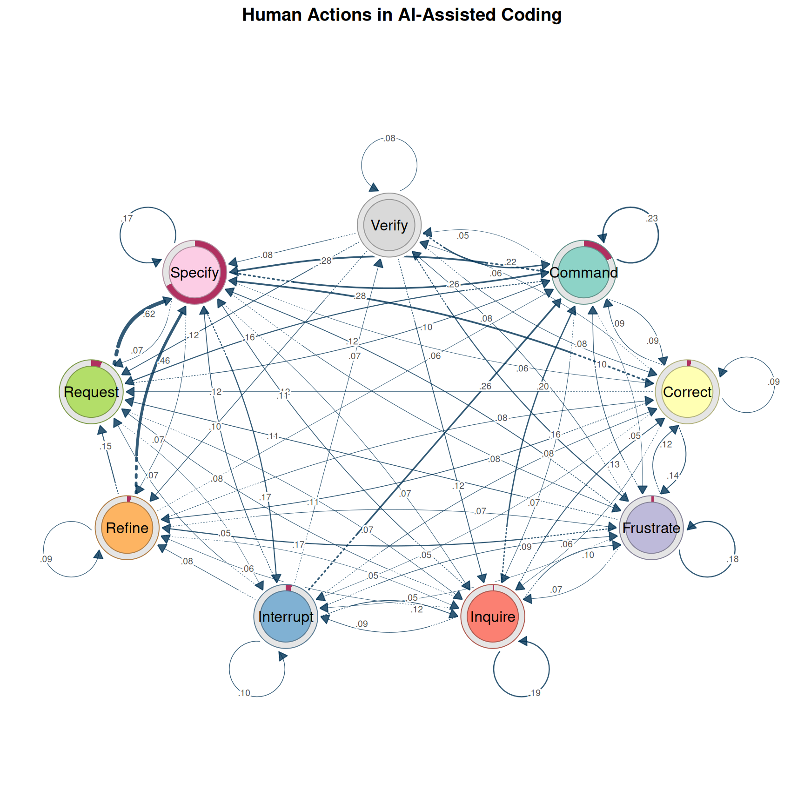

Several patterns stand out: **Specify** is the hub — most actions lead
to and from it. Self-loops on Specify and Command indicate persistence.
The **Request → Specify → Command** backbone reflects the natural
workflow. But this first-order view might be hiding important patterns.
Does it matter *how* someone arrived at Specify?

## Is First-Order Enough? Multi-Order Model Selection

Before investing in higher-order analysis, we should answer: **does
sequential memory actually matter?** The Multi-Order Generative Model
(MOGen; Scholtes 2017) fits Markov models at increasing orders and
compares them using information criteria. Higher-order models fit better
but have exponentially more parameters — AIC and BIC find the best
tradeoff.

``` r

mg <- build_mogen(net, max_order = 4)
summary(mg)
```

    Multi-Order Generative Model (MOGen) Summary

      States: Command, Correct, Frustrate, Inquire, Interrupt, Refine, Request, Specify, Verify
      Paths: 508 | Observations: 10778

      Optimal order: 4 (by aic)

            order layer_dof cum_dof    loglik      aic      bic selected
    order_0     0         8       8 -22001.20 44018.40 44076.68
    order_1     1        72      80 -20805.61 41771.23 42354.05
    order_2     2       621     701 -19819.55 41041.10 46148.07
    order_3     3      2445    3146 -17152.10 40596.20 63515.63
    order_4     4      2990    6136 -11469.73 35211.46 79913.83      <--

``` r

plot(mg)
```

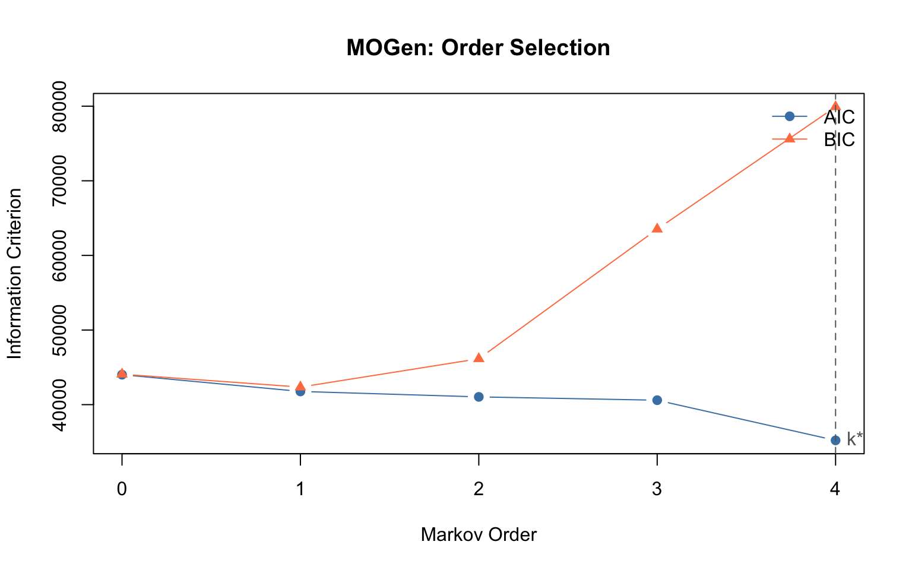

### Interpreting the results

- **Order 0**: Actions are independent — no sequential structure.
- **Order 1**: The standard Markov model is sufficient.
- **Order 2+**: Higher-order dependencies exist. A first-order TNA would
  miss them.

Even when order 1 is globally optimal (by BIC), *specific pathways* may
still exhibit higher-order behavior — the global model averages over all
states. The HON analysis below detects these local patterns.

### Second-order transition matrix

[`mogen_transitions()`](https://saqr.me/Nestimate/reference/mogen_transitions.md)
extracts the transitions at a given order, showing which two-step
contexts lead to different outcomes:

``` r

mt <- mogen_transitions(mg, order = 2)
mt[1:8, ]
```

                                 path count probability               from
    1   Specify -> Command -> Specify   281      0.3914 Specify -> Command
    2   Command -> Request -> Specify   228      0.7782 Command -> Request
    3   Specify -> Command -> Request   198      0.2758 Specify -> Command
    4 Request -> Specify -> Interrupt   187      0.3264 Request -> Specify
    5   Command -> Command -> Command   163      0.3800 Command -> Command
    6 Command -> Specify -> Interrupt   148      0.2792 Command -> Specify
    7   Specify -> Request -> Specify   124      0.6526 Specify -> Request
    8    Specify -> Refine -> Specify   122      0.6010  Specify -> Refine
             to
    1   Specify
    2   Specify
    3   Request
    4 Interrupt
    5   Command
    6 Interrupt
    7   Specify
    8   Specify

Each row is a second-order pathway: the `from` column shows the
two-state context, `to` is the predicted next state, and `probability`
is the conditional probability given that context.

## Higher-Order Networks (HON)

While MOGen tells us *whether* higher-order dependencies exist on
average, the **Higher-Order Network** (HON; Xu et al. 2016) tells us
*where*. HON tests, for each state, whether adding context significantly
changes the outgoing transition distribution using KL-divergence. If the
distribution after *Request → Specify* differs from *Frustrate →
Specify*, HON creates separate nodes for these contexts.

``` r

hon <- build_hon(net)
hon
```

    Higher-Order Network (HON)
      Nodes:        977 (9 first-order states)
      Edges:        3733
      Max order:    5 (requested 5)
      Min freq:     1
      Trajectories: 508

``` r

ho_edges <- hon$ho_edges[hon$ho_edges$from_order > 1, ]
ho_top <- ho_edges[order(-ho_edges$count), ]
ho_top[1:10, ]
```

                                               path                          from
    2851              Specify -> Command -> Specify            Specify -> Command
    322               Command -> Request -> Specify            Command -> Request
    2850              Specify -> Command -> Request            Specify -> Command
    2720            Request -> Specify -> Interrupt            Request -> Specify
    2906   Specify -> Command -> Request -> Specify Specify -> Command -> Request
    10                Command -> Command -> Command            Command -> Command
    379             Command -> Specify -> Interrupt            Command -> Specify
    352  Command -> Request -> Specify -> Interrupt Command -> Request -> Specify
    2916 Specify -> Command -> Specify -> Interrupt Specify -> Command -> Specify
    3253              Specify -> Request -> Specify            Specify -> Request
                to count probability from_order to_order
    2851   Specify   281   0.3913649          2        3
    322    Specify   228   0.7781570          2        3
    2850   Request   198   0.2757660          2        3
    2720 Interrupt   187   0.3263525          2        3
    2906   Specify   180   0.9137056          3        3
    10     Command   163   0.3799534          2        3
    379  Interrupt   148   0.2792453          2        3
    352  Interrupt   135   0.6192661          3        3
    2916 Interrupt   124   0.4476534          3        3
    3253   Specify   124   0.6526316          2        2

Out of 3733 total edges, **3652** (98%) are higher-order — transitions
where the preceding context changes the outcome. Look for pathways where
the higher-order probability differs substantially from the first-order
probability — these represent genuine contextual effects.

### Raw path frequencies

The most common 3-step sequences regardless of statistical significance:

``` r

path_counts(net, k = 3, top = 15)
```

                                  path count proportion
    1    Specify -> Command -> Specify   281     0.0288
    2    Command -> Request -> Specify   228     0.0234
    3    Specify -> Command -> Request   198     0.0203
    4  Request -> Specify -> Interrupt   187     0.0192
    5    Command -> Command -> Command   163     0.0167
    6  Command -> Specify -> Interrupt   148     0.0152
    7    Specify -> Request -> Specify   124     0.0127
    8     Specify -> Refine -> Specify   122     0.0125
    9    Specify -> Specify -> Specify   121     0.0124
    10 Specify -> Interrupt -> Command   109     0.0112
    11   Command -> Specify -> Command   106     0.0109
    12   Request -> Specify -> Specify    94     0.0096
    13   Specify -> Command -> Command    93     0.0095
    14   Command -> Specify -> Specify    76     0.0078
    15   Specify -> Specify -> Command    76     0.0078

## Path Anomaly Detection (HYPA)

HON detects *where* higher-order structure exists. **HYPA** (LaRock et
al. 2020) takes a complementary approach: it detects which specific
paths occur *significantly more or less often than expected* under a
null model.

HYPA constructs a De Bruijn graph and computes expected path frequencies
using a multi-hypergeometric null model. Paths that deviate
significantly are flagged:

- **Over-represented** paths: These sequences occur far more often than
  chance predicts. They represent **learned behavioral routines**.
- **Under-represented** paths: Systematically avoided combinations —
  sequences that are socially inappropriate, cognitively difficult, or
  practically ineffective.

``` r

hypa <- build_hypa(net)


plot_simplicial(hypa, dismantled = TRUE)
```

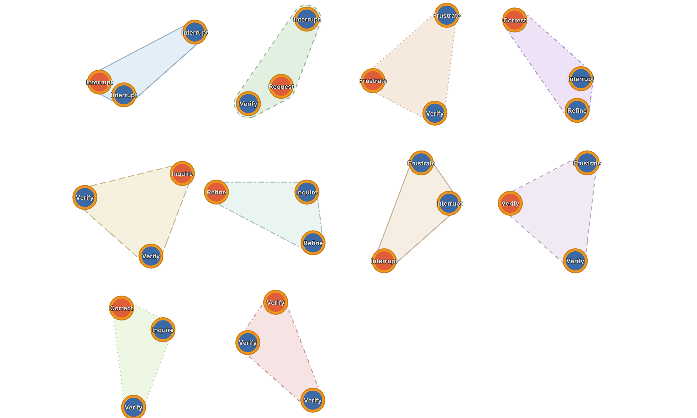

### Over-represented pathways

Learned routines — sequences that occur far more than expected.
[`plot_simplicial()`](https://sonsoles.me/cograph/reference/plot_simplicial.html)
accepts HYPA objects directly with the `anomaly` parameter to filter:

``` r

plot_simplicial(hypa, anomaly = "over", max_pathways = 9,
                dismantled = TRUE, ncol = 3)
```

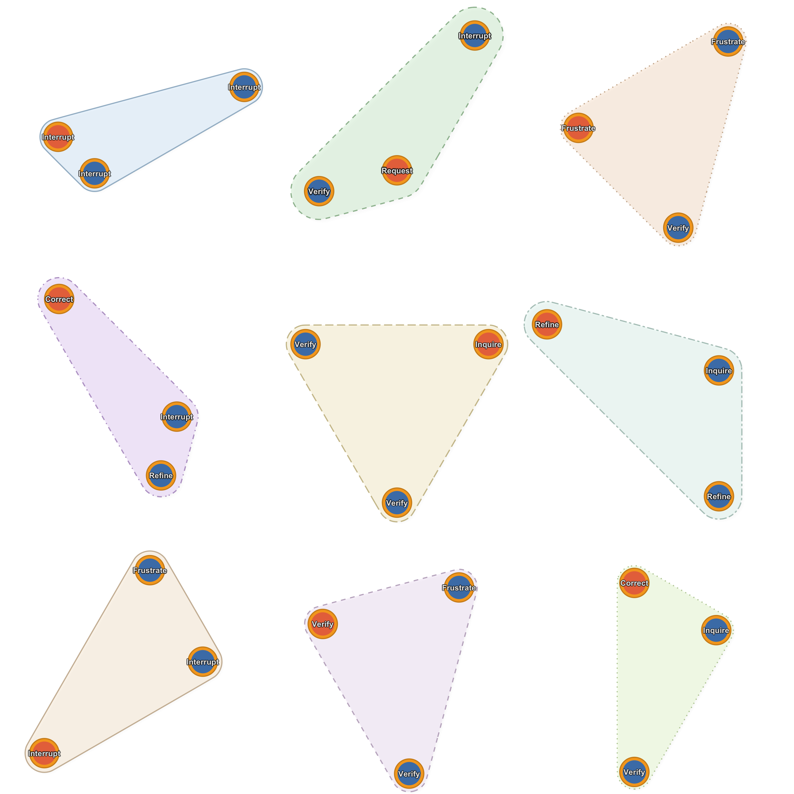

### Under-represented pathways

Avoided sequences:

``` r

plot_simplicial(hypa, anomaly = "under", max_pathways = 6,
                dismantled = TRUE, ncol = 3)
```

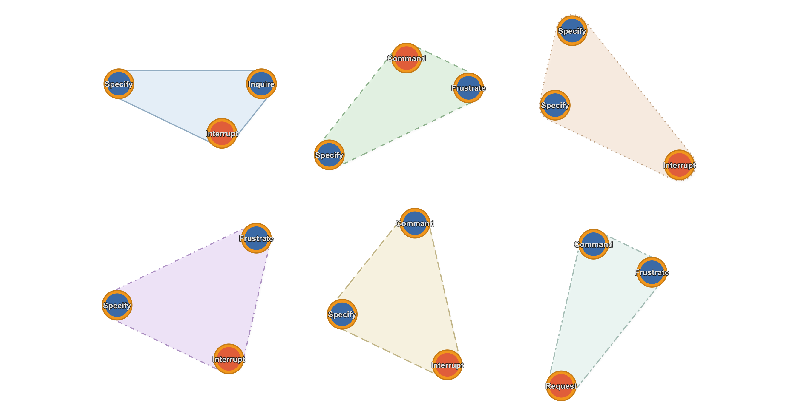

### Combined overlay

Multiple pathways on a single plot — overlapping regions indicate states
that participate in many higher-order patterns:

``` r

plot_simplicial(net, max_pathways = 6,
                title = "Top 6 Higher-Order Pathways")
```

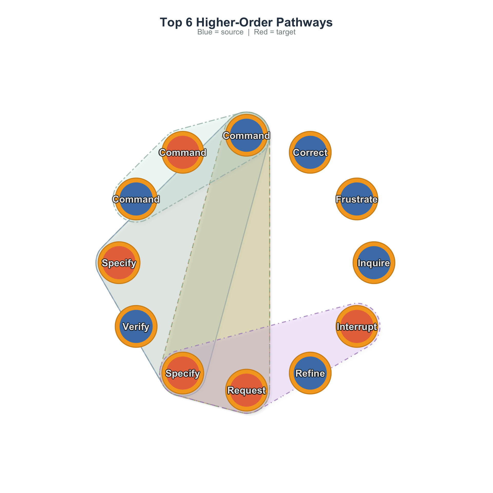

## Higher-Order Analysis Across Groups

A powerful application is comparing higher-order structure across
conditions. We build grouped networks by superclass (Directive,
Evaluative, Metacognitive) and run HYPA on each:

``` r

grp_net <- build_network(human_long, method = "relative",
                         action = "code", actor = "session_id",
                         time = "timestamp", group = "cluster")

hypa_results <- lapply(names(grp_net), function(nm) {
  h <- build_hypa(grp_net[[nm]])
  data.frame(
    group = nm,
    total_edges = h$n_edges,
    anomalous = h$n_anomalous,
    over = h$n_over,
    under = h$n_under,
    pct_anomalous = round(100 * h$n_anomalous / h$n_edges, 1)
  )
})
do.call(rbind, hypa_results)
```

              group total_edges anomalous over under pct_anomalous
    1     Directive          80        39   31     8          48.8
    2 Metacognitive          16        12    9     3          75.0
    3    Evaluative         256        21   19     2           8.2

Groups with a higher percentage of anomalous pathways have more
higher-order structure — their sequential dynamics are less predictable
from first-order transitions alone.

``` r

par(mfrow = c(1, 2))
plot_simplicial(grp_net$Directive, max_pathways = 4,
                title = "Directive: Higher-Order Pathways")
```

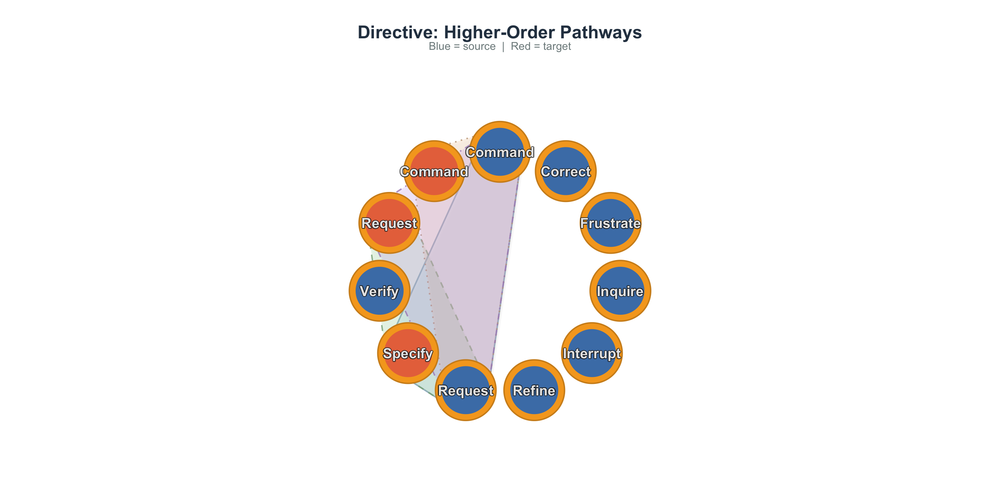

``` r

plot_simplicial(grp_net$Evaluative, max_pathways = 4,
                title = "Evaluative: Higher-Order Pathways")
```

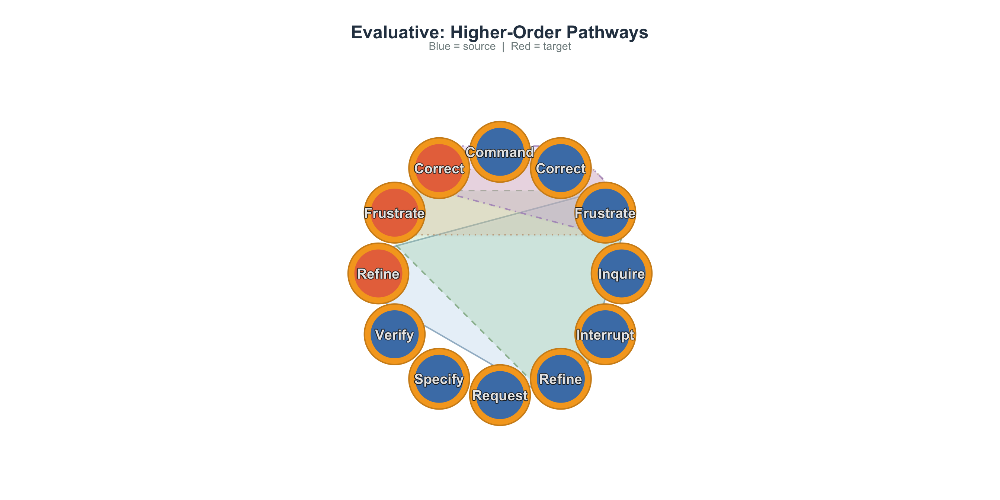

## Comparing Datasets

Higher-order analysis is particularly informative when applied to
different datasets. Here we compare the human-AI coding data with a
collaborative regulation dataset:

``` r

data("group_regulation_long", package = "Nestimate")
net_reg <- build_network(group_regulation_long, method = "relative",
                         action = "Action", actor = "Actor")

hypa_coding <- build_hypa(net)
hypa_reg <- build_hypa(net_reg)

comparison <- data.frame(
  dataset = c("Human-AI Coding", "Collaborative Regulation"),
  nodes = c(net$n_nodes, net_reg$n_nodes),
  total_paths = c(hypa_coding$n_edges, hypa_reg$n_edges),
  anomalous = c(hypa_coding$n_anomalous, hypa_reg$n_anomalous),
  over = c(hypa_coding$n_over, hypa_reg$n_over),
  under = c(hypa_coding$n_under, hypa_reg$n_under)
)
comparison
```

                       dataset nodes total_paths anomalous over under
    1          Human-AI Coding     9        3138       181  139    42
    2 Collaborative Regulation     9        2584       600  524    76

``` r

par(mfrow = c(1, 2))
plot_simplicial(net, max_pathways = 4,
                title = "Human-AI Coding")
```

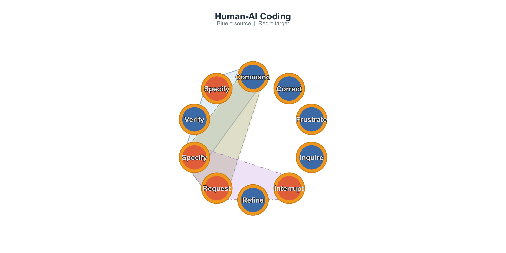

``` r

plot_simplicial(net_reg, max_pathways = 4,
                title = "Collaborative Regulation")
```

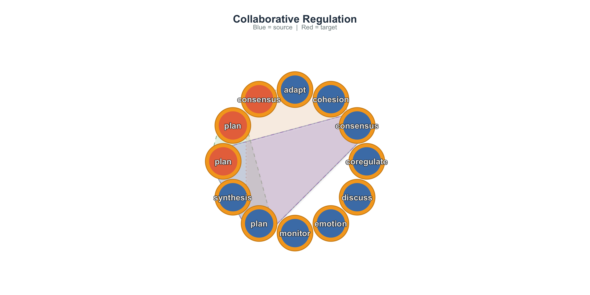

Different domains produce different higher-order signatures. Comparing
these reveals whether sequential memory is a universal property of the
behavioral system or specific to particular tasks.

## Simplicial Complex Analysis

All the methods above analyze sequential pathways. **Simplicial complex
analysis** takes a different perspective: it examines the **topological
structure** of the network itself.

### What is a simplicial complex?

A standard network captures pairwise relationships: node A connects to
node B. But many interactions involve **groups**: states A, B, and C may
all be densely interconnected, forming a triangle. A simplicial complex
formalizes this:

- A **0-simplex** is a single node
- A **1-simplex** is an edge (two connected nodes)
- A **2-simplex** is a filled triangle (three mutually connected nodes)
- A **$`k`$-simplex** is a group of $`k+1`$ mutually connected nodes

The **clique complex** turns every clique into a simplex, lifting a flat
graph into a multi-dimensional topological object.

### Building the complex

``` r

sc <- build_simplicial(net, threshold = 0.05)
sc
```

    Clique Complex
      9 nodes, 511 simplices, dimension 8
      Density: 100.0%  |  Mean dim: 3.51  |  Euler: 1
      f-vector: (f0=9 f1=36 f2=84 f3=126 f4=126 f5=84 f6=36 f7=9 f8=1)
      Betti: b0=1
      Nodes: Command, Correct, Frustrate, Inquire, Interrupt, Refine, Request, Specify, Verify 

### Topological descriptors

- **f-vector** $`(f_0, f_1, f_2, \ldots)`$: counts simplices at each
  dimension.
- **Betti numbers** $`(\beta_0, \beta_1, \beta_2, \ldots)`$: the central
  invariants. $`\beta_0`$ = connected components, $`\beta_1`$ =
  independent loops, $`\beta_2`$ = enclosed voids.
- **Euler characteristic**
  $`\chi = \sum (-1)^k f_k = \sum (-1)^k \beta_k`$. For a contractible
  complex, $`\chi = 1`$.
- **Simplicial degree**: how many higher-dimensional simplices each node
  participates in.

``` r

simplicial_degree(sc)
```

           node d0 d1 d2 d3 d4 d5 d6 d7 d8 total
    1   Command  1  8 28 56 70 56 28  8  1   255
    2   Correct  1  8 28 56 70 56 28  8  1   255
    3 Frustrate  1  8 28 56 70 56 28  8  1   255
    4   Inquire  1  8 28 56 70 56 28  8  1   255
    5 Interrupt  1  8 28 56 70 56 28  8  1   255
    6    Refine  1  8 28 56 70 56 28  8  1   255
    7   Request  1  8 28 56 70 56 28  8  1   255
    8   Specify  1  8 28 56 70 56 28  8  1   255
    9    Verify  1  8 28 56 70 56 28  8  1   255

``` r

plot(sc)
```

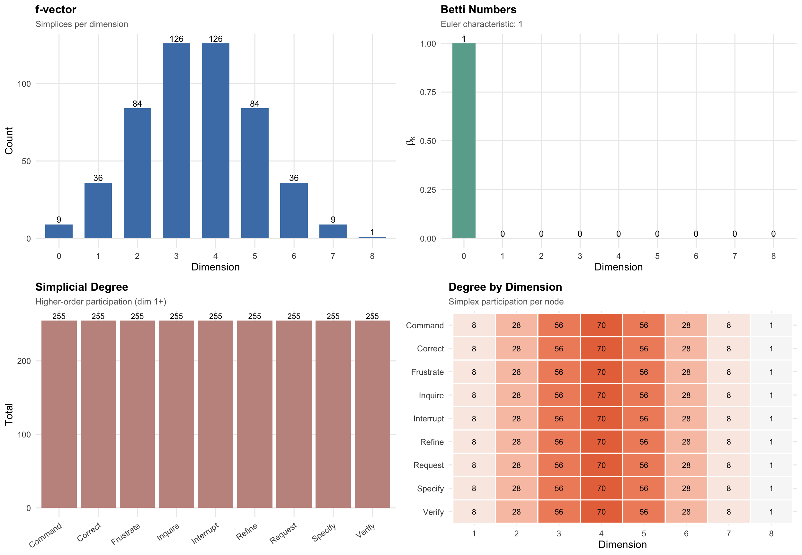

Nodes with high simplicial degree are topological hubs — they
participate in many group interactions. This captures group-level
importance that pairwise degree misses.

### Persistent Homology

A single complex at one threshold gives a static snapshot. **Persistent
homology** reveals how topology evolves as we vary the threshold. Start
with only the strongest edges and progressively add weaker ones.
Features that persist across a wide range are **topologically robust**.

``` r

ph <- persistent_homology(net, n_steps = 25)
ph
```

    Persistent Homology
      25 filtration steps [0.6197 → 0.0062]
      Features: b0: 9 (1 persistent)  |  b1: 2 (0 persistent)  |  b3: 70 (70 persistent)
      Longest-lived:
        b0: 0.6197 → 0.0000 (life: 0.6197)
        b0: 0.6197 → 0.1596 (life: 0.4601)
        b0: 0.6197 → 0.1851 (life: 0.4346)

``` r

plot(ph)
```

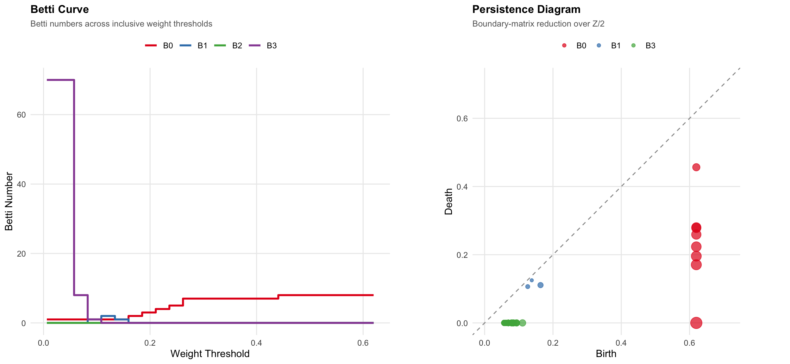

**Betti curve** (left): At high threshold, the network is sparse (many
components). As threshold decreases, components merge ($`\beta_0`$
drops) and loops may form ($`\beta_1`$ rises) then get filled.

**Persistence diagram** (right): Points far from the diagonal have long
lifetimes — structurally important features. Points near the diagonal
are noise.

### Q-Analysis

Q-analysis (Atkin 1974) measures connectivity at multiple levels of
structural sharing. Two maximal simplices are **q-connected** if they
share a face of dimension $`\geq q`$:

- **q = 0**: share at least one node
- **q = 1**: share at least one edge
- **q = 2**: share at least one triangle

``` r

qa <- q_analysis(sc)
qa
```

    Q-Analysis (max q = 8)
      Components: q8:1 q7:1 q6:1 q5:1 q4:1 q3:1 q2:1 q1:1 q0:1
      Fully connected at all q levels
      Structure: Command:8 Correct:8 Frustrate:8 Inquire:8 Interrupt:8 Refine:8 Request:8 Specify:8 Verify:8

``` r

plot(qa)
```

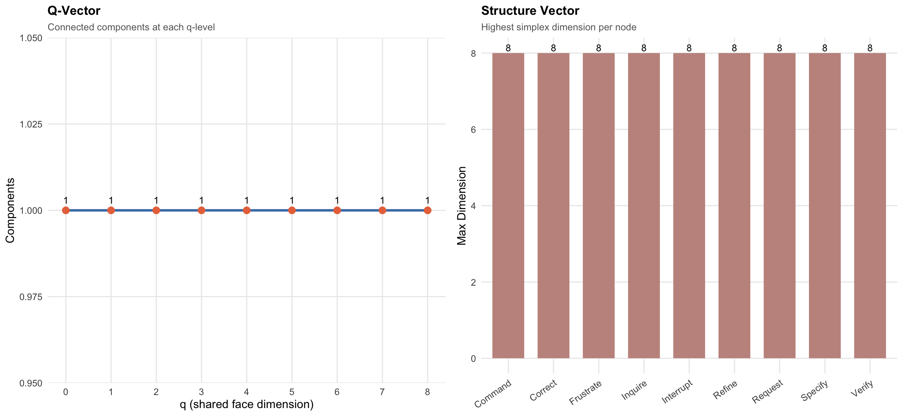

The **fragmentation point** (first q where components \> 1) is critical.
Below it, the network is fully connected through shared sub-structures.
Above it, parts become structurally isolated.

### Pathway Complex from HON

An alternative to the clique complex: build a simplicial complex from
the **pathways** discovered by HON — topology derived from sequential
dynamics rather than network structure:

``` r

sc_hon <- build_simplicial(hon, type = "pathway", max_pathways = 30)
sc_hon
```

    Pathway Complex
      9 nodes, 31 simplices, dimension 3
      Density: 12.2%  |  Mean dim: 1.00  |  Euler: 1
      f-vector: (f0=9 f1=14 f2=7 f3=1)
      Betti: b0=2 b1=1
      Nodes: Command, Correct, Frustrate, Inquire, Interrupt, Refine, Request, Specify, Verify 

``` r

plot(sc_hon)
```

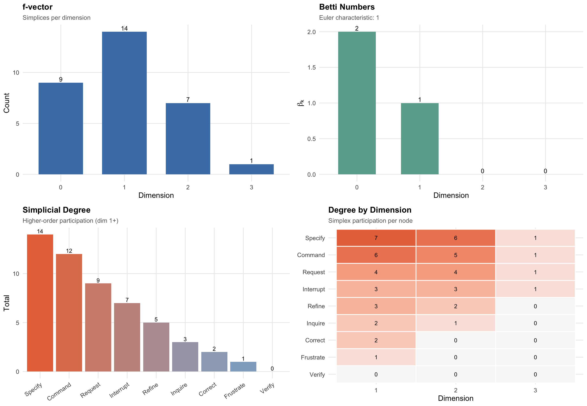

In the pathway complex, each higher-order pathway becomes a simplex.
$`\beta_0 > 1`$ means some states are sequentially disconnected.
$`\beta_1 > 0`$ means there are cyclic pathway structures.

### Verification

All simplicial computations are cross-validated against igraph’s
clique-finding and verified via the Euler-Poincaré theorem:

``` r

verify_simplicial(net$weights, threshold = 0.05)
```

      Cliques:  MATCH (511 simplices)
      Betti:    b0=1 b1=0 b2=0 b3=0 b4=0 b5=0 b6=0 b7=0 b8=0
      Euler:    1 (Euler-Poincare: VERIFIED)

## Summary

| Step | Method | Function | What it reveals |
|----|----|----|----|
| 1 | **TNA** | [`build_network()`](https://saqr.me/Nestimate/reference/build_network.md) | First-order transition structure |
| 2 | **MOGen** | [`build_mogen()`](https://saqr.me/Nestimate/reference/build_mogen.md) | Whether higher-order is needed |
| 3 | **HON** | [`build_hon()`](https://saqr.me/Nestimate/reference/build_hon.md) | Where sequential context changes transitions |
| 4 | **HYPA** | [`build_hypa()`](https://saqr.me/Nestimate/reference/build_hypa.md) | Which paths are anomalously frequent or rare |
| 5 | **Visualization** | [`plot_simplicial()`](https://sonsoles.me/cograph/reference/plot_simplicial.html) | Blob diagrams of pathways |
| 6 | **Simplicial** | [`build_simplicial()`](https://saqr.me/Nestimate/reference/build_simplicial.md) | Topological structure |
| 7 | **Persistence** | [`persistent_homology()`](https://saqr.me/Nestimate/reference/persistent_homology.md) | Robustness across scales |
| 8 | **Q-analysis** | [`q_analysis()`](https://saqr.me/Nestimate/reference/q_analysis.md) | Multi-level connectivity |

The key progression:

- **TNA** answers: *what transitions exist?*
- **MOGen** answers: *is first-order enough?*
- **HON** answers: *where does context matter?*
- **HYPA** answers: *which sequences are surprising?*
- **Simplicial analysis** answers: *what is the shape of the interaction
  space?*

## References

- Atkin, R. H. (1974). *Mathematical Structure in Human Affairs*.
  Heinemann Educational.
- Battiston, F., et al. (2020). Networks beyond pairwise interactions:
  Structure and dynamics. *Physics Reports*, 874, 1–92.
- LaRock, T., Scholtes, I., & Eliassi-Rad, T. (2020). HYPA: Efficient
  detection of path anomalies in time series data on networks. *EPJ Data
  Science*, 9(1), 15.
- Scholtes, I. (2017). When is a network a network? Multi-order
  graphical model selection in pathways and temporal networks.
  *Proceedings of the 23rd ACM SIGKDD International Conference on
  Knowledge Discovery and Data Mining*, 1037–1046.
- Xu, J., Wickramarathne, T. L., & Chawla, N. V. (2016). Representing
  higher-order dependencies in networks. *Science Advances*, 2(5),
  e1600028.
