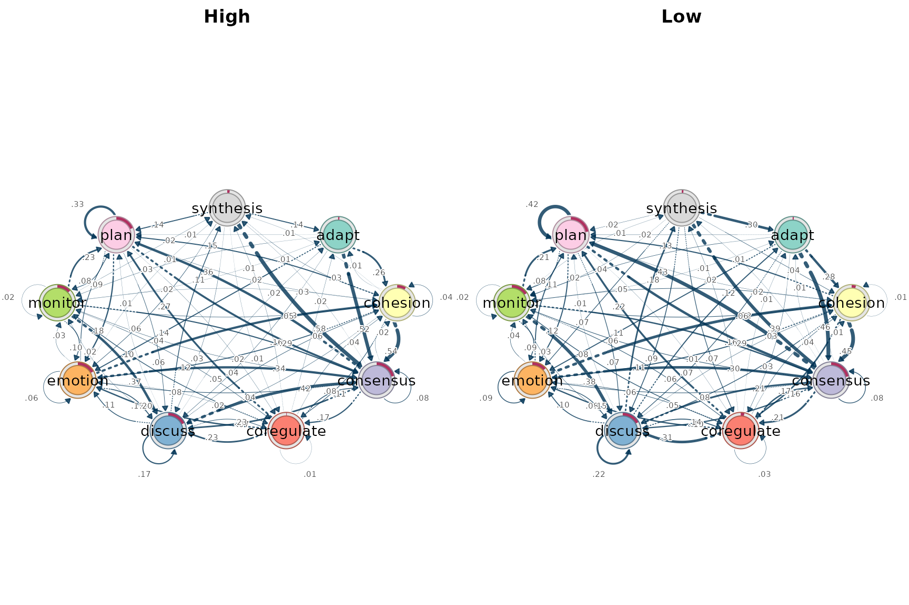
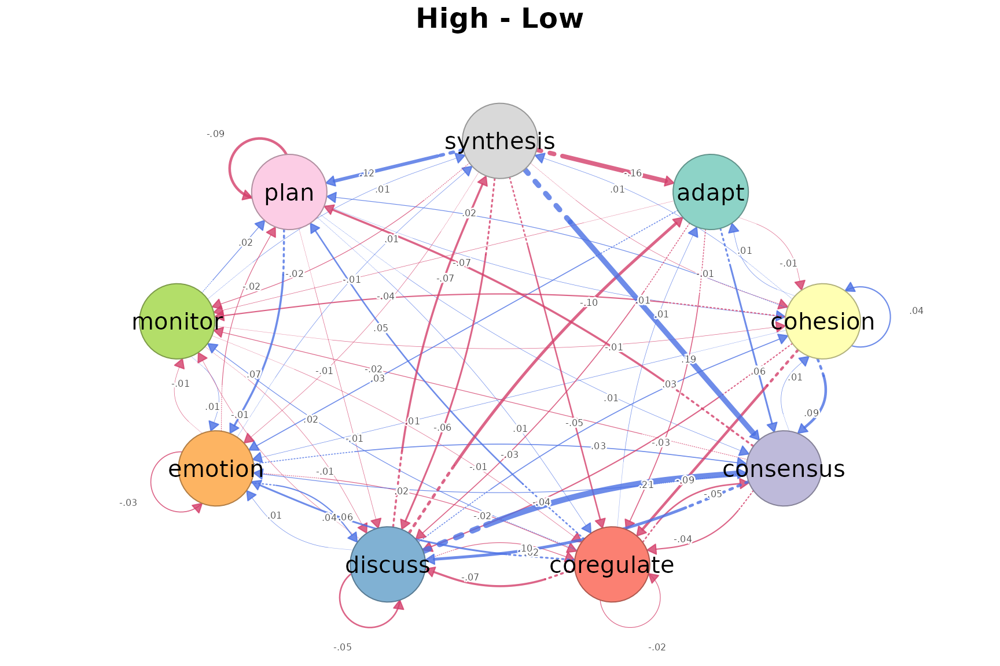
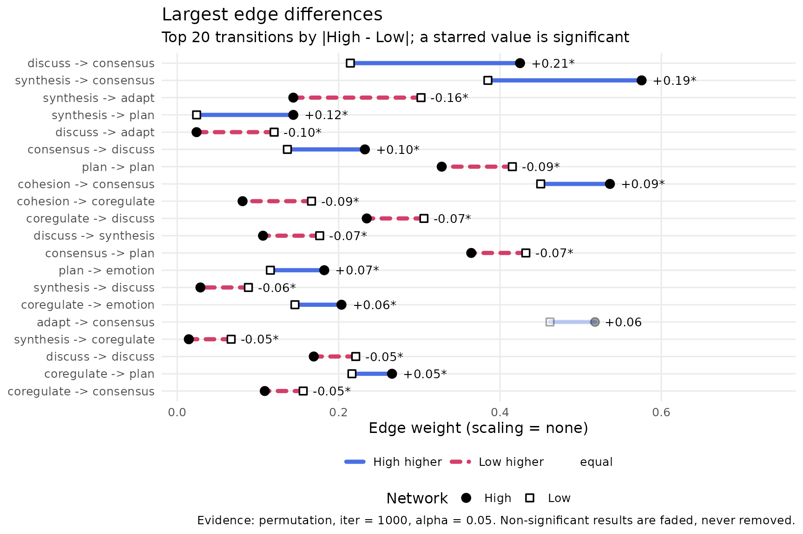
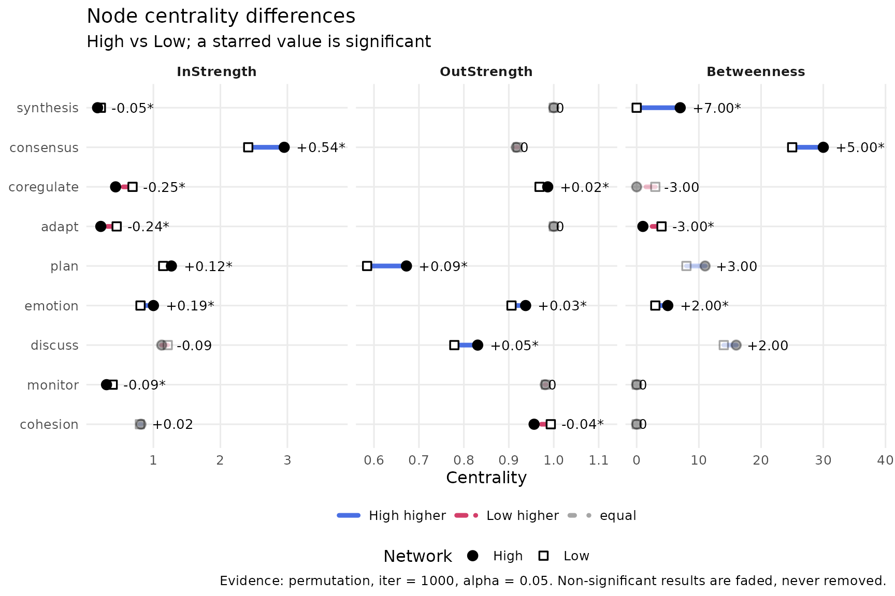
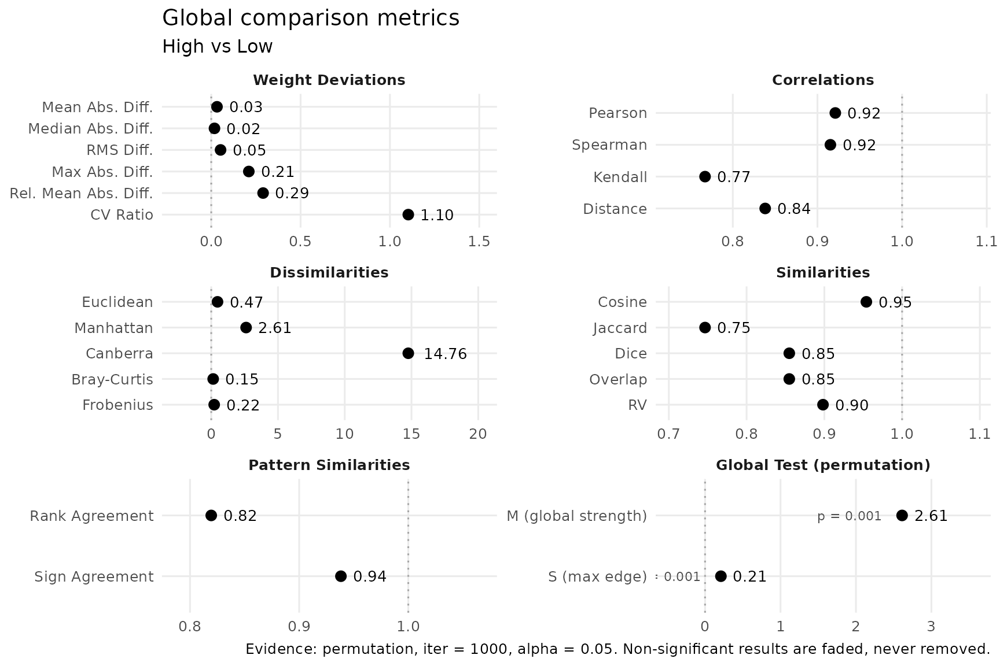
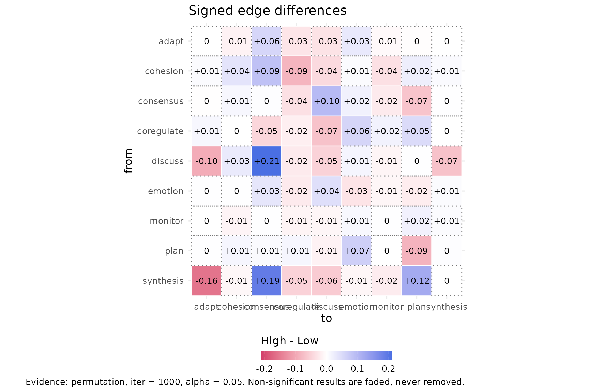
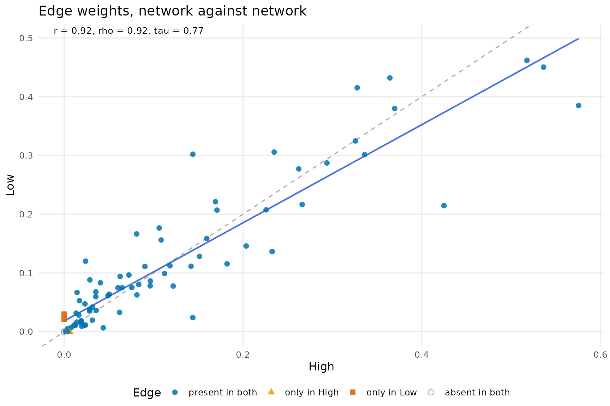
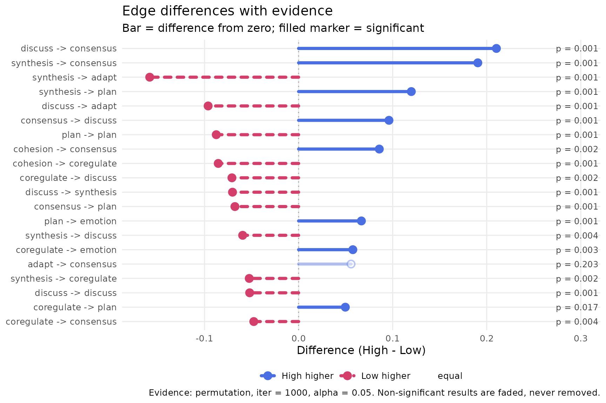

# Comparing two networks with compare_networks()

High and low achievers in `group_regulation_long` are compared with a
permutation test (1,000 permutations).

``` r

achievers <- build_network(group_regulation_long, method = "relative",
                           actor = "Actor", action = "Action",
                           time = "Time", group = "Achiever")
cmp <- compare_networks(achievers, test = "permutation", iter = 1000, seed = 1)
cmp
```

    ## Network comparison (permutation, iter = 1000, alpha = 0.05, adjust = none): 2 networks, 1 pairs, scaling = none
    ##   networks: High (9 nodes, directed), Low (9 nodes, directed)
    ## 
    ##  pair        pearson mean|diff| max|diff| largest change                    
    ##  High vs Low 0.92    0.03       0.21      discuss -> consensus (High higher)
    ##  sig edges
    ##  42       
    ## 
    ## Tables: summary(x), edge_differences(x), node_differences(x), global_differences(x), network_metrics(x). Plot: plot(x, type = ...)

``` r

summary(cmp)
```

    ##         pair network_a network_b n_cells n_differing share_higher_a
    ##  High vs Low      High       Low      81          78           0.51
    ##  share_higher_b mean_abs_diff max_abs_diff pearson spearman cosine jaccard
    ##            0.46          0.03         0.21    0.92     0.92   0.95    0.75
    ##              top_edge top_edge_higher n_sig_edges n_sig_nodes m_stat   m_p
    ##  discuss -> consensus            High          42          16   2.61 0.001
    ##  s_stat   s_p
    ##    0.21 0.001

The networks are similar overall (Pearson 0.92, cosine 0.95, Jaccard
0.75) but differ in 42 of 78 transitions and 16 of 27 node measures. The
global test is significant (M = 2.61, p = 0.001).

## networks

``` r

plot(cmp, type = "networks")
```



The two networks side by side.

## difference

``` r

plot(cmp, type = "difference")
```



High minus Low for each transition: blue is higher in High, red higher
in Low; the line style also carries the sign.

## edges

``` r

plot(cmp, type = "edges")
```



The largest differences: `discuss` to `consensus` (0.42 vs 0.21) and
`synthesis` to `consensus` (0.58 vs 0.39) are higher in High;
`synthesis` to `adapt` is higher in Low (0.14 vs 0.30). All have p =
0.001.

## nodes

``` r

plot(cmp, type = "nodes")
```



Centrality differences per state. `synthesis` has higher betweenness in
High (7 vs 0, p = 0.003); `adapt` in Low (4 vs 1, p = 0.001).

## global

``` r

plot(cmp, type = "global")
```



The 22 similarity and distance metrics of `global_differences(cmp)`,
grouped by category.

## heatmap

``` r

plot(cmp, type = "heatmap")
```



Every cell of the High minus Low difference matrix, with its value.

## scatter

``` r

plot(cmp, type = "scatter")
```



Each transition’s weight in High against Low; points on the diagonal are
equal in both (Pearson 0.92).

## inference

``` r

plot(cmp, type = "inference")
```



Edge differences with their permutation p-values; filled markers are
significant at 0.05.

## Accounting for nesting

``` r

nested <- compare_networks(achievers, test = "permutation", iter = 1000,
                           seed = 1, actor = "Group")
nested
```

    ## Network comparison (permutation, iter = 1000, alpha = 0.05, adjust = none, actor = Group): 2 networks, 1 pairs, scaling = none
    ##   networks: High (9 nodes, directed), Low (9 nodes, directed)
    ## 
    ##  pair        pearson mean|diff| max|diff| largest change                    
    ##  High vs Low 0.92    0.03       0.21      discuss -> consensus (High higher)
    ##  sig edges
    ##  42       
    ## 
    ## Tables: summary(x), edge_differences(x), node_differences(x), global_differences(x), network_metrics(x). Plot: plot(x, type = ...)

``` r

tail(global_differences(nested, digits = 3), 5)
```

    ##         pair network_a network_b                  category
    ##  High vs Low      High       Low Global Test (permutation)
    ##  High vs Low      High       Low Global Test (permutation)
    ##  High vs Low      High       Low                   Nesting
    ##  High vs Low      High       Low                   Nesting
    ##  High vs Low      High       Low                   Nesting
    ##                 metric         key  value perm_p perm_sig
    ##    M (global strength)      perm_M  2.612  0.001     TRUE
    ##           S (max edge)      perm_S  0.210  0.001     TRUE
    ##                    ICC         icc -0.002     NA       NA
    ##  Design effect (edges)  deff_edges  1.009     NA       NA
    ##      Design effect (M) deff_global  1.169     NA       NA

Students are nested in teams, and the achievement level is given per
team. With `actor = "Group"`, the permutation test reassigns whole teams
instead of single students, and
[`global_differences()`](https://saqr.me/Nestimate/reference/comparison_tables.md)
gains three `Nesting` rows. The ICC is −0.002, which indicates little
evidence of a nesting effect; the design effect is 1.01 for the
transitions and 1.17 for M. The networks still differ overall (M = 2.61,
p = 0.001), and 42 transitions remain significant.
