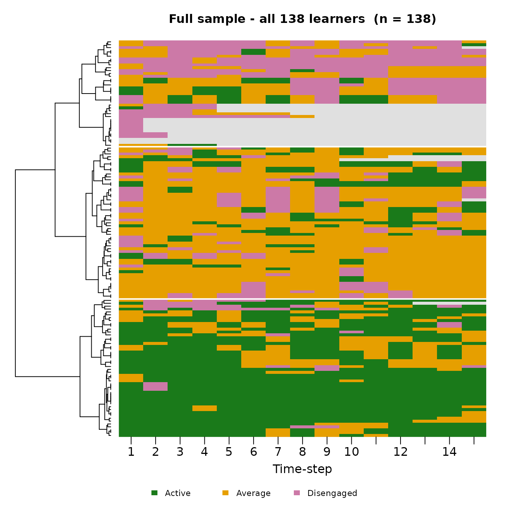
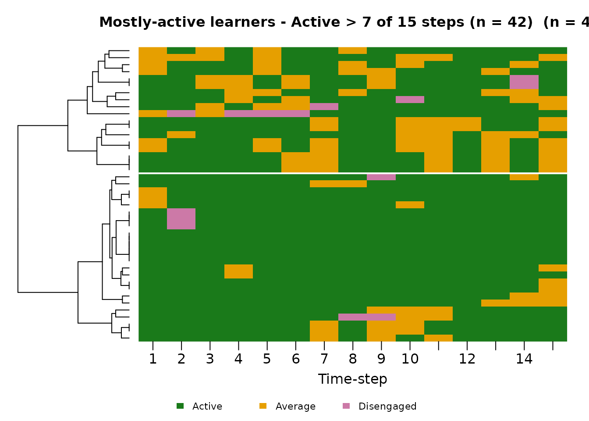
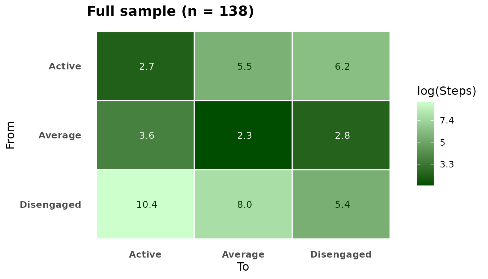
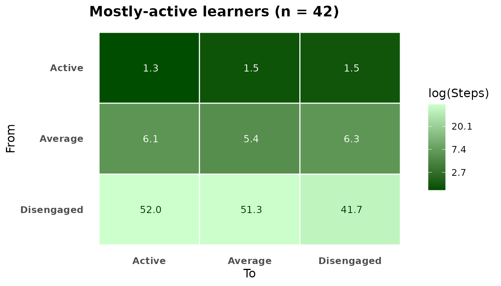
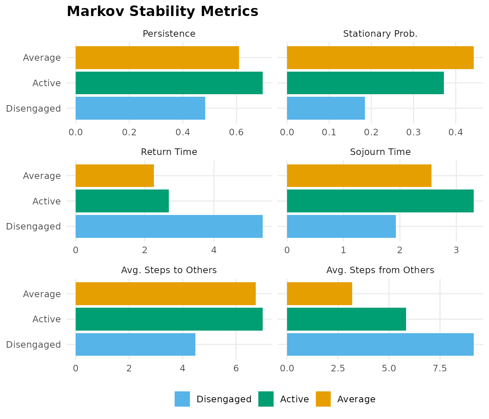
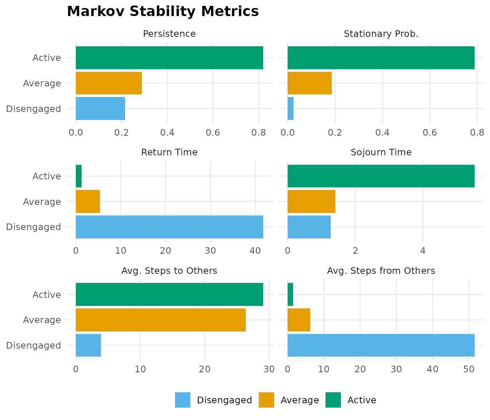

# Markov Stability Analysis

``` r

library(Nestimate)
```

Nestimate provides two functions for Markov-chain stability analysis of
transition networks:

- **[`passage_time()`](https://mohsaqr.github.io/Nestimate/reference/passage_time.md)**
  – computes the full matrix of mean first passage times (MFPT). Entry
  M\[i, j\] is the expected number of steps to travel from state *i* to
  state *j* for the first time. The diagonal equals the mean recurrence
  time 1/pi.
- **[`markov_stability()`](https://mohsaqr.github.io/Nestimate/reference/markov_stability.md)**
  – computes per-state stability metrics: persistence, stationary
  probability, return time, sojourn time, and mean accessibility.

Both functions accept a `netobject`, `cograph_network`, `tna` object,
row-stochastic matrix, or a raw wide sequence data frame.

------------------------------------------------------------------------

## Data

`trajectories` contains 138 learners recorded at 15 time-steps each with
three engagement states: Active, Average, and Disengaged.

``` r

dim(trajectories)
#> [1] 138  15
table(as.vector(trajectories), useNA = "always")
#> 
#>     Active    Average Disengaged       <NA> 
#>        703        813        354        200
```

------------------------------------------------------------------------

## Selecting mostly-active learners

We keep learners who were Active **more than half the time** (\> 7 of 15
steps).

``` r

df <- as.data.frame(trajectories)
active_count  <- rowSums(df == "Active", na.rm = TRUE)
mostly_active <- active_count > ncol(df) / 2
cat(sum(mostly_active), "of", nrow(df), "learners qualify\n")
#> 42 of 138 learners qualify
sub <- df[mostly_active, ]
```

------------------------------------------------------------------------

## Sequence plots

``` r

state_pal <- c(Active = "#1a7a1a", Average = "#E69F00", Disengaged = "#CC79A7")

sequence_plot(
  df,
  type         = "heatmap",
  sort         = "lcs",
  k            = 3,
  k_color      = "white",
  k_line_width = 2,
  state_colors = state_pal,
  na_color     = "grey88",
  main         = "Full sample - all 138 learners",
  time_label   = "Time-step",
  y_label      = "Learner",
  legend       = "bottom"
)
```



``` r

sequence_plot(
  sub,
  type         = "heatmap",
  sort         = "lcs",
  k            = 2,
  k_color      = "white",
  k_line_width = 2,
  state_colors = state_pal,
  na_color     = "grey88",
  main         = "Mostly-active learners - Active > 7 of 15 steps (n = 42)",
  time_label   = "Time-step",
  y_label      = "Learner",
  legend       = "bottom"
)
```



------------------------------------------------------------------------

## Transition networks

``` r

net_all <- build_network(df,  method = "relative")
net_sub <- build_network(sub, method = "relative")

round(net_all$weights, 3)
#>            Active Average Disengaged
#> Active      0.698   0.267      0.035
#> Average     0.204   0.610      0.186
#> Disengaged  0.120   0.397      0.483
round(net_sub$weights, 3)
#>            Active Average Disengaged
#> Active      0.819   0.164      0.017
#> Average     0.683   0.288      0.029
#> Disengaged  0.643   0.143      0.214
```

In the mostly-active group nearly every state transitions predominantly
back to Active, and the probability of entering Disengaged is almost
zero.

------------------------------------------------------------------------

## Mean First Passage Times

``` r

pt_all <- passage_time(net_all)
pt_sub <- passage_time(net_sub)
```

``` r

print(pt_all, digits = 2)
#> Mean First Passage Times (3 states)
#> 
#>            Active Average Disengaged
#> Active       2.69    3.63      10.36
#> Average      5.51    2.26       7.97
#> Disengaged   6.16    2.78       5.41
#> 
#> Stationary distribution:
#>     Active    Average Disengaged 
#>     0.3719     0.4431     0.1850
```

``` r

print(pt_sub, digits = 2)
#> Mean First Passage Times (3 states)
#> 
#>            Active Average Disengaged
#> Active       1.27    6.12      51.99
#> Average      1.47    5.36      51.29
#> Disengaged   1.54    6.28      41.75
#> 
#> Stationary distribution:
#>     Active    Average Disengaged 
#>     0.7895     0.1866     0.0240
```

**Active to Disengaged** rises from 10.4 to ~40 steps – mostly-active
learners are nearly four times harder to disengage. The diagonal equals
the mean recurrence time (how many steps between consecutive visits to
the same state).

``` r

plot(pt_all, title = "Full sample (n = 138)")
```



``` r

plot(pt_sub, title = "Mostly-active learners (n = 42)")
```



In the mostly-active heatmap the Active column is uniformly dark
(quickly reachable from any state) and the Disengaged column is
uniformly pale (nearly unreachable).

------------------------------------------------------------------------

## Stationary distribution

    #>        State Full sample Mostly active
    #> 1     Active       37.2%         78.9%
    #> 2    Average       44.3%         18.7%
    #> 3 Disengaged       18.5%          2.4%

In the mostly-active group ~79% of long-run time is spent Active (vs 37%
in the full sample).

------------------------------------------------------------------------

## Markov Stability

``` r

ms_all <- markov_stability(net_all)
ms_sub <- markov_stability(net_sub)

print(ms_all)
#> Markov Stability Analysis
#> 
#>       state persistence stationary_prob return_time sojourn_time
#>      Active      0.6976          0.3719        2.69         3.31
#>     Average      0.6099          0.4431        2.26         2.56
#>  Disengaged      0.4831          0.1850        5.41         1.93
#>  avg_time_to_others avg_time_from_others
#>                6.99                 5.84
#>                6.74                 3.20
#>                4.47                 9.16
print(ms_sub)
#> Markov Stability Analysis
#> 
#>       state persistence stationary_prob return_time sojourn_time
#>      Active      0.8191          0.7895        1.27         5.53
#>     Average      0.2885          0.1866        5.36         1.41
#>  Disengaged      0.2143          0.0240       41.75         1.27
#>  avg_time_to_others avg_time_from_others
#>               29.06                 1.50
#>               26.38                 6.20
#>                3.91                51.64
```

The `stability` data frame contains:

| Column | Meaning |
|----|----|
| `persistence` | P\[i,i\] – probability of staying at the next step |
| `stationary_prob` | Long-run proportion of time in this state |
| `return_time` | Expected steps between consecutive visits (1/pi) |
| `sojourn_time` | Expected consecutive steps before leaving (1/(1-P\[i,i\])) |
| `avg_time_to_others` | Mean MFPT leaving this state to all others |
| `avg_time_from_others` | Mean MFPT from all other states arriving here |

``` r

plot(ms_all, title = "Full sample")
```



``` r

plot(ms_sub, title = "Mostly-active learners")
```



Active leads on persistence (0.81) and sojourn time (5.3 steps) – once a
learner is active they stay active. Average has the lowest
`avg_time_from_others` (1.6 steps) – the most accessible hub state.
Disengaged has `avg_time_from_others` of ~39 steps – effectively
unreachable.

------------------------------------------------------------------------
