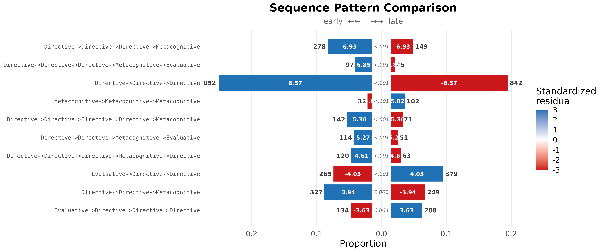
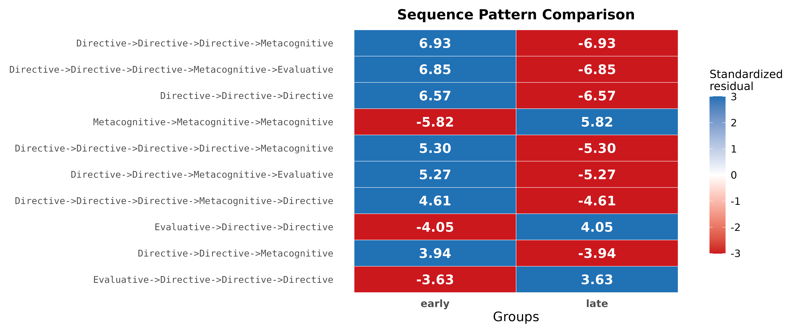
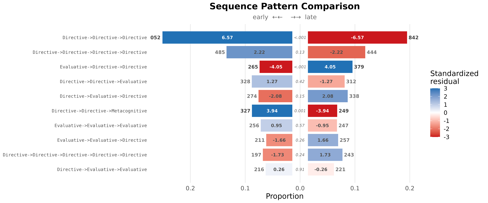

# Sequence Pattern Comparison: Early vs Late Human-AI Interactions

## 1. The dataset

`human_ai_long` is a bundled dataset in `Nestimate` containing coded
action sequences from **429 human-AI coding sessions across 34
projects**. Every row is a single action taken during a session with a
`cluster` label grouping actions into six broad types: `Action`,
`Communication`, `Directive`, `Evaluative`, `Metacognitive`, `Repair`.

``` r

data(human_long, package = "Nestimate")
dat <- as.data.frame(human_long)
cat("rows:", nrow(dat),
    "| sessions:", length(unique(dat$session_id)),
    "| projects:", length(unique(dat$project)), "\n\n")
#> rows: 10796 | sessions: 429 | projects: 34
print(table(dat$cluster))
#> 
#>     Directive    Evaluative Metacognitive 
#>          6024          3029          1743
```

## 2. Split by time — early vs late interactions

For each session, the first half of its actions is labeled `"early"` and
the second half `"late"`. Base R
[`ave()`](https://rdrr.io/r/stats/ave.html) does both jobs — per-session
count and per-session position — and then a single
[`ifelse()`](https://rdrr.io/r/base/ifelse.html) writes the label.

``` r

dat <- dat[order(dat$session_id, dat$order_in_session), ]
n_per <- ave(dat$order_in_session, dat$session_id, FUN = length)
pos   <- ave(dat$order_in_session, dat$session_id, FUN = seq_along)
dat$half <- ifelse(pos <= n_per %/% 2, "early", "late")
print(table(dat$half))
#> 
#> early  late 
#>  5287  5509
```

## 3. Build the grouped network

[`build_network()`](https://mohsaqr.github.io/Nestimate/reference/build_network.md)
is the canonical entry point. Passing `group = "half"` produces a
`netobject_group` with one netobject per half. Each netobject’s `$data`
field holds the session-half sequences.

``` r

net <- build_network(
  data   = dat,
  actor  = "session_id",
  action = "cluster",
  group  = "half",
  method = "relative"
)
net
#> Group Networks (2 groups, group_col: half)
#> 
#>   Group  Nodes  Edges  Weights
#>   early  3      9      [0.105, 0.637]
#>   late   3      9      [0.131, 0.575]
```

## 4. Compare patterns between early and late

[`sequence_compare()`](https://mohsaqr.github.io/Nestimate/reference/sequence_compare.md)
accepts a `netobject_group` directly — group labels are read from the
list names, no separate `group` argument needed. Pattern lengths 3–5,
minimum frequency 25, chi-square test with FDR correction.

``` r

res <- sequence_compare(
  net,
  sub      = 3:5,
  min_freq = 25L,
  test     = "chisq",
  adjust   = "fdr"
)
res
#> Sequence Comparison  [100 patterns | 2 groups: early, late]
#>   Lengths: 3, 4, 5  |  min_freq: 25  |  chi-square  (fdr)
#> 
#>                                                     pattern length freq_early
#>              Directive->Directive->Directive->Metacognitive      4        278
#>  Directive->Directive->Directive->Metacognitive->Evaluative      5         97
#>                             Directive->Directive->Directive      3       1052
#>                 Metacognitive->Metacognitive->Metacognitive      3         32
#>   Directive->Directive->Directive->Directive->Metacognitive      5        142
#>             Directive->Directive->Metacognitive->Evaluative      4        114
#>   Directive->Directive->Directive->Metacognitive->Directive      5        120
#>                            Evaluative->Directive->Directive      3        265
#>                         Directive->Directive->Metacognitive      3        327
#>                 Evaluative->Directive->Directive->Directive      4        134
#>  freq_late prop_early   prop_late resid_early resid_late statistic      p_value
#>        149 0.06876082 0.035100118    6.929245  -6.929245  47.32807 6.004603e-10
#>         25 0.02645214 0.006488451    6.849638  -6.849638  45.67504 6.979522e-10
#>        842 0.23672367 0.180803092    6.568847  -6.568847  42.81109 2.009648e-09
#>        102 0.00720072 0.021902512   -5.820751   5.820751  32.87528 2.456621e-07
#>         71 0.03872375 0.018427200    5.303063  -5.303063  27.38985 3.326031e-06
#>         51 0.02819688 0.012014134    5.271906  -5.271906  26.96981 3.444305e-06
#>         63 0.03272430 0.016350895    4.605937  -4.605937  20.53065 8.383434e-05
#>        379 0.05963096 0.081382865   -4.045115   4.045115  16.03382 7.777640e-04
#>        249 0.07358236 0.053467898    3.939441  -3.939441  15.18176 1.084909e-03
#>        208 0.03314371 0.048998822   -3.627419   3.627419  12.76045 3.540257e-03
#>   ... and 90 more patterns
```

``` r

head(res$patterns, 10)
#>                                                       pattern length freq_early
#> 1              Directive->Directive->Directive->Metacognitive      4        278
#> 2  Directive->Directive->Directive->Metacognitive->Evaluative      5         97
#> 3                             Directive->Directive->Directive      3       1052
#> 4                 Metacognitive->Metacognitive->Metacognitive      3         32
#> 5   Directive->Directive->Directive->Directive->Metacognitive      5        142
#> 6             Directive->Directive->Metacognitive->Evaluative      4        114
#> 7   Directive->Directive->Directive->Metacognitive->Directive      5        120
#> 8                            Evaluative->Directive->Directive      3        265
#> 9                         Directive->Directive->Metacognitive      3        327
#> 10                Evaluative->Directive->Directive->Directive      4        134
#>    freq_late prop_early   prop_late resid_early resid_late statistic
#> 1        149 0.06876082 0.035100118    6.929245  -6.929245  47.32807
#> 2         25 0.02645214 0.006488451    6.849638  -6.849638  45.67504
#> 3        842 0.23672367 0.180803092    6.568847  -6.568847  42.81109
#> 4        102 0.00720072 0.021902512   -5.820751   5.820751  32.87528
#> 5         71 0.03872375 0.018427200    5.303063  -5.303063  27.38985
#> 6         51 0.02819688 0.012014134    5.271906  -5.271906  26.96981
#> 7         63 0.03272430 0.016350895    4.605937  -4.605937  20.53065
#> 8        379 0.05963096 0.081382865   -4.045115   4.045115  16.03382
#> 9        249 0.07358236 0.053467898    3.939441  -3.939441  15.18176
#> 10       208 0.03314371 0.048998822   -3.627419   3.627419  12.76045
#>         p_value
#> 1  6.004603e-10
#> 2  6.979522e-10
#> 3  2.009648e-09
#> 4  2.456621e-07
#> 5  3.326031e-06
#> 6  3.444305e-06
#> 7  8.383434e-05
#> 8  7.777640e-04
#> 9  1.084909e-03
#> 10 3.540257e-03
```

### How to read the residuals

For every pattern, the standardized residual is computed from a 2x2
contingency table `(this pattern vs. everything else)`:

``` math
\text{stdres}_{ij} = \frac{O_{ij} - E_{ij}}{\sqrt{E_{ij} \cdot (1 - r_i/N) \cdot (1 - c_j/N)}}
```

- **Positive on `early`** → over-represented in the first half of
  sessions
- **Positive on `late`** → over-represented in the second half
- `|z| > 1.96` corresponds to `p < 0.05`; `|z| > 3` is very strong
  evidence

## 5. Pyramid plot

Back-to-back bars with residual labels inside each segment. Both sides
use the same standardized-residual color scale.

``` r

plot(res, style = "pyramid", show_residuals = TRUE)
```



## 6. Heatmap

Same top patterns, same color scale, alternative layout. Works for any
number of groups (pyramid requires exactly 2).

``` r

plot(res, style = "heatmap")
```



## 7. Sort by frequency

By default patterns are ranked by test statistic. Pass
`sort = "frequency"` to rank by total occurrence count instead — useful
for focusing on the most common patterns regardless of their group
difference.

``` r

plot(res, style = "pyramid", sort = "frequency", show_residuals = TRUE)
```



## 9. Note on the test choice

This vignette uses `test = "chisq"` because the split-within-session
design makes the two halves from the same session non-independent (same
human, same AI, same project). The chi-square answers the k-gram-level
question “do the rates differ between halves?” and is the right tool for
this design.

`test = "permutation"` shuffles group labels at the sequence level and
assumes exchangeability across sequences — it’s the right choice when
the groups are independent cohorts (e.g., `Project_A` vs `Project_B`),
not when each session contributes to both groups.
