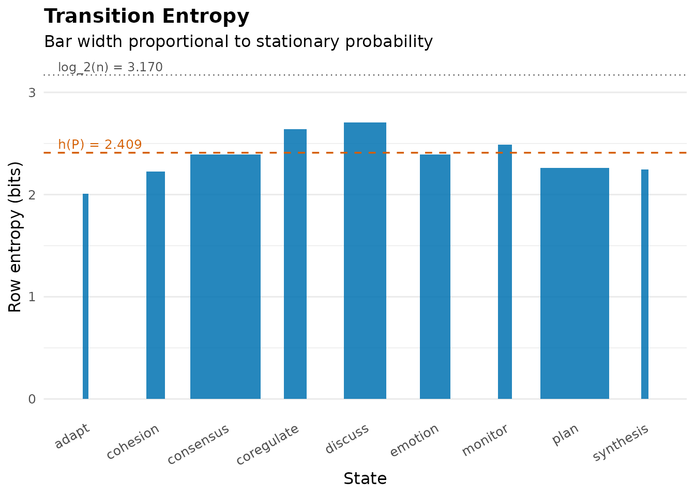
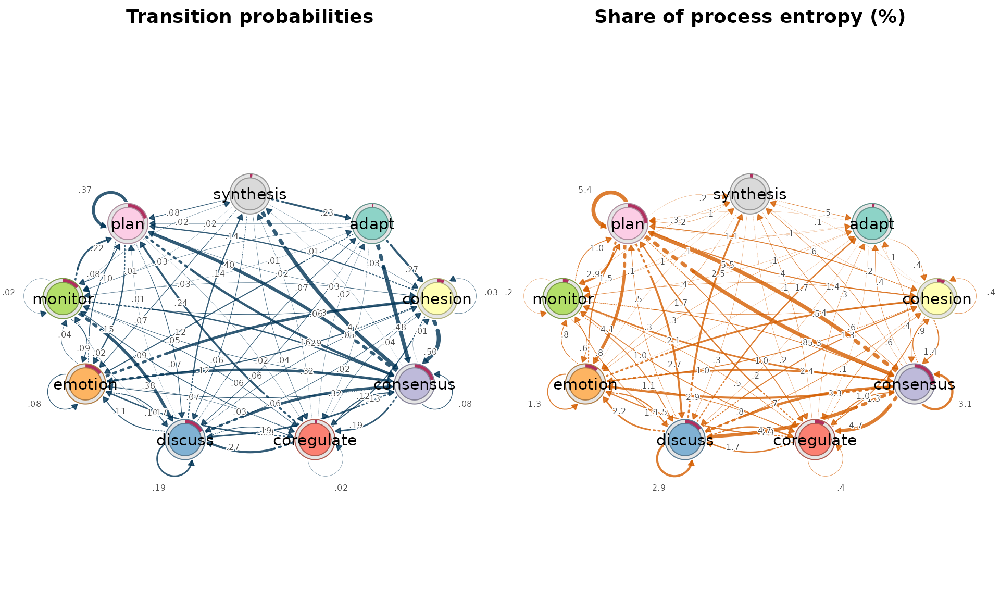
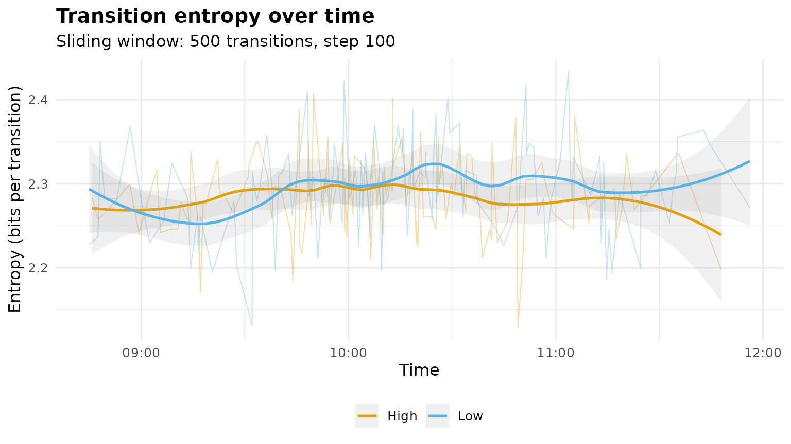
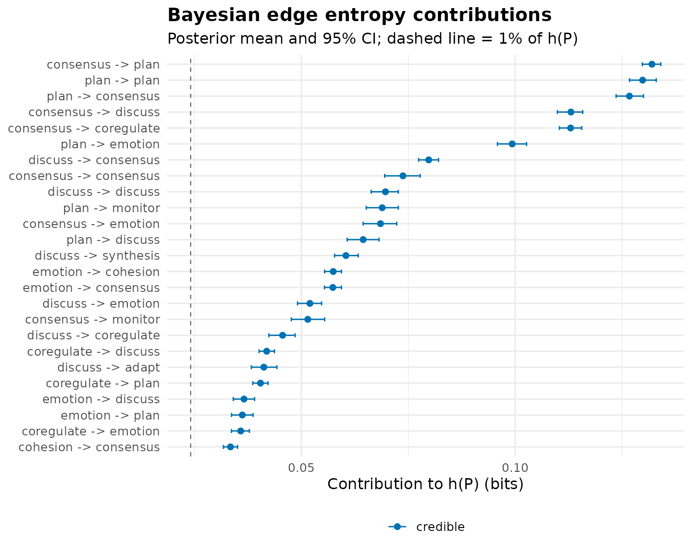

# Transition Matrix Entropy

``` r

library(Nestimate)
```

How predictable is a sequential process? The entropy rate of its
transition matrix answers with a single number: the average uncertainty,
in bits, about the next state given the current one (Shannon, 1948;
Cover & Thomas, 2006, ch. 4),

``` math
H = -\sum_i \pi_i \sum_j P_{ij} \log_2 P_{ij},
```

where $`P`$ is the transition matrix and $`\pi`$ its stationary
distribution (the eigenvector of $`P^\top`$ at $`\lambda = 1`$). This is
the quantity Krejtz et al. (2015) introduced to behavioral research as
gaze transition entropy and Krejtz et al. (2025) track in real time as
mobile transition matrix entropy. Nestimate computes it for any
transition network, decomposes it per state and per edge, tracks it over
time, and estimates it with Bayesian credible intervals.

Throughout we use the bundled `group_regulation_long` data: 27,533
timestamped regulation actions by students collaborating in groups,
coded into nine states.

## The entropy of a transition network

[`transition_entropy()`](https://saqr.me/Nestimate/reference/transition_entropy.md)
accepts a fitted network, a transition matrix, or sequence data.

``` r

net <- build_network(group_regulation_long, method = "relative",
                     actor = "Actor", action = "Action", time = "Time")
te <- transition_entropy(net)
te
#> Transition Entropy (9 states, bits; ceiling = 3.170)
#> 
#>                           raw            normalised
#>   Entropy rate    h(P)  = 2.409 bits    0.760
#>   Stationary    H(pi)  = 2.782 bits    0.878
#>   Redundancy   H(pi)-h = 0.373 bits    0.134
#> 
#> Normalised: h(P) and H(pi) are raw / log_2(n_states) (0 = deterministic, 1 = uniform);
#>   redundancy is the relative redundancy (H(pi) - h(P)) / H(pi), not raw / log_2(n_states).
```

The call computes the entropy rate $`H`$, the stationary entropy
$`H(\pi)`$ (the ceiling that would apply if consecutive actions were
independent), and their difference, the redundancy. The process runs at
2.41 bits per step against a ceiling of $`\log_2 9 = 3.17`$; the
normalized entropy 0.76 is the scale-free version Krejtz et al. (2025)
report. Regulation is far from scripted, but knowing the current action
removes 22% of the uncertainty about the next one (relative redundancy
0.22): sequence carries real information, which is the empirical
justification for modeling transitions rather than activity frequencies
alone.

### Which states are decision points?

$`H`$ is the stationary-weighted sum of per-state branching entropies
$`H(P_{i\cdot})`$. The summary and plot display those terms.

``` r

summary(te)
#> Transition Entropy Summary (bits)
#> 
#> Per-state contribution to h(P):
#>       state stationary row_entropy row_entropy_norm contribution
#>   consensus      0.250       2.393            0.755        0.597
#>        plan      0.245       2.261            0.713        0.554
#>     discuss      0.152       2.706            0.854        0.411
#>     emotion      0.109       2.390            0.754        0.261
#>  coregulate      0.082       2.640            0.833        0.216
#>    cohesion      0.067       2.225            0.702        0.148
#>     monitor      0.049       2.487            0.785        0.121
#>   synthesis      0.027       2.248            0.709        0.060
#>       adapt      0.021       2.006            0.633        0.042
#>  contribution_pct
#>              24.8
#>              23.0
#>              17.0
#>              10.8
#>               9.0
#>               6.2
#>               5.0
#>               2.5
#>               1.7
#> 
#> Chain-level summary:
#>               quantity   raw normalised
#>      entropy_rate h(P) 2.409      0.760
#>       stationary H(pi) 2.782      0.878
#>  redundancy H(pi)-h(P) 0.373      0.134
#>       ceiling log_2(n) 3.170      1.000
#> 
#> Normalised: row entropy, h(P) and H(pi) are raw / log_2(n_states), in [0, 1];
#>   redundancy is the relative redundancy (H(pi) - h(P)) / H(pi).
plot(te)
```



Tall bars are decision points: states whose continuation is genuinely
open. Short bars are scripted states whose next step is nearly
determined. Bar width is the stationary probability $`\pi_i`$, so bar
area is the state’s additive contribution $`\pi_i H(P_{i\cdot})`$ to the
process entropy.

## The entropy network

$`H`$ is a sum over transitions: edge $`i \to j`$ contributes exactly
$`\pi_i P_{ij} \log_2(1/P_{ij})`$.
[`entropy_network()`](https://saqr.me/Nestimate/reference/entropy_network.md)
returns the fitted network with those terms as edge weights — the same
object class as
[`build_network()`](https://saqr.me/Nestimate/reference/build_network.md),
so it prints, summarises, and plots identically. With
`scaling = "share"` the weights become percentages of $`H`$ and sum to
100.

``` r

ent <- entropy_network(net, scaling = "share")
ent
#> Network (method: entropy) [directed]
#>   Weights: [0.069, 5.482]  |  mean: 1.282
#> 
#>   Weight matrix:
#>              adapt cohesion consensus coregulate discuss emotion monitor  plan
#>   adapt      0.000    0.442     0.440      0.103   0.208   0.317   0.142 0.081
#>   cohesion   0.069    0.391     1.386      1.012   0.671   0.996   0.450 1.102
#>   consensus  0.379    0.934     3.065      4.693   4.696   2.848   2.136 5.482
#>   coregulate 0.328    0.587     1.323      0.430   1.739   1.485   1.037 1.678
#>   discuss    1.712    1.317     3.315      1.895   2.897   2.160   0.770 0.471
#>   emotion    0.097    2.387     2.383      0.754   1.520   1.288   0.787 1.502
#>   monitor    0.146    0.469     0.852      0.481   1.071   0.634   0.212 0.964
#>   plan       0.099    1.359     5.265      1.025   2.677   4.130   2.860 5.393
#>   synthesis  0.542    0.182     0.566      0.220   0.277   0.298   0.086 0.310
#>              synthesis
#>   adapt          0.000
#>   cohesion       0.080
#>   consensus      0.553
#>   coregulate     0.366
#>   discuss        2.510
#>   emotion        0.108
#>   monitor        0.193
#>   plan           0.166
#>   synthesis      0.000 
#> 
#>   Initial probabilities:
#>   consensus     0.214  ████████████████████████████████████████
#>   plan          0.204  ██████████████████████████████████████
#>   discuss       0.175  █████████████████████████████████
#>   emotion       0.151  ████████████████████████████
#>   monitor       0.144  ███████████████████████████
#>   cohesion      0.060  ███████████
#>   synthesis     0.019  ████
#>   coregulate    0.019  ████
#>   adapt         0.011  ██
#> 
#>   Scaling: share
```

``` r

op <- par(mfrow = c(1, 2))
cograph::splot(net, minimum = 0, title = "Transition probabilities",
               edge_label_digits = 2)
cograph::splot(ent, title = "Share of process entropy (%)")
```



``` r

par(op)
```

The two panels separate structure from uncertainty. The probability
panel shows where the process goes; the entropy panel shows where it is
unpredictable. High-probability routine transitions shrink in the
entropy view — observing the near-inevitable carries little information
— while the thick entropy edges mark frequent transitions whose outcome
is genuinely open. No new quantity is estimated: the entropy network
displays the summands of the equation above, so every number inherits
the defensibility of $`H`$ itself.

## Entropy over time

A single $`H`$ summarises the whole observation period. Sliding a window
across the transition stream — the design of Krejtz et al. (2025), who
use 30-second windows over gaze transitions — turns entropy into a
process measure.
[`entropy_trajectory()`](https://saqr.me/Nestimate/reference/entropy_trajectory.md)
builds transitions within each actor’s sequence, orders them in time,
and computes one entropy value per window.

``` r

tr <- entropy_trajectory(group_regulation_long,
                         action = "Action", actor = "Actor", time = "Time",
                         group = "Achiever", window = 500, step = 100)
summary(tr)
#>   group windows     mean         sd      min      max    first     last
#> 1  High     123 2.286338 0.04794534 2.128561 2.407602 2.241115 2.355472
#> 2   Low     124 2.295566 0.05498775 2.132020 2.433906 2.244097 2.388426
#>      change
#> 1 0.1143576
#> 2 0.1443291
plot(tr)
```



Each faint line is one 500-transition window stepped by 100; the bold
curve is the loess trend per achievement group. Declining entropy is
routinization — the group settling into predictable regulation; rising
entropy is exploration; a level shift marks a phase change. The `change`
column of the summary (last window minus first) gives each group’s net
trend. Within a window the chain is routinely non-ergodic, so the
per-window estimator weights rows by observed occupancy rather than the
eigenvector stationary distribution; over long stationary stretches the
two coincide.

## Bayesian estimation

Plug-in entropy treats an edge observed three times exactly like one
observed three thousand times.
[`entropy_bayes()`](https://saqr.me/Nestimate/reference/entropy_bayes.md)
places an independent Dirichlet posterior on each row of the transition
matrix (Jeffreys prior 0.5 by default) and pushes Monte Carlo draws
through the entropy formula, so every quantity — the entropy rate, each
state’s branching entropy, each edge’s contribution — arrives with a
credible interval that reflects how much data supports it.

``` r

eb <- entropy_bayes(net, draws = 1000, seed = 1)
eb
#> Bayesian Transition Entropy (9 states, bits; Dirichlet prior 0.5, 1000 draws)
#> 
#>   entropy_rate:       2.411 [2.396, 2.425]
#>    stationary_entropy: 2.783 [2.771, 2.796]
#>    redundancy:         0.373 [0.361, 0.384]
#> 
#> Edges: 78 observed; 31 credible (share of h(P) credibly > 1%).
#> Use summary() for the edge table, plot() for the posterior, and
#> $model for the pruned stable entropy network.
```

The posterior mean sits slightly below the plug-in estimate — the
posterior integrates over sparse-count uncertainty instead of taking the
point estimate at face value — and the interval quantifies how firmly
the data pin down the process entropy. An edge is flagged `credible`
when its share of $`H`$ credibly exceeds `min_share` (1% by default);
`$model` contains the entropy network with all other edges zeroed — the
stable entropy skeleton, safe to display without overreading thin cells.

``` r

plot(eb)
```



Blue intervals are stable estimates; grey intervals rest on too few
observations to distinguish their entropy share from noise at the 95%
level.

## When to use which

- **One process, one number** —
  [`transition_entropy()`](https://saqr.me/Nestimate/reference/transition_entropy.md):
  how predictable is the process; is sequence informative at all
  (redundancy).
- **Where the uncertainty sits** — `plot(transition_entropy())` for
  states,
  [`entropy_network()`](https://saqr.me/Nestimate/reference/entropy_network.md)
  for transitions. Both display terms of the same equation; use
  `scaling = "share"` for percentage labels.
- **Change over time** —
  [`entropy_trajectory()`](https://saqr.me/Nestimate/reference/entropy_trajectory.md):
  routinization, exploration, phase shifts. Report the window size and
  step.
- **Sparse data or formal comparison** —
  [`entropy_bayes()`](https://saqr.me/Nestimate/reference/entropy_bayes.md):
  credible intervals for $`H`$, per-state and per-edge; group
  differences via the posterior draws; `$model` for a display pruned of
  unstable edges.

## References

Cover, T. M., & Thomas, J. A. (2006). *Elements of Information Theory*
(2nd ed., ch. 4). Wiley.

Krejtz, K., Duchowski, A., Szmidt, T., Krejtz, I., González Perilli, F.,
Pires, A., Vilaró, A., & Villalobos, N. (2015). Gaze transition entropy.
*ACM Transactions on Applied Perception*, 13(1), 4:1–4:20.

Krejtz, K., Hughes, C. J., Stasiak, I., Duchowski, A., & Krejtz, I.
(2025). Real-time mobile transition matrix entropy based on eye and head
movements. *Proceedings of ETRA ’25*.

Shannon, C. E. (1948). A mathematical theory of communication. *Bell
System Technical Journal*, 27, 379–423.
