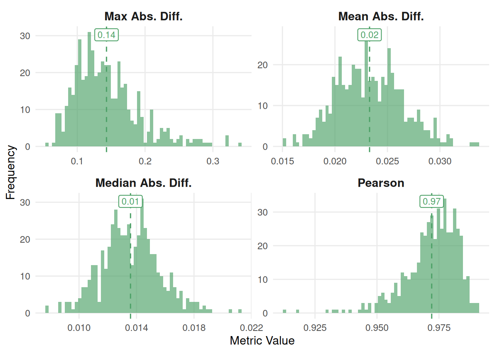
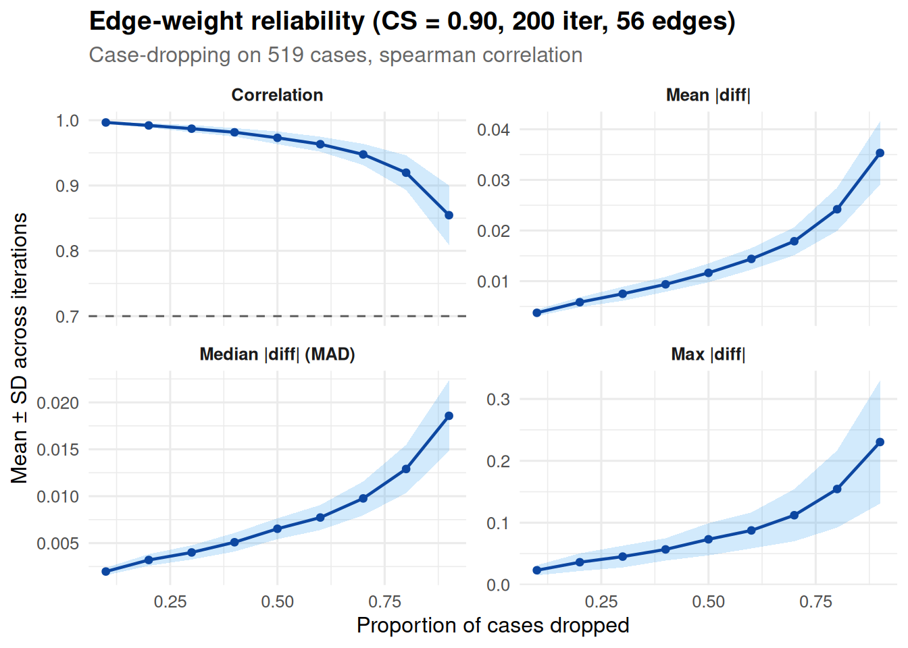
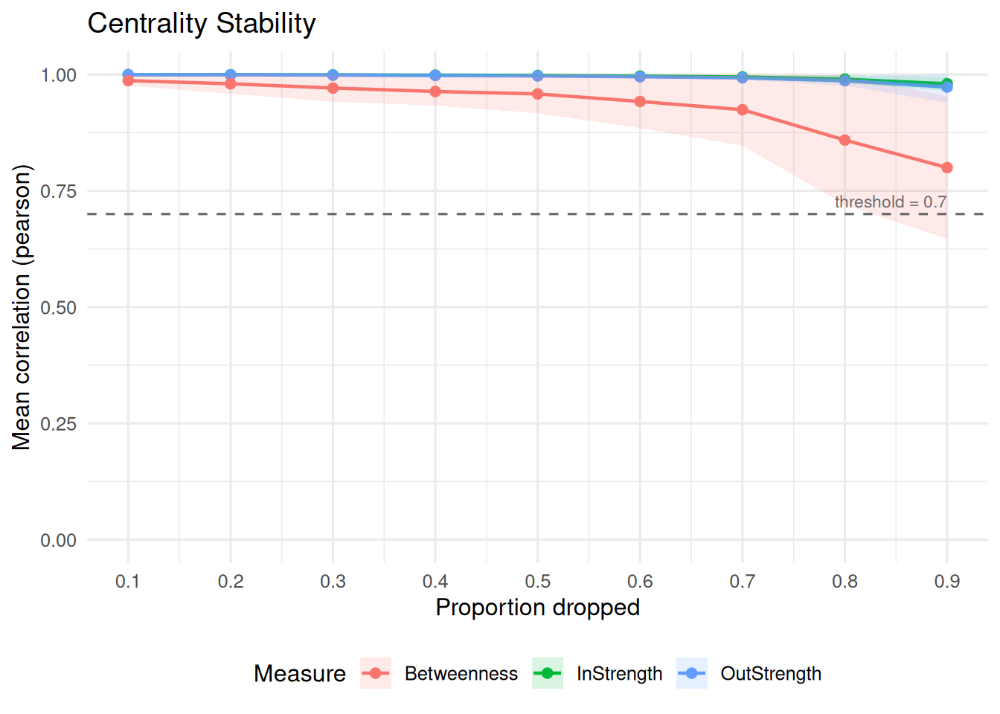
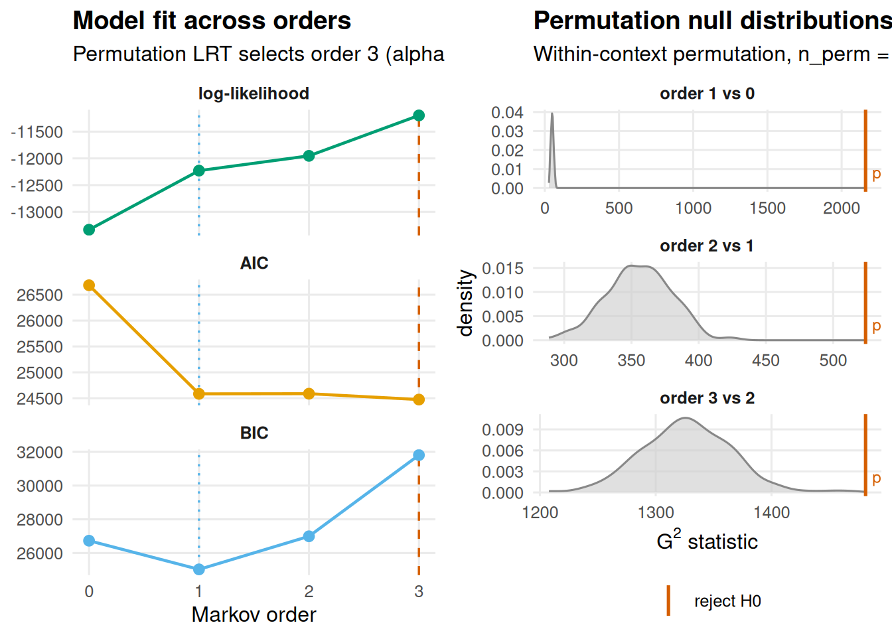
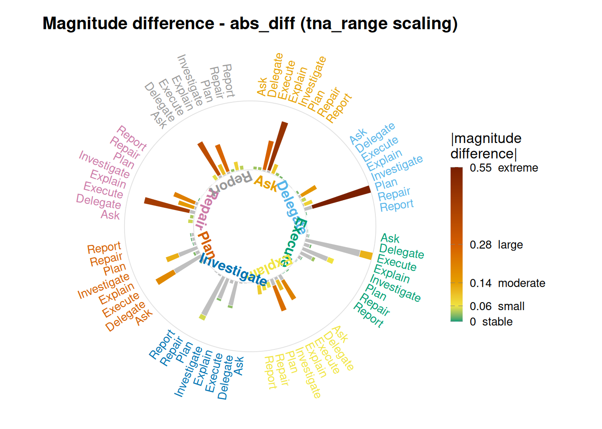

# Tutorial: Model assessment for transition networks

## Tutorial: Model assessment for transition networks

#### Split-half reliability, case-dropping stability, and Markov-order adequacy

``` r

library(Nestimate)
```

### The questions to ask

A fitted transition network summarises a lot of sequence data into a
small matrix of edge weights. Before interpreting any result drawn from
that matrix — a centrality ranking, a pathway, a difference between two
groups — you need to know how much of the matrix is signal and how much
is an artefact of this particular sample. Five complementary analyses
answer that question from different angles: four ask whether the matrix
is stable when the data changes, and one asks whether the probability
view overstates edges that originate in rare states.

- **Split-half reliability.** If I randomly split my cases into two
  halves and estimate the network on each half, do the two networks
  agree? This is the classical internal-consistency check (Epskamp,
  Borsboom & Fried, 2018).
- **Edge-weight case-dropping stability.** If I drop a fraction of my
  cases and re-estimate the network, do the same edges keep roughly the
  same weights? This asks whether the *map* of connections is stable.
- **Centrality case-dropping stability.** Same case-dropping procedure,
  but now we ask whether the *ranking* of nodes by centrality is
  preserved. The formal summary is the CS-coefficient (Epskamp, Borsboom
  & Fried, 2018).
- **Markov-order adequacy.** The transition network assumes that the
  next state depends only on the current state. Does the data actually
  respect that assumption, or is history beyond one step carrying
  information?
- **Count versus probability.** Row-normalisation turns transition
  counts into conditional probabilities. An edge leaving a rare state
  can be negligible in counts yet dominate its row in probability. Which
  edges does the probability view promote this way, and by how much?

Each function below answers one question. Run them together when you
need the full picture; run just the relevant one when you only need one.
None of them replaces the others.

------------------------------------------------------------------------

### The data

`ai_long` contains coded actions from AI-side turns in a human–AI
vibe-coding study. Each row is one action, tagged with the session it
belongs to and a timestamp.

``` r

data(ai_long)
dim(ai_long)
```

    [1] 8551    9

``` r

head(ai_long, 3)
```

      message_id   project   session_id  timestamp session_date     code cluster
    1       3441 Project_7 0086cabebd15 1772661600   2026-03-05 Delegate  Action
    2       3441 Project_7 0086cabebd15 1772661600   2026-03-05     Plan  Repair
    3       3443 Project_7 0086cabebd15 1772661600   2026-03-05  Execute  Action
      code_order order_in_session
    1          1                5
    2          2                6
    3          1                8

``` r

table(ai_long$code)
```


            Ask    Delegate     Execute     Explain Investigate        Plan
             99         295        3258         524        2317        1620
         Repair      Report
            257         181 

Eight codes, 8,551 actions, spread over several hundred sessions. The
most common actions are `Execute` and `Investigate`; `Ask` and `Report`
are rare. That imbalance is one reason we want stability checks — rare
codes produce unreliable edges because there are few observations of
them.

------------------------------------------------------------------------

### Building the baseline network

The stability assessments all work on the same network, so we estimate
it once. We use the row-stochastic transition network
(`method = "relative"`): each edge is the probability of going from one
code to another.

``` r

net <- build_network(
  ai_long,
  method = "relative",
  action = "code",
  actor  = "session_id",
  time   = "timestamp"
)
net
```

    Transition Network (relative probabilities) [directed]
      Weights: [0.004, 0.624]  |  mean: 0.125

      Weight matrix:
                    Ask Delegate Execute Explain Investigate  Plan Repair Report
      Ask         0.033    0.033   0.286   0.484       0.099 0.033  0.022  0.011
      Delegate    0.007    0.025   0.183   0.050       0.093 0.624  0.014  0.004
      Execute     0.010    0.022   0.509   0.055       0.247 0.116  0.031  0.010
      Explain     0.018    0.012   0.259   0.133       0.311 0.070  0.084  0.112
      Investigate 0.009    0.016   0.251   0.036       0.219 0.440  0.018  0.012
      Plan        0.010    0.048   0.471   0.059       0.303 0.033  0.038  0.038
      Repair      0.052    0.040   0.472   0.172       0.236 0.016  0.008  0.004
      Report      0.006    0.057   0.373   0.114       0.285 0.032  0.089  0.044

      Initial probabilities:
      Investigate   0.642  ████████████████████████████████████████
      Delegate      0.166  ██████████
      Execute       0.131  ████████
      Plan          0.035  ██
      Explain       0.012  █
      Ask           0.008
      Repair        0.006
      Report        0.002  

The network has eight nodes (one per code) and a full 8×8 weight matrix
of transition probabilities. The question now is: how much of that
matrix can we trust?

------------------------------------------------------------------------

### Split-half reliability

**Question.** If I split my sessions randomly in half and fit the
network on each half, how close are the two halves?

``` r

rel <- network_reliability(net, iter = 500L, seed = 1)
rel
```

    Split-Half Reliability (500 iterations, split = 50%)
      Mean Abs. Diff.     mean = 0.0233  sd = 0.0032
      Median Abs. Diff.   mean = 0.0136  sd = 0.0020
      Pearson             mean = 0.9721  sd = 0.0107
      Max Abs. Diff.      mean = 0.1431  sd = 0.0479

[`network_reliability()`](https://saqr.me/Nestimate/reference/network_reliability.md)
runs 500 random 50/50 splits. For each split it fits the network on each
half and compares the two 8×8 weight matrices along four metrics:

- `mean_dev` / `median_dev` / `max_dev` — absolute differences between
  corresponding cells of the two matrices. Smaller is better. Because
  our weights are probabilities in `[0, 1]`, the mean absolute
  difference is interpretable on the same scale: a `mean_dev` of 0.02
  means the two halves disagree by 2 percentage points on the typical
  edge.
- `cor` — Pearson correlation between the two weight vectors. Closer to
  1 is better. This is the single most-cited psychometric summary of
  split-half reliability.

The numbers above show the average over iterations. The distribution
matters too — if `cor` averages 0.95 but occasionally dips to 0.4, that
is a very different story from a tight distribution centred on 0.95.

``` r

plot(rel)
```



Each panel is the histogram of one metric across the 500 iterations,
with a dashed line at the mean. The correlation panel is the one to read
first: values concentrated near 1.0 say the split-half networks are
near-identical, values spread over a wide range say the network shape
depends on which sessions happen to be in which half.

------------------------------------------------------------------------

### Edge-weight stability under case-dropping

**Question.** If I randomly drop a fraction of my sessions (10%, 20%, …,
75%) and re-estimate the network, how correlated is the resulting edge
vector with the edge vector from the full data?

``` r

edge_stab <- casedrop_reliability(net, iter = 200L, seed = 1)
edge_stab
```

    Edge-weight Case-dropping Stability
      Cases (rows of $data) : 519
      Edges assessed        : 56 (diagonal excluded)
      Iterations / prop     : 200
      Correlation method    : spearman
      CS-coefficient (r)    : 0.90  (threshold=0.70, certainty=0.95)

    Model-level reliability across iterations (mean +/- sd per drop):
      drop_prop      p=0.1        p=0.2        p=0.3        p=0.4        p=0.5        p=0.6        p=0.7        p=0.8        p=0.9
      mean|diff|      0.004+- 0.001   0.006+- 0.001   0.008+- 0.001   0.009+- 0.001   0.012+- 0.002   0.014+- 0.002   0.018+- 0.003   0.024+- 0.004   0.035+- 0.006
      MAD             0.002+- 0.000   0.003+- 0.001   0.004+- 0.001   0.005+- 0.001   0.007+- 0.001   0.008+- 0.001   0.010+- 0.002   0.013+- 0.003   0.019+- 0.004
      cor             0.997+- 0.002   0.992+- 0.003   0.987+- 0.006   0.981+- 0.007   0.973+- 0.010   0.963+- 0.012   0.948+- 0.016   0.920+- 0.026   0.855+- 0.046
      max|diff|       0.023+- 0.008   0.036+- 0.014   0.045+- 0.018   0.057+- 0.018   0.073+- 0.026   0.088+- 0.029   0.112+- 0.042   0.154+- 0.062   0.230+- 0.099

The printed summary reports the **CS-coefficient** — the largest drop
proportion at which the correlation with the original network stays
above 0.7 in at least 95% of iterations. A CS-coefficient of 0.75 means
we can drop up to three-quarters of sessions and still recover
essentially the same edge map; a CS-coefficient of 0.1 means dropping
even 10% of sessions changes the edge map materially. Epskamp, Borsboom
and Fried (2018) recommend interpreting CS \> 0.5 as “very stable”,
0.25–0.5 as “moderate”, and below 0.25 as “do not interpret”.

The `$summary` data frame gives the mean correlation at each drop
proportion, which is useful for seeing *where* the stability breaks down
rather than just the single summary.

``` r

edge_stab$summary
```

               metric drop_prop        mean           sd      median          mad
    1    mean_abs_dev       0.1 0.003745396 0.0006610889 0.003722848 0.0007023935
    2    mean_abs_dev       0.2 0.005837442 0.0009764617 0.005717209 0.0008899873
    3    mean_abs_dev       0.3 0.007501541 0.0013866835 0.007288957 0.0011968245
    4    mean_abs_dev       0.4 0.009373706 0.0014756410 0.009272323 0.0014506353
    5    mean_abs_dev       0.5 0.011638929 0.0018594173 0.011607276 0.0018970206
    6    mean_abs_dev       0.6 0.014392345 0.0021273819 0.014362050 0.0021959736
    7    mean_abs_dev       0.7 0.017888843 0.0027631074 0.017662760 0.0023932913
    8    mean_abs_dev       0.8 0.024203225 0.0042686450 0.023896966 0.0045259882
    9    mean_abs_dev       0.9 0.035323256 0.0062466915 0.034959053 0.0060704021
    10 median_abs_dev       0.1 0.001970910 0.0004040397 0.001943886 0.0003863574
    11 median_abs_dev       0.2 0.003200589 0.0006209685 0.003178931 0.0005884811
    12 median_abs_dev       0.3 0.004005006 0.0007536424 0.003889321 0.0007526981
    13 median_abs_dev       0.4 0.005092435 0.0009974518 0.004971274 0.0010134297
    14 median_abs_dev       0.5 0.006528835 0.0011103443 0.006456650 0.0011124039
    15 median_abs_dev       0.6 0.007727481 0.0013359315 0.007458601 0.0012806467
    16 median_abs_dev       0.7 0.009764636 0.0018032095 0.009834557 0.0018238086
    17 median_abs_dev       0.8 0.012901266 0.0025697061 0.012629338 0.0024811624
    18 median_abs_dev       0.9 0.018568118 0.0037663270 0.017944809 0.0034527373
    19    correlation       0.1 0.996502634 0.0017368400 0.996923997 0.0013047342
    20    correlation       0.2 0.991933207 0.0032188308 0.992395243 0.0023182648
    21    correlation       0.3 0.987015873 0.0055843498 0.988917656 0.0043329959
    22    correlation       0.4 0.981468213 0.0065265229 0.982600683 0.0062226591
    23    correlation       0.5 0.972989486 0.0097224737 0.975199993 0.0096498541
    24    correlation       0.6 0.963231697 0.0115063110 0.963883143 0.0111741910
    25    correlation       0.7 0.947559776 0.0163015032 0.950688584 0.0153889561
    26    correlation       0.8 0.919636275 0.0264746150 0.926076100 0.0210671543
    27    correlation       0.9 0.854575788 0.0455482804 0.861398128 0.0479189081
    28    max_abs_dev       0.1 0.023175348 0.0081869871 0.021978022 0.0080982353
    29    max_abs_dev       0.2 0.036149026 0.0142795323 0.033098727 0.0116904624
    30    max_abs_dev       0.3 0.045226645 0.0175772306 0.041803232 0.0132695351
    31    max_abs_dev       0.4 0.056840320 0.0180386709 0.054029509 0.0167781662
    32    max_abs_dev       0.5 0.073191848 0.0259732594 0.067142680 0.0215532470
    33    max_abs_dev       0.6 0.087522302 0.0290720762 0.083386857 0.0283193538
    34    max_abs_dev       0.7 0.112090709 0.0421676838 0.103467254 0.0370447590
    35    max_abs_dev       0.8 0.154451250 0.0623674393 0.140789654 0.0553785259
    36    max_abs_dev       0.9 0.230368405 0.0994627654 0.209338130 0.0814956986
              q025        q975
    1  0.002615373 0.005004996
    2  0.004040667 0.007711156
    3  0.005304633 0.010280509
    4  0.006830791 0.012498049
    5  0.008496306 0.015580892
    6  0.010233386 0.018300112
    7  0.012420562 0.023246482
    8  0.017008968 0.032597412
    9  0.024422601 0.048783559
    10 0.001256168 0.002817319
    11 0.002146920 0.004394063
    12 0.002943635 0.005824648
    13 0.003489657 0.007045524
    14 0.004756724 0.008914517
    15 0.005630005 0.010723094
    16 0.006675266 0.013797616
    17 0.008277390 0.019361258
    18 0.012215760 0.027032649
    19 0.991350086 0.998769609
    20 0.983424316 0.996650971
    21 0.973869564 0.994206856
    22 0.966733628 0.990450642
    23 0.952220818 0.986706157
    24 0.937444238 0.981945377
    25 0.906414935 0.972034928
    26 0.853826143 0.955447970
    27 0.750341369 0.923668615
    28 0.012304208 0.042147436
    29 0.018040176 0.070432596
    30 0.021967619 0.087816153
    31 0.028999532 0.094734432
    32 0.040071315 0.132459366
    33 0.043835829 0.152847153
    34 0.056666082 0.208929599
    35 0.068507699 0.302067932
    36 0.117946369 0.483516484

``` r

plot(edge_stab)
```



The curve should stay near 1 for small drops and decline as we drop
more. A curve that drops sharply at low proportions means a few
influential sessions are carrying the edge estimates — a warning that
the network is not a population-level summary but a description of those
particular sessions.

------------------------------------------------------------------------

### Centrality stability under case-dropping

**Question.** The edges are one thing; the *rankings* of nodes by
centrality are what most applied readers focus on (which code is the
most “central”, which is the least, etc.). If I case-drop, do those
rankings survive?

``` r

cent_stab <- centrality_stability(
  net,
  measures = c("InStrength", "OutStrength", "Betweenness"),
  iter     = 200L,
  seed     = 1
)
cent_stab
```

    Centrality Stability (200 iterations, threshold = 0.7)
      Drop proportions: 0.1, 0.2, 0.3, 0.4, 0.5, 0.6, 0.7, 0.8, 0.9

      CS-coefficients:
        InStrength       0.90
        OutStrength      0.90
        Betweenness      0.70

[`centrality_stability()`](https://saqr.me/Nestimate/reference/centrality_stability.md)
produces one CS-coefficient per centrality measure. The machinery is the
same as
[`casedrop_reliability()`](https://saqr.me/Nestimate/reference/casedrop_reliability.md)
— drop cases, re-estimate, correlate — but the correlation is computed
between the centrality vectors, not the edge vectors. A node can have
stable edges and unstable centrality (or vice versa) because centrality
sums many edges and rank ties can flip even when individual edges barely
move.

The interpretation thresholds are the same: above 0.5 is stable enough
to report, 0.25–0.5 means report with caution, below 0.25 means do not
rank.

``` r

plot(cent_stab)
```



Each curve is one centrality measure. When two measures diverge — for
example, `InStrength` stays stable but `Betweenness` collapses — that is
a statement about which kind of finding the data can support. Strength
centralities are sums over all incoming/outgoing edges and average out
sampling noise; betweenness depends on shortest paths and can rewire
with small changes, so it is often the first to become unstable.

------------------------------------------------------------------------

### Markov-order adequacy

**Question.** A transition network treats the next action as depending
only on the current action. Is that assumption actually warranted for
this data, or does the previous-previous action (or further back) carry
information the network is throwing away?

[`markov_order_test()`](https://saqr.me/Nestimate/reference/markov_order_test.md)
tests this directly. For each order $`k`$ from 1 to `max_order`, it asks
whether moving from a $`k`$-th-order Markov model to a
$`(k+1)`$-th-order one explains significantly more variance in the
sequence. The test statistic is the classical likelihood-ratio $`G^2`$
computed on $`(k+1)`$-grams, with a reference distribution built by
exact within-context permutation — no parametric bootstrap, no plug-in
MLE. Details are in
[`?markov_order_test`](https://saqr.me/Nestimate/reference/markov_order_test.md).

[`markov_order_test()`](https://saqr.me/Nestimate/reference/markov_order_test.md)
reads the sequences straight out of the network — pass the `net` object
and it pulls one sequence per session from the model.

``` r

mo <- markov_order_test(net, max_order = 3L, n_perm = 200L, seed = 1)
mo
```

    Markov Order Test  [within-w permutation, n_perm = 200, alpha = 0.050]
      503 sequences / 8535 observations / 8 states

      Selected order  BIC: 1   AIC: 3   permutation-LRT: 3

     order    loglik      AIC      BIC   df      g2 p_permutation p_asymptotic
         0 -13333.84 26681.68 26731.04   NA      NA            NA           NA
         1 -12229.21 24584.43 25028.70   49 2161.35   0.004975124 0.000000e+00
         2 -11952.72 24587.43 26992.14  392  524.10   0.004975124 8.704760e-06
         3 -11196.97 24473.94 31807.95 1455 1481.24   0.004975124 3.099724e-01
     significant
              NA
            TRUE
            TRUE
            TRUE

The `test_table` reports, for each order $`k`$, the log-likelihood,
degrees of freedom, observed $`G^2`$ statistic, permutation p-value, and
whether the increment from $`k`$ to $`k+1`$ is significant at
$`\alpha = 0.05`$.

``` r

mo$test_table
```

      order    loglik      AIC      BIC   df        g2 p_permutation p_asymptotic
    1     0 -13333.84 26681.68 26731.04   NA        NA            NA           NA
    2     1 -12229.21 24584.43 25028.70   49 2161.3550   0.004975124 0.000000e+00
    3     2 -11952.72 24587.43 26992.14  392  524.0985   0.004975124 8.704760e-06
    4     3 -11196.97 24473.94 31807.95 1455 1481.2430   0.004975124 3.099724e-01
      significant
    1          NA
    2        TRUE
    3        TRUE
    4        TRUE

Two orders to pay attention to: the **permutation-selected** order
(smallest $`k`$ whose increment is not significant — the highest order
the data provides evidence for) and the **BIC-selected** order (smallest
BIC, a penalised-likelihood criterion). They often agree. When they
disagree — BIC says “keep it simple, order 1”, permutation says “order 2
is really different from order 1” — the correct reading is that the
effect is real but small; whether to use the larger model depends on
what you plan to do with it.

``` r

plot(mo)
```



The left panel shows log-likelihood, AIC, and BIC by order, with both
selected orders marked. The right panel shows the permutation null for
each order with the observed $`G^2`$ overlaid — a red line far out in
the right tail of the null is the visual signature of a significant
order increment.

**Why this matters for the transition network.** If `mo$optimal_order`
is 1, the order-1 transition network captures the sequence dynamics and
any pathway longer than one step is a composition of independent steps.
If it is 2 or higher, the network is a *first-order approximation* to a
process with memory, and longer pathways are overstated or understated
depending on which specific higher-order patterns the data contains.
That is the situation where a higher-order model
([`build_hon()`](https://saqr.me/Nestimate/reference/build_hon.md),
[`build_mogen()`](https://saqr.me/Nestimate/reference/build_mogen.md))
is indicated, not a signal to abandon the first-order network but to
supplement it.

------------------------------------------------------------------------

### Count versus probability: magnitude difference

**Question.** The network above is the row-normalised (probability)
view. The same transitions also have a raw-count (frequency) view, and
the two rank edges differently: an edge leaving a rare state can be a
rounding error in counts yet dominate its row in probability. Which
edges does normalisation promote this way, and how far?

[`magnitude_difference()`](https://saqr.me/Nestimate/reference/magnitude_difference.md)
builds both views from the data and reports, per edge, the gap between
them on a common scale. It takes the event log directly, not the fitted
network, because it needs both the counts and the probabilities.

``` r

md <- magnitude_difference(ai_long, action = "code",
                           actor = "session_id", time = "timestamp")
md
```

    magnitude_difference object
      metric: abs_diff   scale: tna_range
      states (8):  Ask, Delegate, Execute, Explain, Investigate, Plan, Repair, Report
      edges: 64
      magnitude-difference summary (abs_diff):
       Min. 1st Qu.  Median    Mean 3rd Qu.    Max.
    0.00000 0.00917 0.02858 0.07946 0.09482 0.55082 

The default metric is `abs_diff` (absolute difference) with both
matrices placed on the TNA probability scale (`scale = "tna_range"`), so
the numbers are in probability units. The summary shows that the median
edge moves only about 0.03 between the two views — most of the network
reads the same either way — but the maximum is 0.55. A handful of edges
are interpreted completely differently depending on which summary you
read.

The plot makes the promoted edges visible. Each sector is one source
state; the grey base is the value shared by both views and the coloured
tip is the magnitude difference, so a long coloured tip marks an edge
the probability view inflates.

``` r

plot(md)
```



The longest tips sit on the rare source states — transitions such as
`Delegate -> Plan`, `Ask -> Explain`, and `Repair -> Execute` are
near-zero in raw counts (a few events each) but carry probabilities of
0.4–0.6 because their source state is visited so seldom that a single
successor dominates its row. The reading is concrete: a high transition
probability out of a rare state is not the same evidence as a high
transition probability out of a common one. When you report a strong
edge, check whether its source is frequent enough for that probability
to mean what it appears to mean —
[`magnitude_difference()`](https://saqr.me/Nestimate/reference/magnitude_difference.md)
tells you exactly which edges need that caveat.

------------------------------------------------------------------------

### Reading the assessments together

No single number answers “is my network good”. Each assessment answers a
different kind of “good”:

| Assessment | Answers | Threshold |
|----|----|----|
| `network_reliability` | Does the network survive a 50/50 split? | `cor` \> 0.8 typical, \> 0.9 strong |
| `casedrop_reliability` | Which edges persist when I drop cases? | CS \> 0.5 stable, \> 0.25 moderate |
| `centrality_stability` | Can I trust the rankings I’ll report? | CS \> 0.5 stable, \> 0.25 moderate |
| `markov_order_test` | Is the first-order assumption adequate? | Smallest non-rejected order |
| `magnitude_difference` | Which edges does the probability view inflate over counts? | Large `signed` flags a rare-source edge |

The typical workflow is:

1.  Run
    [`markov_order_test()`](https://saqr.me/Nestimate/reference/markov_order_test.md)
    first. If the optimal order is 1, you can proceed with a first-order
    transition network and the three stability checks apply directly. If
    it is higher, decide whether to continue with a first-order
    approximation (and report the order test as a caveat) or to move to
    a higher-order model.
2.  Run
    [`casedrop_reliability()`](https://saqr.me/Nestimate/reference/casedrop_reliability.md)
    and
    [`centrality_stability()`](https://saqr.me/Nestimate/reference/centrality_stability.md).
    If both CS-coefficients are above 0.5, report the network and any
    centrality ranking it supports. If one is below 0.25, re-plan: more
    data, a different estimator, or a simpler claim.
3.  Run
    [`network_reliability()`](https://saqr.me/Nestimate/reference/network_reliability.md)
    as a sanity check that the full network does not depend on the
    particular partition you happen to have. A high `cor` here with
    unstable case-dropping is possible — it means the full network is
    internally consistent at this sample size, but generalising it
    beyond these cases is not warranted.

When reporting a transition-network analysis in a paper, all four
numbers (optimal Markov order, CS-coefficient for edges, CS-coefficient
for the reported centrality measure, split-half correlation) belong in a
short methods paragraph. Reviewers and replicators will ask for them in
review if they are absent.

------------------------------------------------------------------------

### References

Epskamp, S., Borsboom, D., & Fried, E. I. (2018). Estimating
psychological networks and their accuracy: A tutorial paper. *Behavior
Research Methods*, 50(1), 195–212.

Saqr, M. (2026). Human–AI vibe coding interaction study.
<https://saqr.me/blog/2026/human-ai-interaction-cograph/>
